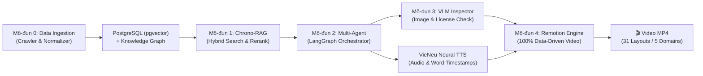

# ChronoViet 🇻🇳

> **Automated Historical EdTech &amp; Interactive GraphRAG Video Platform**  
> Nền tảng tự động hóa sản xuất video giáo dục lịch sử Việt Nam 100% Data-Driven kết hợp Hệ thống Chatbot RAG tương tác hai chiều &amp; Multi-Agent Pipeline.

---


---

## 📌 1. Giới Thiệu (Overview)

**ChronoViet** (*Chronology + Việt Nam*) giải quyết bài toán sấy khô kiến thức lịch sử bằng cách biến nguồn tri thức lịch sử Việt Nam dạng văn bản thành các **Video tóm tắt trực quan tự động** kết hợp **Hệ thống Chatbot RAG tương tác hai chiều**.

Dự án ứng dụng mô hình **Decoupled Event-Driven Architecture** với 5 mô-đun xử lý chuyên biệt:
0. **Data Preprocessing &amp; Ingestion Engine [✅]**: Nạp tri thức lịch sử offline, cào tự động toàn bộ 15 thời kỳ lịch sử (`pnpm crawl:all`), làm sạch lỗi OCR, chuẩn hóa địa danh qua các thời kỳ (`SAME_AS_LOCATION`), khử nhập nhằng nhân vật (`ALIAS_OF`), Dynamic Hierarchical Chunking, xử lý song song có kiểm soát (Concurrency Worker Pool), điều phối Hierarchical 2-Level Interleaved Rotation, nạp PostgreSQL pgvector (1024d BGE-M3 + FTS BM25), Relational Graph &amp; Append-Only Audit Trail (`entity_audit_logs`).

1. **Hybrid GraphRAG Engine [✅]**: Động cơ tìm kiếm kết hợp Knowledge Graph + Dense Vector BGE-M3 + Sparse BM25 (lọc Stopword tiếng Việt) + PostgreSQL Recursive CTE Subgraph Search (Cycle Pruning) + Pure Local Cross-Encoder Reranker (`Qwen3-Reranker-0.6B` / `bge-reranker-v2-m3` GGUF Q8_0 qua `POST /v1/rerank` trên `llama-server` Port 8096, bảo tồn danh xưng 2 ký tự) + Multi-Factor Historical Fusion + LRU Query Embedding Cache + Global Singleton Schema Init. Đảm bảo tri thức lịch sử chính xác 100%, loại bỏ hoàn toàn suy đoán sai (Hallucination Rate 0%).
2. **Multi-Agent Orchestrator (LangGraph.js) [✅]**: Lập kịch bản video chi tiết, phân chia phân cảnh & chọn bố cục trực quan phù hợp, tích hợp NLI Entailment Hallucination Judge & Folklore Guardrail Gate.
3. **VLM Inspector Agent (Gemini 3.6 Flash / Agnes / CLIP) [✅]**: Kiểm định bối cảnh lịch sử của tư liệu hình ảnh & thẩm định giấy phép bản quyền.
4. **Remotion Render Engine [✅]**: Engine render video MP4 100% Data-Driven từ Zod JSON Schema v4.1.



---

## ✨ 2. Tính Năng Nổi Bật (Key Features)

- 👑 **Master Historical Corpus Crawler**: Cào tự động 100% tài liệu tri thức phủ rộng qua **15 Thời Kỳ Lịch Sử Việt Nam** chuẩn hóa trong 1 câu lệnh (`pnpm crawl:all`).
- 🎬 **100% Data-Driven Remotion Video Engine**: Render video chất lượng cao từ file JSON mà không cần sửa code React.
- 📐 **31 LayoutModes & 19 TransitionTypes**: Hỗ trợ 11 bố cục hình ảnh tư liệu & 20 bố cục lập trình đồ họa (Pure Code), 4 hiệu ứng bộ lọc màu (*Historical, Sepia, Monochrome, Vivid*) và hiệu ứng camera Ken Burns.
- 🏛️ **5 Miền Nội Dung Lịch Sử (Domains)**: Quy chuẩn kịch bản chuẩn cho *BIOGRAPHY* (Nhân vật), *BATTLE* (Chiến dịch), *DYNASTY* (Triều đại), *MYSTERY* (Bí ẩn/Vụ án) và *ARTIFACT* (Bảo vật quốc gia).
- 🛡️ **Tự Động Bảo Đảm Giọng Văn Dã Sử (Folklore Guardrail Gate)**: Tự động bắt lỗi Regex Pattern Matching và yêu cầu LLM dùng giọng văn giả thuyết cho nguồn tin Level 3/Dã sử.
- 🎙️ **Self-Hosted VieNeu Neural TTS**: Giọng đọc thuyết minh truyền cảm với word-level timestamps cho hiệu ứng chữ Karaoke.
- 🔒 **Type-Safe Monorepo System**: Định nghĩa hợp đồng dữ liệu chuẩn hóa qua `@chronoviet/shared-spec` (Zod runtime validation) và tầng runtime hạ tầng tập trung qua `@chronoviet/infra` (DB, Redis, LLM, TTS SDK).

---

## 🏗️ 3. Cấu Trúc Dự Án (Monorepo Architecture v4.0)

Dự án được tổ chức dạng **pnpm Workspace Monorepo**:

```text
ChronoViet/
├── apps/
│   ├── render-worker/           # Background Job Worker (BullMQ + Redis + Remotion CLI) (+ eval/)
│   └── web/                     # Next.js 14 Frontend Heritage Hub & REST/WebSocket API Server
│
├── packages/
│   ├── shared-spec/             # [✅ READY] Pure Zod Schemas & Data Contracts (SSOT, Zero Node/Backend Runtime Deps)
│   ├── infra/                   # [✅ READY] Unified Node.js Infrastructure (Postgres Pool, Redis, Logger, LLM, TTS SDK)
│   ├── agent-orchestrator/      # [✅ READY] LangGraph.js Multi-Agent Pipeline + Research Provider Chain (+ eval/)
│   ├── data-ingestion/          # [✅ READY] Data Preprocessing & Ingestion Engine (Mô-đun 0) (+ eval/)
│   ├── rag-engine/              # [✅ READY] Chrono-RAG Retrieval Engine (Mô-đun 1) (+ eval/)
│   ├── remotion-engine/         # [✅ READY] Remotion Render Engine & Studio (+ eval/ test suite)
│   └── vlm-inspector/           # [✅ READY] Deterministic Visual Quality Gate (+ eval/)
│
├── services/
│   └── vieneu-tts/              # [✅ READY] Standalone Python FastAPI VieNeu ONNX Neural TTS Microservice (+ eval/)
│
├── eval/                        # Tầng Đánh Giá Tập Trung (E2E Integration Benchmark & Golden Datasets)
├── docs/                        # Trung tâm Tài liệu Kỹ thuật & Kiến trúc (Documentation Portal)
├── media/                       # Local Mount Volume cho media assets (/raw-assets, /rendered-videos)
├── docker-compose.yml           # Cấu hình Hạ tầng Docker (Postgres pgvector, Redis, Caddy Proxy)
└── Caddyfile                    # Cấu hình Reverse Proxy & Serving Static Media Assets
```

### Chi Tiết Phân Nhóm Mô-đun (Packages & Apps):

| Package / App | Vai Trò | Trạng Thái | Thư Mục Eval / Test |
| :--- | :--- | :---: | :---: |
| [`@chronoviet/shared-spec`](packages/shared-spec) | Nguồn sự thật duy nhất (SSOT) cho Zod Schemas & TypeScript Data Contracts (Pure) | **✅ Ready** | N/A (Pure Contracts) |
| [`@chronoviet/infra`](packages/infra) | Gói hạ tầng runtime hợp nhất: DB Pool, Redis BullMQ, Logger, Telemetry, LLM, TTS SDK | **✅ Ready** | `src/__tests__/` |
| [`@chronoviet/data-ingestion`](packages/data-ingestion) | Data Preprocessing & Ingestion Engine (Mô-đun 0) Crawler, Normalizer, Chunking & Seeder | **✅ Ready** | `packages/data-ingestion/eval/` |
| [`@chronoviet/rag-engine`](packages/rag-engine) | Chrono-RAG Retrieval Engine (Mô-đun 1) PostgreSQL pgvector + Graph CTEs + BM25 | **✅ Ready** | `packages/rag-engine/eval/` |
| [`@chronoviet/agent-orchestrator`](packages/agent-orchestrator) | Đội ngũ Multi-Agent LangGraph.js chia phân cảnh, Research Provider Chain, NLI Judge | **✅ Ready** | `packages/agent-orchestrator/eval/` |
| [`@chronoviet/remotion-engine`](packages/remotion-engine) | Engine render video Remotion v4, 31 LayoutModes, 19 Components, 11 Compositions | **✅ Ready** | `packages/remotion-engine/eval/` |
| [`@chronoviet/vlm-inspector`](packages/vlm-inspector) | Offline Deterministic Visual Quality Gate, Whitelisted License Filter | **✅ Ready** | `packages/vlm-inspector/eval/` |
| [`services/vieneu-tts`](services/vieneu-tts) | Python FastAPI Standalone Microservice tổng hợp giọng nói thuyết minh Neural TTS (Port 8080) | **✅ Ready** | `services/vieneu-tts/eval/` |
| [`apps/web`](apps/web) | Next.js 14 Heritage Research Hub, REST APIs, SSE Stream & WebSocket Gateway | **✅ Ready** | `src/__tests__/` |
| [`apps/render-worker`](apps/render-worker) | BullMQ Render Worker, Process Isolation, Remotion Headless Chrome Rendering | **✅ Ready** | `apps/render-worker/eval/` |

---

## 🚀 4. Hướng Dẫn Bắt Đầu Nhanh (Quickstart Workflow)

### Bước 1: Cài Đặt Dependencies & Cấu Hình Môi Trường

```bash
# 1. Cài đặt toàn bộ packages trong monorepo
pnpm install

# 2. Tạo file cấu hình môi trường từ mẫu
cp .env.example .env
```

> **Lưu ý:** Bạn có thể cấu hình `HF_TOKEN` trong file `.env` để tăng tốc độ tải mô hình từ Hugging Face CDN.

---

### Bước 2: Tải Trọng Số Mô Hình AI & Khởi Tạo Cơ Sở Dữ Liệu

```bash
# 1. Tải các mô hình AI cục bộ GGUF (BGE-M3 1024d, Qwen 3.5 9B, Qwen 3.5 4B, Qwen3-Reranker 0.6B)
pnpm models:download

# Hoặc tải gói siêu nhẹ cho Ingestion / Crawler:
pnpm models:download:lite     # Chỉ tải BGE-M3 + Qwen Extraction LLM (~2.4 GB)

# 2. Khởi chạy hạ tầng cơ sở dữ liệu (PostgreSQL pgvector & Redis)
pnpm stack:infra

# 3. Khởi tạo schema cơ sở dữ liệu chuẩn hóa
pnpm db:init
```

---

### Bước 3: Khởi Chạy Toàn Bộ Hệ Thống (1-Lệnh Duy Nhất)

```bash
# [Khuyến nghị] 🚀 1-Click Smart Dev: Tự động khởi động Docker Infra (Postgres+Redis) + Auto AI Detect + Web & Worker
pnpm dev

# Hoặc khởi chạy theo chế độ chuyên biệt:
pnpm dev:full        # Full Stack: Docker Infra + AI + VieNeu TTS + Web UI + Worker
pnpm dev:cloud       # Chế độ siêu nhẹ: 0% GPU/RAM máy, Web + Worker với Cloud AI
pnpm dev:data        # Data Ingestion Stack: Postgres + Redis + AI Lite (8090 + 8094)
```

*Mở trình duyệt tại `http://localhost:3000` để trải nghiệm Không gian Tra cứu Sử liệu RAG & Xưởng Phim Tự Động 1-Click.*

#### 🌐 Bảng Tra Cứu Cổng Dịch Vụ Mặc Định:
| Dịch vụ / Ứng dụng | Cổng (Port) | Mô tả |
| :--- | :---: | :--- |
| **Web Frontend & API Gateway** | `3000` | Giao diện tương tác Heritage Workspace & REST/WS endpoints |
| **Render Worker Probe & Metrics** | `3001` | Lắng nghe hàng đợi BullMQ, Render Lock & Health Probes |
| **Remotion Studio UI** | `9876` | Visual Preview & Debug 31 LayoutModes & Transitions |
| **Local LLM Gateway (Qwen 3.5 9B)** | `8092` | Lõi suy luận ngôn ngữ kịch bản, VLM & RAG Chatbot |
| **Stage 2 Extraction LLM (Qwen 3.5 4B)** | `8094` | Lõi trích xuất quan hệ tri thức Knowledge Triples cho Data Pipeline |
| **Local Reranker Engine (Qwen3-Reranker-0.6B)** | `8096` | Lõi Cross-Encoder Reranker chấm điểm ngữ cảnh chuyên sâu cho RAG |
| **Local Embedding Gateway (BGE-M3)**| `8090` | Không gian vector SSOT 1024 chiều (pgvector Indexing) |
| **VieNeu Neural TTS Service** | `8080` | Engine tổng hợp giọng đọc & align word timestamps |
| **PostgreSQL (pgvector)** | `5432` | Cơ sở dữ liệu quan hệ, BGE-M3 vectors & Graph CTEs |
| **Redis** | `6379` | Queue hàng đợi render BullMQ, Distributed Mutex & Cache |

---

### Bước 4: Xem Preview Remotion Studio & Đánh Giá Chất Lượng

#### 1. Xem Trực Quan Trên Remotion Studio:

```bash
pnpm remotion:studio
```

*Trình duyệt sẽ tự động mở Remotion Studio tại `http://localhost:9876` để bạn xem trực quan 31 LayoutModes, 19 Transitions và hiệu ứng chuyển cảnh real-time.*

#### 2. Chạy Suite Kiểm Định & Đánh Giá Chất Lượng (Eval Runner):

```bash
# Dọn dẹp sạch toàn bộ audio rác, báo cáo cũ & port bị chiếm giữ:
pnpm eval:clean

# Chạy toàn bộ Master Global Eval Monorepo (7 Modules & 3 Integration Chains):
pnpm eval:all

# Hoặc đánh giá từng module chuyên biệt:
pnpm eval:rag           # Đánh giá RAG Engine (11 tầng C0-C10)
pnpm eval:orchestrator  # Đánh giá Multi-Agent Orchestrator
pnpm eval:ingest        # Đánh giá Data Ingestion
pnpm eval:vlm           # Đánh giá VLM Inspector
pnpm eval:tts           # Đánh giá VieNeu TTS
pnpm eval:remotion      # Đánh giá Remotion Video Rendering
pnpm eval:chain         # Đánh giá chuỗi tích hợp E2E
```

---

## ⚡ 5. Bảng Tra Cứu Bộ Lệnh Toàn Diện (Commands by Workflow)

### 💻 1. Bộ 4 Lệnh Cốt Lõi Hàng Ngày (Core 4 Essential Commands)
```bash
pnpm dev             # 🚀 Smart 1-Click Dev: Tự bật Docker Infra + Tự kết nối AI + Chạy Web & Worker
pnpm data:setup      # 📦 1-Click Data: Bật Infra -> Init Schema CSDL -> Nạp Tri thức chuẩn -> Health Audit
pnpm ai              # 🤖 AI Dashboard TUI: Quản lý, kiểm tra port & bật/tắt Local AI Stack
pnpm check           # ✅ Verification Gate: Typecheck -> Lint -> Test -> Build (100% Pass)
```

### 🛠️ 2. Các Chế Độ Khởi Chạy (Dev Profiles & Apps)
```bash
pnpm dev:full        # Khởi chạy Full Stack: Docker Infra + AI + TTS + Web + Worker
pnpm dev:cloud       # Khởi động Web + Worker với Cloud AI fallback (0% RAM/GPU AI Local)
pnpm dev:data        # Khởi động Postgres + Redis + AI Lite (Embedding + Extraction) cho Data/Crawler
pnpm dev:web         # Chạy riêng Web App Next.js (port 3000)
pnpm dev:worker      # Chạy riêng BullMQ Video Render Worker (port 3001)
pnpm remotion:studio # Mở Remotion Studio UI xem trước kịch bản & căn chỉnh bố cục (port 9876)
pnpm remotion:render # Render video MP4 qua Remotion CLI
```

### 🤖 3. Quản Lý AI Model & TTS Cục Bộ (Unified AI CLI)
```bash
pnpm ai              # [Tương tác] Xem trạng thái các port (8090, 8092, 8094, 8096, 8080) & model đã nạp
pnpm ai:start        # Khởi chạy Full Local AI Stack (Embedding + Extraction + LLM 9B + Reranker + TTS)
pnpm ai:lite         # Chạy cặp đôi AI Lite: Embedding (8090) + Extraction (8094) (~3.1GB RAM)
pnpm ai:emb          # Chỉ chạy Embedding Server (Port 8090, BGE-M3 ~600MB) cho Vector Search
pnpm ai:extract      # Chỉ chạy Extraction LLM (Port 8094, Qwen 4B ~1.8GB) cho Triples/Crawler
pnpm ai:rerank       # Chỉ chạy Reranker Engine (Port 8096, Qwen3-Reranker-0.6B ~600MB)
pnpm ai:llm          # Chỉ chạy Chat/Agent LLM & VLM (Port 8092, Qwen 9B)
pnpm ai:tts          # Khởi chạy microservice VieNeu TTS FastAPI trong Docker (Port 8080)
pnpm ai:stop         # Dừng/giải phóng toàn bộ tiến trình AI & TTS, trả lại 100% RAM/VRAM
```

### 🔍 4. Fast Typecheck & Unit Tests theo từng Package
```bash
# Typecheck nhanh theo package (tiết kiệm thời gian trong lúc dev):
pnpm typecheck:spec | :infra | :ingest | :rag | :orchestrator | :vlm | :remotion | :web | :worker

# Chạy deterministic unit tests theo package:
pnpm test:spec | :infra | :ingest | :rag | :orchestrator | :vlm | :remotion | :web | :worker
```

### 📚 5. Pipeline Dữ Liệu & Nạp Tri Thức Lịch Sử (Data Ingestion)
```bash
pnpm db:init         # Khởi tạo CSDL & Schema Vector/Graph (pgvector 1024d)
pnpm db:health       # Audit sức khỏe DB (dangling refs, embeddings, chunks, entities, indexes)
pnpm db:backup       # Sao lưu snapshot CSDL
pnpm db:restore      # Khôi phục CSDL từ snapshot
pnpm db:clean        # Dọn dẹp transactional: xóa trùng lặp, self-loops & dangling relations
pnpm crawl:corpus    # Cào dữ liệu sử liệu từ corpus
pnpm ingest:vector   # Stage 1: Nạp Chunks & Vector Store (BGE-M3 1024d) + Fast NER
pnpm ingest:graph    # Stage 2: Nạp Knowledge Graph Triples bằng LLM 4B
pnpm ingest:knowledge# Nạp trọn gói cả 2 Stage liên hoàn
pnpm rag:chat        # Chatbot tra cứu RAG trực tiếp trên Terminal
```

### 🧪 6. Đánh Giá Chất Lượng Toàn Diện (Evaluation & Benchmarks)
```bash
pnpm eval:clean      # Dọn dẹp artifact rác, file tạm & port treo
pnpm eval            # Chạy Master Evaluation Runner
pnpm eval:all        # Đánh giá toàn diện Monorepo
pnpm eval:chain      # Đánh giá chuỗi tích hợp E2E
pnpm eval:ingest     # Đánh giá Data Ingestion (Vector, Graph, Triples, NER)
pnpm eval:rag        # Đánh giá RAG Engine (11 tầng C0-C10 + System Ablation)
pnpm eval:orchestrator # Đánh giá Multi-Agent Orchestrator (A0-A5 + Ablation)
pnpm eval:vlm        # Đánh giá VLM Inspector offline image scoring
pnpm eval:tts        # Đánh giá VieNeu TTS Engine
pnpm eval:remotion   # Đánh giá Remotion Video Engine
```

---

## 🔄 6. CI/CD (GitHub Actions)

Pipeline tự động chạy trên **mọi Pull Request và push lên `main`** — tất cả quality gates bắt buộc phải PASS trước khi merge:

| Job                | Nội dung                                                                    |
| :------------------ | :--------------------------------------------------------------------------- |
| **Lint**           | `pnpm lint` (tsc `--noEmit` recursive)                                      |
| **Typecheck**      | `pnpm typecheck` + `pnpm typecheck:extras` (eval &amp; scripts)             |
| **Unit Tests**     | `pnpm test` (vitest recursive với `--dir src/` — chỉ quét `src/`)           |
| **Build**          | `pnpm build` (build toàn bộ monorepo)                                       |
| **Security Audit** | `pnpm audit --audit-level=high`                                             |
| **Integration**    | Postgres pgvector + Redis services → `pnpm db:init` → `verify-db-health.ts` |

Chạy tương đương cục bộ trước khi push:

```bash
pnpm check
```

Dependency updates tự động qua Dependabot (`npm` + `github-actions`, hàng tuần).

---

## 🐳 7. Triển Khai Hạ Tầng Qua Docker Compose (Profiles)

Hệ thống được cấu hình sẵn với `docker-compose.yml` sử dụng Docker Compose Profiles phục vụ môi trường Production / VPS:

```bash
# 1. Khởi chạy toàn bộ dịch vụ cho môi trường Production (DB, Redis, TTS, App, Worker, Caddy)
pnpm stack:prod

# 2. Khởi chạy riêng cụm Database & Redis cho Dev
pnpm stack:infra

# 3. Khởi chạy container llama.cpp CUDA trên máy chủ GPU
pnpm stack:ai

# 4. Khởi chạy Full Stack gồm cả Local CUDA LLM & Embedding (Linux GPU)
pnpm stack:prod:all
```

---

## 📚 8. Trung Tâm Tài Liệu Dự Án (Documentation Portal)

Toàn bộ tài liệu thiết kế kiến trúc và quy chuẩn kỹ thuật nằm tại thư mục [`docs/`](docs/):

- 📜 [**Master Data Governance Spec (`docs/specs/KNOWLEDGE_DATA_GOVERNANCE_SPEC.md`)**](docs/specs/KNOWLEDGE_DATA_GOVERNANCE_SPEC.md): Quy chuẩn Master Source of Truth cho 15 Epochs, 7 Entity Taxonomies, RRF Min-Max, FPC Cochran formula &amp; Audit Logs.
- 📑 [**Documentation Portal (`docs/README.md`)**](docs/README.md): Bản đồ tra cứu tài liệu tổng quan.
- 🏛️ [**System Overview (`docs/SystemOverview.md`)**](docs/SystemOverview.md): Kiến trúc RAG + Multi-Agent + VLM + Remotion.
- ⚙️ [**Remotion Technical Spec (`docs/specs/EVAL_REMOTION_TECHNICAL_SPEC.md`)**](docs/specs/EVAL_REMOTION_TECHNICAL_SPEC.md): Hướng dẫn chi tiết 31 LayoutModes, 19 Transitions, Zod Schema &amp; Compositions.
- 📜 [**Content Formats Spec (`docs/specs/REMOTION_CONTENT_FORMATS_SPEC.md`)**](docs/specs/REMOTION_CONTENT_FORMATS_SPEC.md): Quy chuẩn 5 Domain lịch sử &amp; Schema Production v4.1.
- 📊 [**RAG Component Benchmark Spec (`docs/specs/RAG_COMPONENT_BENCHMARK_SPEC.md`)**](docs/specs/RAG_COMPONENT_BENCHMARK_SPEC.md): Benchmark từng component RAG (C0-C10), datasets, metrics &amp; regression gate.
- 🩺 [**Observability &amp; Logging (`docs/architecture/06_OBSERVABILITY_AND_LOGGING.md`)**](docs/architecture/06_OBSERVABILITY_AND_LOGGING.md): Unified structured logger (`@chronoviet/infra`), correlation ID, event names &amp; hướng dẫn truy vết log bằng `jq`.
- 💻 [**macOS Local Model Optimization (`docs/guides/MACOS_LOCAL_MODEL_OPTIMIZATION.md`)**](docs/guides/MACOS_LOCAL_MODEL_OPTIMIZATION.md): Tối ưu mô hình local trên Apple Silicon.

---

## 📄 9. Giấy Phép (License)

Dự án thuộc sở hữu riêng của **ChronoViet Team**. Mọi quyền được bảo lưu.

