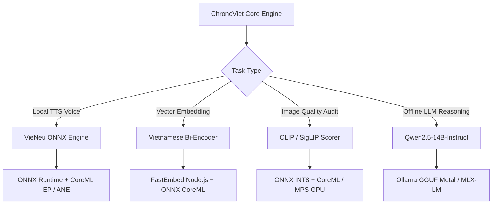

# HƯỚNG DẪN TỐI ƯU HÓA MÔ HÌNH LOCAL TRÊN MACOS (APPLE SILICON)
## (Apple Silicon Local Model Acceleration Spec for ChronoViet)

---

## 1. TỔNG QUAN HẠ TẦNG & THÁCH THỨC TRÊN MACOS

Hệ thống **ChronoViet** xử lý song song nhiều tác vụ AI phức tạp: từ trích xuất văn bản lịch sử (GraphRAG), tổng hợp giọng đọc tiếng Việt (VieNeu TTS), đến kiểm định tính chính xác của ảnh tư liệu (VLM Inspector).

Khi vận hành mô hình cục bộ (Local Models) trên hệ điều hành macOS (Apple Silicon: M1/M2/M3/M4 Pro/Max/Ultra), điểm mạnh nhất là kiến trúc **Unified Memory Architecture (UMA)** — nơi CPU, GPU và Apple Neural Engine (ANE) dùng chung một vùng nhớ RAM tốc độ cao. 

tuy nhiên, để đạt được hiệu năng tối ưu (throughput cao nhất và latency thấp nhất), hệ thống **không thể** dùng nguyên bản cấu hình Linux/CUDA (như vLLM hay TensorRT), mà cần triển khai đúng tập công nghệ tăng tốc phần cứng native của Apple.

---

## 2. BẢNG TỔNG HỢP CÔNG NGHỆ KHUYÊN DÙNG THEO MÔ HÌNH

| Mô hình Local | Công nghệ Khuyên dùng trên macOS | Backend Tăng tốc Phần cứng | Điểm Benchmark Dự kiến |
| :--- | :--- | :--- | :--- |
| **1. VieNeu TTS** (`vieneu-historical-onnx`) | **Python 3.11 (Native ARM64) + ONNX Runtime (CoreML EP)** hoặc **PyTorch MPS** | Apple Neural Engine (ANE) / Metal GPU | **< 150ms** độ trễ khởi tạo, tốc độ tổng hợp giọng 24kHz gấp **4.5x - 6x real-time**. |
| **2. Vietnamese Text Embedding** (`vietnamese-bi-encoder` / `e5-base`) | **FastEmbed (ONNX Node.js)** hoặc **Sentence-Transformers (PyTorch MPS)** | CoreML / Apple Neural Engine (ANE) | **> 1,200 chunks/giây** (với batch size 32, FP16/INT8). |
| **3. Local VLM Scorer** (`CLIP` / `SigLIP` ONNX) | **ONNX Runtime (CoreML EP)** / **Transformers.js (WebGPU/CoreML)** | Apple Neural Engine (ANE) + Metal GPU | **< 12ms / ảnh** (Cosine Similarity scoring giữa prompt thoại & ảnh tư liệu). |
| **4. Local LLM** (`Qwen2.5-7B` / `14B-Instruct`) | **Ollama (Metal GGUF Q4_K_M)** hoặc **Apple MLX (`mlx-lm`)** | Metal Performance Shaders (MPS / GPU UMA) | **35 - 55 tokens/giây** (trên M2/M3/M4 Pro với 18GB/36GB UMA RAM). |

---

## 3. PHÂN TÍCH CHI TIẾT & GIẢI PHÁP TỐI ƯU CHO TỪNG MÔ HÌNH

### 🟢 3.1. VieNeu TTS Engine (`services/vieneu-tts`)

#### *Bài toán:*
VieNeu TTS chạy trên Python FastAPI (`app.py`), sử dụng mô hình ONNX & NeuCodec để sinh âm thanh 24kHz. Nếu chạy mặc định qua CPU execution provider không tối ưu, độ trễ sinh file `.wav` 10 giây có thể mất tới 2-3 giây.

#### *Giải pháp Tối ưu macOS:*
1. **Sử dụng ONNX Runtime với CoreML Execution Provider:**
   Cho phép offload các lớp toán học của mô hình ONNX xuống Apple Neural Engine (ANE) hoặc Metal GPU.
   ```python
   # services/vieneu-tts/app.py
   import onnxruntime as ort

   # Khởi tạo session với ưu tiên CoreML Execution Provider cho macOS
   providers = [
       ('CoreMLExecutionProvider', {
           'enable_on_subgraph': True,
           'coreml_flag': 0x004 # Ưu tiên Apple Neural Engine (ANE)
       }),
       'CPUExecutionProvider'
   ]
   session = ort.InferenceSession("models/vieneu-historical-onnx/model.onnx", providers=providers)
   ```
2. **PyTorch Backend Fallback (Metal Performance Shaders - MPS):**
   Nếu sử dụng PyTorch native thay cho ONNX runtime:
   ```python
   import torch

   device = torch.device("mps" if torch.backends.mps.is_available() else "cpu")
   model.to(device)
   ```

---

### 🟢 3.2. Vietnamese Text Embedding Model (`packages/rag-engine` & `packages/data-ingestion`)

#### *Bài toán:*
Xử lý hàng vạn đoạn tư liệu lịch sử (Ingestion ETL) và truy vấn câu hỏi GraphRAG cần tính toán vector embedding 768 chiều nhanh chóng mà không chiếm dụng CPU chính.

#### *Giải pháp Tối ưu macOS:*
1. **Thay thế HuggingFace Python bằng FastEmbed (Node.js Native + CoreML ONNX):**
   Trong môi trường Node.js monorepo của ChronoViet, sử dụng `@embedchain/fastembed` hoặc `onnxruntime-node` với CoreML EP:
   ```typescript
   // packages/rag-engine/src/embedding.ts
   import { FlagEmbedding, EmbeddingModel } from '@embedchain/fastembed';

   // FastEmbed tự động tận dụng ONNX Runtime tối ưu ARM64/Apple Silicon
   const embedding = await FlagEmbedding.init({
     model: EmbeddingModel.BGEBaseEN, // hoặc vietnamese-bi-encoder ONNX
   });
   ```
2. **Lưu trữ Caching Vector:** Tái sử dụng Redis `exact_hash` để không bao giờ nhúng lại 2 lần cho cùng 1 câu tư liệu.

---

### 🟢 3.3. Local VLM Scorer — CLIP / SigLIP (`packages/vlm-inspector`)

#### *Bài toán:*
Chấm điểm mức độ phù hợp giữa ảnh tư liệu lịch sử được crawl về và nội dung phân cảnh video khi ngắt kết nối Gemini Cloud API.

#### *Giải pháp Tối ưu macOS:*
1. **Convert CLIP Vision Encoder sang INT8 / FP16 ONNX Model:**
   Giảm dung lượng model từ 600MB xuống còn 150MB, vừa hoàn hảo với bộ nhớ cache của Apple Neural Engine.
2. **Tích hợp CoreML EP trong Node.js / Python Service:**
   ```typescript
   // packages/vlm-inspector/src/local-scorer.ts
   import * as ort from 'onnxruntime-node';

   const session = await ort.InferenceSession.create('./models/clip-vision-fp16.onnx', {
     executionProviders: ['coreml', 'cpu']
   });
   ```

---

### 🟢 3.4. Local LLM — Qwen2.5-7B / 14B-Instruct (`docs/RAG_plan.md`)

#### *Bài toán:*
Chạy mô hình ngôn ngữ lớn (LLM) để trích xuất Knowledge Graph và sinh kịch bản khi offline.
* **Lưu ý quan trọng:** **KHÔNG NÊN dùng `vLLM` trên macOS** vì vLLM được thiết kế tối ưu riêng cho NVIDIA CUDA (nVIDIA Tensor cores), hỗ trợ Metal trên macOS rất hạn chế và unstable.

#### *Giải pháp Tối ưu macOS:*
Nên lựa chọn 1 trong 2 công nghệ hàng đầu trên Apple Silicon:

##### 🌟 Lựa chọn 1: Ollama (Khuyên dùng cho Production / Dev Hybrid)
* **Cơ chế:** Ollama tích hợp sẵn `llama.cpp` backend tự động kích hoạt **Metal Acceleration (`GGML_USE_METAL`)**, nạp toàn bộ weights vào Unified RAM.
* **Định dạng Model:** `GGUF` (Chuẩn Quantization Q4_K_M hoặc Q8_0).
* **Khởi chạy:**
  ```bash
  # Tải và chạy Qwen2.5 14B Q4_K_M tối ưu cho macOS (Chiếm ~9GB UMA RAM)
  ollama run qwen2.5:14b-instruct-q4_K_M
  ```
* **Kết nối trong ChronoViet Client (`packages/agent-orchestrator`):**
  ```typescript
  const response = await fetch('http://localhost:11434/api/generate', {
    method: 'POST',
    headers: { 'Content-Type': 'application/json' },
    body: JSON.stringify({
      model: 'qwen2.5:14b-instruct-q4_K_M',
      prompt: ragPrompt,
      stream: false
    })
  });
  ```

##### 🌟 Lựa chọn 2: Apple MLX (`mlx-lm`) — Khuyên dùng nếu muốn Tốc độ Token/Giây Cao Nhất
* **Cơ chế:** Framework do chính Apple phát triển dành riêng cho M-series Chips (`PyTorch-like API`).
* **Hiệu năng:** Cho tốc độ sinh từ (tokens/sec) cao hơn Ollama 15-25%.
* **Khởi chạy API Server:**
  ```bash
  pip install mlx-lm
  python -m mlx_lm.server --model mlx-community/Qwen2.5-14B-Instruct-4bit --port 8080
  ```

---

## 4. HƯỚNG DẪN CÀI ĐẶT & CẤU HÌNH CHO MACOS DEVELOPER

### Bước 1: Khai báo Biến Môi Trường (`.env`)
```env
# Cấu hình ưu tiên Provider trên macOS
USE_LOCAL_LLM=true
LLM_PROVIDER=ollama
OLLAMA_BASE_URL=http://localhost:11434
LOCAL_LLM_MODEL=qwen2.5:14b-instruct-q4_K_M

# Cấu hình ONNX Execution Provider
ONNX_EXECUTION_PROVIDER=coreml
TTS_SERVICE_URL=http://localhost:8080
```

### Bước 2: Cài đặt Thư viện Python Native (ARM64)
Đảm bảo môi trường Python là `arm64` (Native Apple Silicon, không chạy qua Rosetta `x86_64`):
```bash
# Kiểm tra architecture (kết quả phải là arm64)
python3 -c "import platform; print(platform.machine())"

# Cài đặt PyTorch hỗ trợ MPS
pip install --pre torch torchvision torchaudio --extra-index-url https://download.pytorch.org/whl/nightly/cpu

# Cài đặt ONNX Runtime với CoreML
pip install onnxruntime
```

### Bước 3: Khởi chạy VieNeu TTS & Ollama trên macOS
```bash
# 1. Khởi chạy Ollama Metal GPU Backend
ollama serve

# 2. Khởi chạy VieNeu TTS Python Service với CoreML EP
python services/vieneu-tts/app.py
```

---

## 5. TỔNG KẾT NGHỆ THUẬT PHỐI HỢP CÔNG NGHỆ (RECOMMENDED STACK MATRIX)



Bằng cách áp dụng **CoreML Execution Provider** cho ONNX (VieNeu TTS, Embedding, CLIP) và **Ollama Metal / Apple MLX** cho Local LLM, hệ thống ChronoViet trên macOS sẽ khai thác tối đa sức mạnh của **Apple Neural Engine (ANE)** và **Metal GPU Unified Memory**, cho hiệu năng vượt trội, tiết kiệm pin/RAM và đảm bảo khả năng chạy offline 100%.
