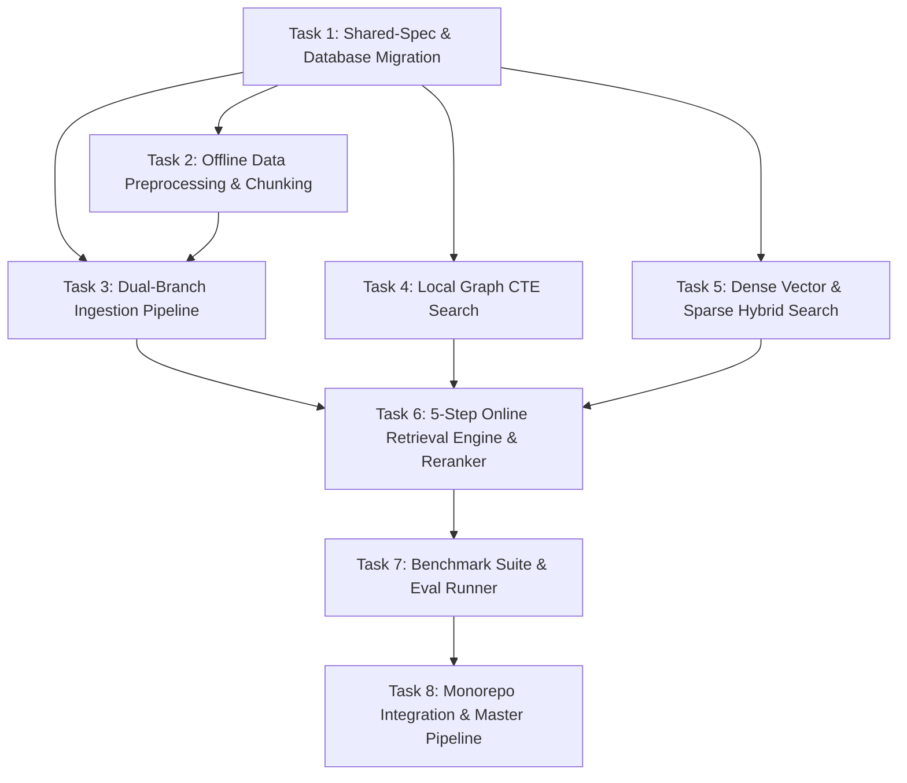

# Kế Hoạch Triển Khai Chi Tiết & Chuẩn Hoá: Mô-đun 1 — Chrono-RAG Engine

## Tổng Quan (Executive Overview)

Mô-đun **Chrono-RAG Engine** (`packages/rag-engine`) là "Bộ não Tri thức" (Knowledge & Fact Retrieval Layer) của hệ thống **ChronoViet**. Nhiệm vụ tối thượng của mô-đun là triệt tiêu hoàn toàn hiện tượng **Hallucination** (bị đặt dữ kiện, nhầm lẫn mốc thời gian, tên nhân vật, địa danh cổ) khi mô hình AI tự động tạo kịch bản video lịch sử.

Hệ thống được thiết kế theo kiến trúc **Hybrid GraphRAG tinh gọn trên PostgreSQL 15+ (`pgvector` + Relational Graph Schema)**, kết hợp 3 tầng công nghệ cốt lõi:
1. **Knowledge Graph (Relational Graph Schema):** Quản lý thực thể (`entities`), mối quan hệ (`relationships`), bảng bí danh (`ALIAS_OF`) và ánh xạ địa danh qua các thời kỳ (`SAME_AS_LOCATION`).
2. **Vector Store & Hybrid Search (`pgvector` + Full-Text Search):** Lưu trữ vector 1024 chiều (mô hình `BAAI/bge-m3`) với HNSW Index kết hợp với Full-Text Search (BM25 Lexical Search) và thuật toán **Reciprocal Rank Fusion (RRF)**.
3. **Local Search ($k$-Hop Recursive CTEs) & Reranking:** Duyệt đồ thị cục bộ sub-millisecond bằng thuật toán PostgreSQL Recursive CTEs ($k=1, 2$) kết hợp với mô hình **BGE Reranker v2** (`BAAI/bge-reranker-v2-m3`) để chọn ra Top-K ngữ cảnh chính xác tuyệt đối.

Kế hoạch này phân rã toàn bộ quá trình phát triển Chrono-RAG Engine thành các nhiệm vụ nhỏ (Vertical Slices), có tiêu chí nghiệm thu tự động (Acceptance Criteria) và bộ công cụ đánh giá `packages/rag-engine/eval/` độc lập tuân thủ nguyên tắc **Stateless Monorepo & SSOT Spec**.

---

## Đối Chiếu & Bổ Sung Kiến Trúc (Architecture & Data Contracts Audit)

### 1. Chuẩn Hóa Data Contract (SSOT tại `packages/shared-spec`)
Mọi giao diện TypeScript và Zod Schemas giữa RAG Engine và các mô-đun khác (đặc biệt là Multi-Agent Orchestrator) được khai báo tập trung tại [`packages/shared-spec`](../packages/shared-spec):
- `IRagEngine`: Interface chuẩn cho service RAG (`search()` và `ingestDocument()`).
- `RagSearchRequestSchema`: Zod validation cho dữ liệu đầu vào `search()`, bao gồm `query`, `entityFilter`, `maxTokens`, `rerankTopK`.
- `RagSearchResponseSchema`: Zod validation cho kết quả đầu ra, bao gồm `verifiedContext`, `aliasTable`, `citations`, và `retrievalLatencyMs`.
- `HistoricalContextEntitySchema`: Chi tiết thực thể được xác minh kèm điểm tin cậy và nguồn trích dẫn.

### 2. Sơ Đồ Cơ Sở Dữ Liệu PostgreSQL Đầy Đủ (Relational Graph + Vector Store + FTS)
Dữ liệu lưu trữ hoàn toàn trên PostgreSQL local stack (Docker Compose):
- Bảng `entities`:
  - `id VARCHAR(128) PRIMARY KEY`
  - `name VARCHAR(255) NOT NULL`
  - `type VARCHAR(64) NOT NULL` (Person, Event, Location, Dynasty, TimePeriod)
  - `aliases TEXT[]`
  - `metadata JSONB DEFAULT '{}'::jsonb`
  - Chỉ mục: `idx_entities_aliases GIN (aliases)`
- Bảng `relationships`:
  - `id SERIAL PRIMARY KEY`
  - `source_entity_id VARCHAR(128) REFERENCES entities(id) ON DELETE CASCADE`
  - `target_entity_id VARCHAR(128) REFERENCES entities(id) ON DELETE CASCADE`
  - `relation_type VARCHAR(64) NOT NULL` (PART_OF, LED_BY, HAPPENED_IN, HAPPENED_AT, SAME_AS_LOCATION, ALIAS_OF, ROYAL_LINEAGE, MENTIONED_IN)
  - `confidence REAL DEFAULT 1.0`
  - Chỉ mục: `idx_rel_source (source_entity_id)`, `idx_rel_target (target_entity_id)`, `idx_rel_type (relation_type)`
- Bảng `document_chunks`:
  - `id VARCHAR(128) PRIMARY KEY`
  - `title VARCHAR(255) NOT NULL`
  - `text_content TEXT NOT NULL`
  - `dynasty VARCHAR(64)`
  - `source_reliability VARCHAR(32) DEFAULT 'LEVEL_1'` (LEVEL_1, LEVEL_2, LEVEL_3)
  - `parent_chunk_id VARCHAR(128)` (Hỗ trợ Hierarchical Chunking)
  - `time_start INT`, `time_end INT`
  - `key_figures TEXT[]`
  - `location VARCHAR(255)`
  - `page_number INT`
  - `embedding vector(1024)`
  - `tsv tsvector GENERATED ALWAYS AS (to_tsvector('simple', title || ' ' || text_content)) STORED`
  - Chỉ mục: `idx_chunks_embedding_hnsw HNSW (embedding vector_cosine_ops) WITH (m=16, ef_construction=64)`, `idx_chunks_fts GIN (tsv)`
- Bảng `entity_chunks`:
  - `entity_id VARCHAR(128) REFERENCES entities(id) ON DELETE CASCADE`
  - `chunk_id VARCHAR(128) REFERENCES document_chunks(id) ON DELETE CASCADE`
  - `PRIMARY KEY (entity_id, chunk_id)`

---

## Phân Rã Công Việc & Sơ Đồ Phụ Thuộc (Dependency Graph)



---

## Danh Sách Task Triển Khai (Task List)

### Phase 1: Hạ Tầng Database & Shared Data Contracts

#### Task 1: Khởi tạo Data Contracts & Schema Migration PostgreSQL
- **Mục tiêu:** Hoàn thiện Zod schema & TypeScript interfaces tại `packages/shared-spec` và triển khai script khởi tạo bảng DB đầy đủ chỉ mục HNSW + Full-Text Search GIN trong `packages/rag-engine`.
- **Mô tả chi tiết:**
  - Bổ sung `RagSearchRequestSchema`, `RagSearchResponseSchema`, `HistoricalContextEntitySchema` vào `packages/shared-spec/src/schema.ts` và export kiểu từ `interfaces.ts`.
  - Cập nhật SQL migration script trong `packages/rag-engine/src/db/schema.ts` tạo đủ 4 bảng (`entities`, `relationships`, `document_chunks`, `entity_chunks`), cột `tsv tsvector`, chỉ mục `HNSW` và các chỉ mục `GIN` phụ trợ.
  - Viết Postgres client pool (`packages/rag-engine/src/db/client.ts`) sử dụng `pg` kết nối tới PostgreSQL container với retry strategy và connection pooling configuration.
- **Tiêu chí nghiệm thu (Acceptance Criteria):**
  - [ ] `pnpm --filter @chronoviet/shared-spec typecheck` đạt 0 lỗi TypeScript.
  - [ ] Script `INITIAL_RAG_SCHEMA_SQL` thực thi thành công trên PostgreSQL 15+, tạo đủ 4 bảng, extension `vector`, cột `tsv tsvector`, và 4 chỉ mục (`idx_chunks_embedding_hnsw`, `idx_chunks_fts`, `idx_entities_aliases`, `idx_rel_source`).
- **Xác minh (Verification):**
  - [ ] `pnpm typecheck` thành công monorepo-wide.
  - [ ] Script kiểm tra kết nối Postgres `src/db/client.ts` hoạt động mượt mà.
- **Phụ thuộc:** Không.
- **Tệp liên quan:**
  - `packages/shared-spec/src/schema.ts`
  - `packages/shared-spec/src/interfaces.ts`
  - `packages/rag-engine/src/db/schema.ts`
  - `packages/rag-engine/src/db/client.ts`
- **Quy mô dự kiến:** Medium (4 tệp)

---

### Phase 2: Offline Preprocessing & Ingestion Engine (Workstream A - Offline)

#### Task 2: Module Tiền Xử Lý Sử Liệu, Làm Sách Text & Chunking Đa Cấp
- **Mục tiêu:** Xây dựng pipeline làm sạch văn bản sử học tiếng Việt, đồng nhất nhân vật/địa danh cổ và cắt nhỏ văn bản (Dynamic Hierarchical Temporal Chunking).
- **Mô tả chi tiết:**
  - Viết `src/ingestion/text-cleaner.ts`: Loại bỏ lỗi OCR, kí tự rác, chuẩn hóa từ Hán-Việt cổ.
  - Viết `src/ingestion/entity-disambiguator.ts`: Ánh xạ từ điển địa danh qua các thời kỳ (`SAME_AS_LOCATION`: Thăng Long -> Đông Quan -> Đông Kinh -> Hà Nội) và bí danh nhân vật (`ALIAS_OF`: Quang Trung = Nguyễn Huệ = Hồ Thơm).
  - Viết `src/ingestion/chunker.ts`: Phân đoạn văn bản thành Parent Chunk (2000-3000 từ) và Child Chunk (300-500 từ) đính kèm Metadata (`source_reliability` Level 1/2/3, `dynasty`, `time_start`/`time_end`, `key_figures`, `location`, `page_number`).
- **Tiêu chí nghiệm thu (Acceptance Criteria):**
  - [ ] Chuyển đổi văn bản thô từ SGK / Sử liệu cổ thành mảng Parent & Child Chunks có Metadata chuẩn JSON Schema.
  - [ ] Ánh xạ thành công từ điển bí danh nhân vật và địa danh lịch sử theo dòng thời gian.
- **Xác minh (Verification):**
  - [ ] Unit tests cho `chunker.ts` và `entity-disambiguator.ts`.
- **Phụ thuộc:** Task 1.
- **Tệp liên quan:**
  - `packages/rag-engine/src/ingestion/text-cleaner.ts`
  - `packages/rag-engine/src/ingestion/entity-disambiguator.ts`
  - `packages/rag-engine/src/ingestion/chunker.ts`
- **Quy mô dự kiến:** Medium (3 tệp)

#### Task 3: Dual-Branch Ingestion Pipeline & Cross-Linking
- **Mục tiêu:** Xây dựng luồng nạp dữ liệu 2 nhánh: Nhánh Vector (`BAAI/bge-m3` 1024d) + Nhánh Graph (Trích xuất bộ ba LLM) và liên kết chéo `entity_chunks`.
- **Mô tả chi tiết:**
  - Viết `src/ingestion/triple-extractor.ts`: Gọi LLM (Gemini 2.5 Flash / Qwen2.5) với Schema-Guided Prompting để trích xuất bộ ba `(Sub -> Rel -> Obj)` chuẩn định dạng `PART_OF`, `LED_BY`, `HAPPENED_IN`, `HAPPENED_AT`, `SAME_AS_LOCATION`, `ALIAS_OF`, `ROYAL_LINEAGE`.
  - Viết `src/ingestion/embedding-service.ts`: Mô-đun tạo Dense Vector 1024d (`BAAI/bge-m3`) hỗ trợ ONNX runtime local hoặc API embedding.
  - Viết `src/ingestion/ingest-pipeline.ts`: Thực thi nạp dữ liệu song song vào `entities`, `relationships`, `document_chunks` và ghi bản ghi liên kết chéo `entity_chunks`.
- **Tiêu chí nghiệm thu (Acceptance Criteria):**
  - [ ] Nạp 1 file văn bản mẫu (vd: Trận Tốt Động - Chúc Động) tạo đúng danh sách Nút/Cạnh trên Graph DB và Embeddings trên `pgvector`.
  - [ ] Bảng `entity_chunks` ghi nhận đầy đủ liên kết giữa `entity_id` và `chunk_id`.
- **Xác minh (Verification):**
  - [ ] Integration test nạp văn bản mẫu vào PostgreSQL test container.
- **Phụ thuộc:** Task 2.
- **Tệp liên quan:**
  - `packages/rag-engine/src/ingestion/triple-extractor.ts`
  - `packages/rag-engine/src/ingestion/embedding-service.ts`
  - `packages/rag-engine/src/ingestion/ingest-pipeline.ts`
- **Quy mô dự kiến:** Medium (3 tệp)

---

### Checkpoint 1: Database & Ingestion Engine
- [ ] 100% Bảng PostgreSQL (`entities`, `relationships`, `document_chunks`, `entity_chunks`) được khởi tạo chuẩn xác.
- [ ] Ingestion pipeline nạp thành công dữ liệu mẫu, tạo đủ Graph Triples, Vector Embeddings và Cross-Linking records.
- [ ] Monorepo `pnpm typecheck` đạt 0 lỗi.

---

### Phase 3: Online Retrieval Engine (Workstream A - Online)

#### Task 4: Thuật Toán Local Graph Search với PostgreSQL Recursive CTEs
- **Mục tiêu:** Triển khai truy vấn mở rộng Subgraph cục bộ $k$-hop ($k=1, 2$) trực tiếp bằng PostgreSQL Recursive CTEs.
- **Mô tả chi tiết:**
  - Viết câu lệnh PostgreSQL Recursive CTE hai chiều trong `src/retrieval/graph-cte-search.ts` để duyệt đồ thị từ các Nút thực thể đầu vào:
    ```sql
    WITH RECURSIVE graph_cte AS (
      SELECT source_entity_id, target_entity_id, relation_type, confidence, 1 AS depth
      FROM relationships
      WHERE source_entity_id = ANY($1) OR target_entity_id = ANY($1)
      UNION ALL
      SELECT r.source_entity_id, r.target_entity_id, r.relation_type, r.confidence, g.depth + 1
      FROM relationships r
      INNER JOIN graph_cte g ON r.source_entity_id = g.target_entity_id OR r.target_entity_id = g.source_entity_id
      WHERE g.depth < $2
    )
    SELECT DISTINCT * FROM graph_cte;
    ```
  - Trả về mảng `GraphTriple` và rút ra danh sách `aliasTable` (từ cạnh `ALIAS_OF` và cột `entities.aliases`) phục vụ Fact-Checker Agent.
- **Tiêu chí nghiệm thu (Acceptance Criteria):**
  - [ ] Truy vấn với `entityId` cho trước trả về đầy đủ Subgraph $k$-hop với thời gian phản hồi sub-millisecond ($< 5\text{ms}$).
  - [ ] Rút ra chính xác bảng bí danh nhân vật (`aliasTable`) để phục vụ Fact-Checker Agent.
- **Xác minh (Verification):**
  - [ ] Unit & integration test cho `searchLocalGraphCTE()`.
- **Phụ thuộc:** Task 1.
- **Tệp liên quan:**
  - `packages/rag-engine/src/retrieval/graph-cte-search.ts`
- **Quy mô dự kiến:** Small (1 tệp)

#### Task 5: Hybrid Search (pgvector HNSW Cosine + BM25 Sparse & RRF)
- **Mục tiêu:** Phát triển engine tìm kiếm Hybrid Vector Search trên PostgreSQL `pgvector` kết hợp tìm kiếm từ khóa chính xác BM25 qua PostgreSQL Full-Text Search.
- **Mô tả chi tiết:**
  - Viết `src/retrieval/vector-search.ts`:
    1. Thực thi HNSW Cosine Similarity Query (`embedding <=> $1`) trên `document_chunks`.
    2. Thực thi Full-Text Search Query (`tsv @@ plainto_tsquery('simple', $2)`) lấy điểm `ts_rank_cd`.
    3. Áp dụng thuật toán **Reciprocal Rank Fusion (RRF)**:
       $$RRF\_Score(d) = \frac{1}{60 + Rank_{Vector}(d)} + \frac{1}{60 + Rank_{FTS}(d)}$$
  - Trả về Top-K `document_chunks` xếp hạng theo điểm RRF.
- **Tiêu chí nghiệm thu (Acceptance Criteria):**
  - [ ] Truy vấn kết hợp trả về các đoạn văn vừa đúng ngữ nghĩa vừa khớp chính xác tên riêng nhân vật/địa danh cổ.
  - [ ] Tốc độ truy vấn Hybrid Search $< 50\text{ms}$.
- **Xác minh (Verification):**
  - [ ] Unit test cho `searchDenseVector()` và hàm fusion RRF.
- **Phụ thuộc:** Task 1.
- **Tệp liên quan:**
  - `packages/rag-engine/src/retrieval/vector-search.ts`
- **Quy mô dự kiến:** Small (1 tệp)

#### Task 6: Đường Ống Retrieval 5 Bước & Integrated Context Reranker
- **Mục tiêu:** Lắp ráp hoàn chỉnh chu trình Online Retrieval 5 bước và mô hình BGE Reranker v2 để xuất ra `RagSearchResponse`.
- **Mô tả chi tiết:**
  - Viết `src/retrieval/question-ner.ts`: Trích xuất thực thể từ câu hỏi người dùng.
  - Viết `src/retrieval/chunk-retriever.ts`: Thực thi Graph-Guided Chunk Retrieval bằng cách truy vết bảng `entity_chunks` kết nối Subgraph ở Task 4 với `document_chunks`.
  - Viết `src/retrieval/reranker.ts`: Sử dụng mô hình `BAAI/bge-reranker-v2-m3` (ONNX local hoặc API) để chấm điểm lại và chọn Top-3/Top-5 context chuẩn xác nhất.
  - Viết `src/rag-engine.ts`: Implement interface `IRagEngine`, kết hợp 5 bước (Question NER -> Local Graph CTE -> Hybrid Vector -> Graph-Guided Retrieval -> Reranking & Fusion).
- **Tiêu chí nghiệm thu (Acceptance Criteria):**
  - [ ] Hàm `search(request)` của `ChronoRagEngine` hoạt động mượt mà, trả về đúng định dạng `RagSearchResponse` tuân thủ SSOT Schema.
  - [ ] Phản hồi chứa đầy đủ `verifiedContext`, `aliasTable`, `citations`, và `retrievalLatencyMs` ($< 300\text{ms}$).
- **Xác minh (Verification):**
  - [ ] Integration test giả lập câu hỏi phức tạp về trận đánh lịch sử Việt Nam.
- **Phụ thuộc:** Task 4, Task 5.
- **Tệp liên quan:**
  - `packages/rag-engine/src/retrieval/question-ner.ts`
  - `packages/rag-engine/src/retrieval/chunk-retriever.ts`
  - `packages/rag-engine/src/retrieval/reranker.ts`
  - `packages/rag-engine/src/rag-engine.ts`
  - `packages/rag-engine/src/index.ts`
- **Quy mô dự kiến:** Medium (5 tệp)

---

### Checkpoint 2: Online Retrieval Pipeline
- [ ] Hàm `IRagEngine.search()` phản hồi đầy đủ Verified Historical Context và Alias Table.
- [ ] Tốc độ truy vấn trung bình $< 300\text{ms}$.
- [ ] Monorepo `pnpm typecheck` đạt 0 lỗi.

---

### Phase 4: Bộ Công Cụ Đánh Giá Module (ChronoEval Suite tại `eval/`)

#### Task 7: Xây Dựng Bộ Benchmark ChronoEval-1000 & Framework Đánh Giá
- **Mục tiêu:** Triển khai bộ dữ liệu kiểm thử benchmark và runner đánh giá tự động 3 chỉ số KPI chính tại `packages/rag-engine/eval/`.
- **Mô tả chi tiết:**
  - Tạo bộ dataset benchmark tại `packages/rag-engine/eval/datasets/chronoeval-1000.json` gồm 1,000 câu hỏi sử học phân loại theo 5 nhóm chủ đề (`BIOGRAPHY`, `BATTLE`, `DYNASTY`, `MYSTERY`, `ARTIFACT`).
  - Viết `packages/rag-engine/eval/metrics.ts` đo lường:
    1. **Fact Precision Score**: $\frac{\text{Dữ kiện đúng}}{\text{Tổng dữ kiện}} \times 100\%$ (Target $> 99.2\%$).
    2. **Hallucination Rate**: $\frac{\text{Dữ kiện ảo giác}}{\text{Tổng dữ kiện}} \times 100\%$ (Target $< 0.8\%$).
    3. **Citation Traceability**: Tỉ lệ 100% ngữ cảnh có trích dẫn dẫn về tập/trang sử liệu gốc (Target $100\%$).
  - Viết `packages/rag-engine/eval/runner.ts` hỗ trợ cờ `--clean`, `--fresh`, `--json` xuất báo cáo kết quả đánh giá ra `packages/rag-engine/eval/reports/`.
  - Cập nhật `packages/rag-engine/eval/README.md`.
- **Tiêu chí nghiệm thu (Acceptance Criteria):**
  - [ ] Lệnh `pnpm --filter @chronoviet/rag-engine eval` thực thi hoàn chỉnh suite kiểm thử, tính toán chính xác 3 chỉ số KPI và xuất file báo cáo JSON.
  - [ ] Đạt ma trận tiêu chuẩn KPI: Fact Precision $> 99.2\%$, Hallucination Rate $< 0.8\%$, Citation Traceability $100\%$.
- **Xác minh (Verification):**
  - [ ] Chạy `pnpm --filter @chronoviet/rag-engine eval` và kiểm tra file report sinh ra.
- **Phụ thuộc:** Task 6.
- **Tệp liên quan:**
  - `packages/rag-engine/eval/datasets/chronoeval-1000.json`
  - `packages/rag-engine/eval/metrics.ts`
  - `packages/rag-engine/eval/runner.ts`
  - `packages/rag-engine/eval/README.md`
- **Quy mô dự kiến:** Medium (4 tệp)

---

### Phase 5: Hợp Nhất Hệ Thống & Master Pipeline Script

#### Task 8: Tích Hợp Master Script `pnpm eval:all` & Đồng Bộ Documentation
- **Mục tiêu:** Đưa `rag-engine` vào script đánh giá toàn cục monorepo (`pnpm eval:all`) và đồng bộ hóa tài liệu kỹ thuật trong `docs/`.
- **Mô tả chi tiết:**
  - Cập nhật script root `package.json` đảm bảo `pnpm eval:all` kích hoạt mượt mà runner `eval/` của `rag-engine`.
  - Cập nhật tài liệu kỹ thuật [`docs/modules/01_CHRONO_RAG_ENGINE.md`](modules/01_CHRONO_RAG_ENGINE.md) và [`docs/IMPLEMENTATION_PLAN.md`](IMPLEMENTATION_PLAN.md) chuyển trạng thái Mô-đun 1 sang `[✅ IMPLEMENTED]`.
- **Tiêu chí nghiệm thu (Acceptance Criteria):**
  - [ ] Lệnh `pnpm eval:all` chạy thành công monorepo-wide.
  - [ ] Tài liệu trong `docs/` được cập nhật đồng bộ với codebase thực tế.
- **Xác minh (Verification):**
  - [ ] `pnpm typecheck` & `pnpm lint` & `pnpm eval:all`.
- **Phụ thuộc:** Task 7.
- **Tệp liên quan:**
  - `package.json`
  - `docs/IMPLEMENTATION_PLAN.md`
  - `docs/modules/01_CHRONO_RAG_ENGINE.md`
- **Quy mô dự kiến:** Small (3 tệp)

---

### Checkpoint Complete: Complete Chrono-RAG Engine
- [ ] 100% mã nguồn Mô-đun 1 Chrono-RAG Engine hoàn thiện và đạt 0 lỗi TypeScript monorepo-wide (`pnpm typecheck`).
- [ ] Suite đánh giá `packages/rag-engine/eval/` vượt ma trận KPI đề ra.
- [ ] Tài liệu `docs/` synchronized 100% với mã nguồn.

---

## Quản Trị Rủi Ro & Phương Án Dự Phòng (Risk Management & Mitigation)

| Rủi Ro (Risk) | Mức Độ | Phương Án Dự Phòng / Xử Lý (Mitigation) |
| :--- | :---: | :--- |
| **Nhiễu trích xuất bộ ba Graph do văn bản Hán-Việt cổ** | Trung bình | Sử dụng Schema-Guided Prompting với Few-shot examples từ SGK Lịch sử; bổ sung từ điển Hán-Việt chuẩn hóa trong `text-cleaner.ts`. |
| **Tốc độ truy vấn pgvector bị chậm khi dữ liệu tăng cao** | Thấp | Cấu hình tham số HNSW index tối ưu (`m = 16, ef_construction = 64`), kết hợp phân vùng dữ liệu theo triều đại (`dynasty`). |
| **Rate limit / Chi phí khi gọi LLM API trích xuất Graph** | Trung bình | Sử dụng Gemini 2.5 Flash API với chi phí token rất rẻ; có phương án fallback sang mô hình Open-source local `Qwen2.5-14B-Instruct` qua Ollama/vLLM. |
| **Thiếu dữ liệu benchmark chuẩn sử học** | Thấp | Xây dựng bộ **ChronoEval-1000** trực tiếp từ các bộ đề thi Lịch sử GDPT và sách SGK chuẩn hóa. |

---

## Kế Hoạch Kiểm Thử & Xác Minh (Verification Plan)

### Automated Verification:
1. **Tier 1 (TypeScript):** `pnpm typecheck` (Đảm bảo 0 lỗi trên toàn bộ monorepo).
2. **Tier 2 (Zod Contract):** `pnpm --filter @chronoviet/shared-spec typecheck`.
3. **Tier 3 (Linting):** `pnpm lint`.
4. **Tier 4 (Module Benchmark):** `pnpm --filter @chronoviet/rag-engine eval` (Đo lường 3 chỉ số Fact Precision > 99.2%, Hallucination Rate < 0.8%, Citation Traceability 100%).

### Manual Verification:
1. Nạp kịch bản ví dụ "Trận Bạch Đằng 1288 và vai trò của Trần Quốc Tuấn" và kiểm tra dữ liệu xuất ra tại PostgreSQL `pgvector` & Graph Tables.
2. Thực thi thử một câu hỏi mơ hồ ("Nguyễn Huệ và Quang Trung có phải là một người không?") để xác minh khả năng tra cứu `aliasTable` và `ALIAS_OF` graph edge.
