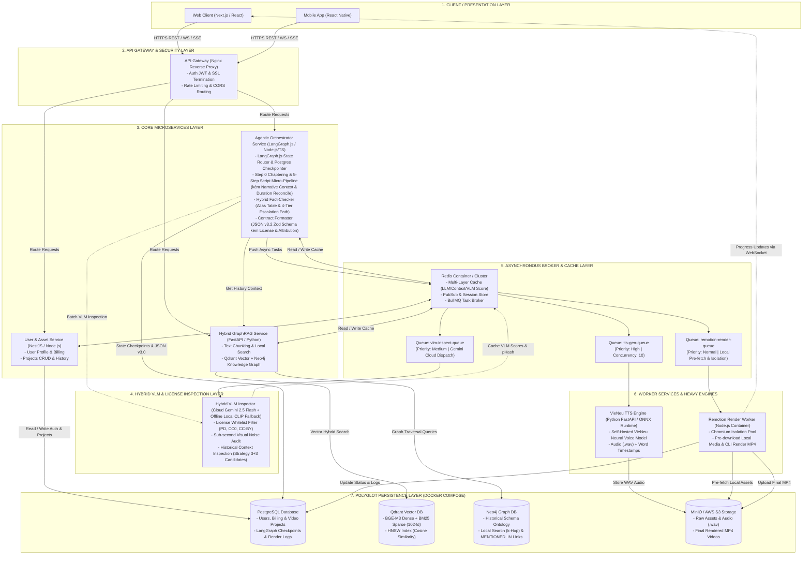
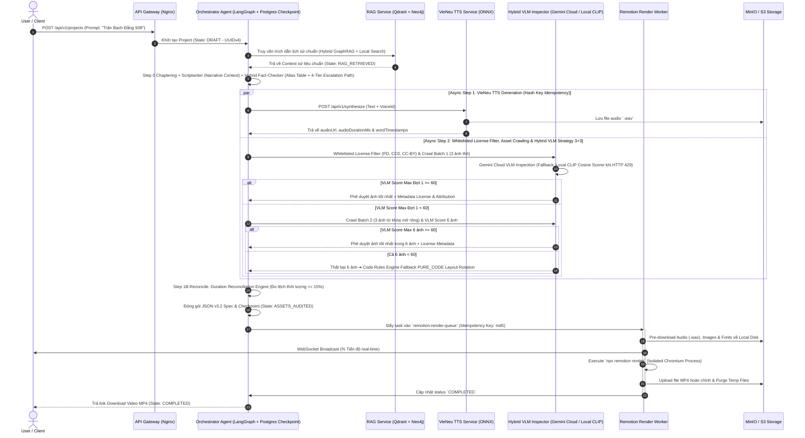
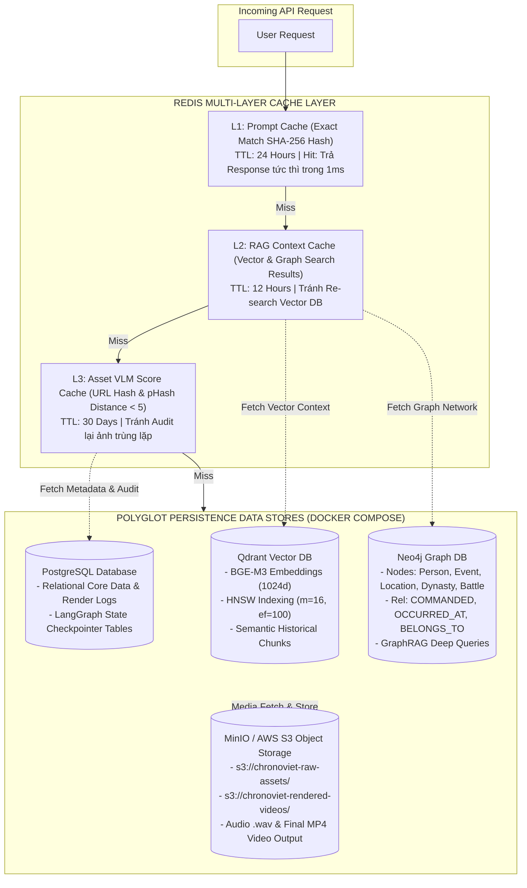
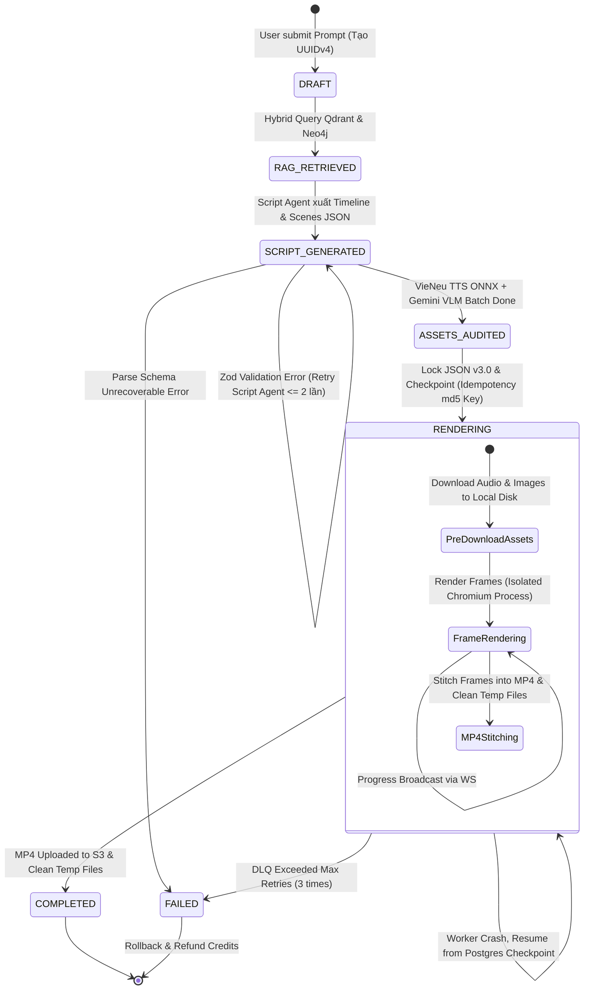
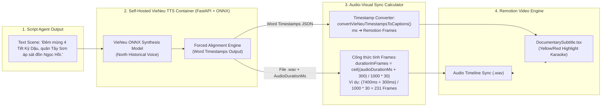
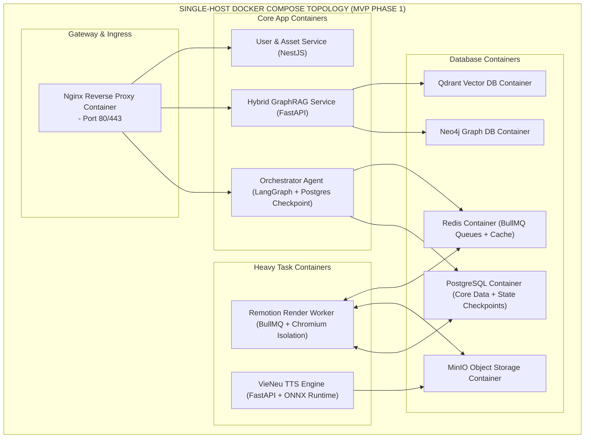

# CHRONOVIET - SYSTEM ARCHITECTURE DIAGRAMS & TECHNICAL SPECIFICATION

Document tổng hợp và đối chiếu toàn bộ Sơ đồ Kiến trúc Hệ thống, Quy trình xử lý dữ liệu Multi-Agent, Hạ tầng Polyglot Persistence, Message Queues, State Machine Engine, VieNeu TTS và Topology Triển khai Single-Host Docker Compose cho dự án **ChronoViet**.

---

## 1. 🏗️ Sơ Đồ Kiến Trúc Hệ Thống Tổng Thể (System Topology & Service Boundaries)

Sơ đồ thể hiện 6 tầng kiến trúc của **ChronoViet** giai đoạn MVP (Single-Host Docker Compose + Hybrid Cloud VLM):

---

## 2. 🔄 Quy Trình Multi-Agent & RAG Pipeline (Sequence Flow v3.2)

Sơ đồ quy trình chi tiết từ khi Người dùng khởi tạo câu lệnh đến khi xuất video hoàn chỉnh.

---

## 3. 💾 Polyglot Persistence & Caching Multi-Layer

Sơ đồ luồng truy vấn bộ nhớ đệm 3 lớp trên Redis trước khi chạm tới tầng lưu trữ lâu dài Polyglot Persistence.

---

## 4. ⚙️ Quản Lý Trạng Thái Máy (State Machine & Retry Engine)

Trạng thái dự án trải qua 7 bước quản lý nghiêm ngặt thông qua LangGraph Engine kèm Postgres Checkpointer.

---

## 5. 🎤 Tích Hợp VieNeu TTS Engine & Audio-Visual Scene Sync

Mô hình tích hợp VieNeu TTS tự host (ONNX Engine) và công thức toán học đồng bộ số khung hình Remotion.

---

## 6. 🐳 Hạ Tầng Triển Khai Single-Host Docker Compose Topology

Sơ đồ thể hiện mô hình triển khai Docker Compose Single-Host cho toàn bộ hệ thống ChronoViet:

---

## 7. 📊 Bảng Đối Chiếu & Xác Nhận Tính Đầy Đủ (Verification Matrix)

| Hạng Mục Kiến Trúc | File Gốc Trong Spec | Trạng Thái Đối Chiếu Trong Sơ Đồ | Điểm Tối Ưu Đã Thể Hiện |
| :--- | :--- | :---: | :--- |
| **Architectural Style** | [01_ARCHITECTURAL_STYLE.md](file:///D:/Persional_Projects/ChronoViet/docs/architecture/01_ARCHITECTURAL_STYLE.md) | **✅ ĐẦY ĐỦ** | Single-Host Docker Compose Architecture + Gemini 2.5 Flash VLM API. |
| **Communication & Queues** | [02_COMMUNICATION_AND_QUEUES.md](file:///D:/Persional_Projects/ChronoViet/docs/architecture/02_COMMUNICATION_AND_QUEUES.md) | **✅ ĐẦY ĐỦ** | REST API, SSE, WebSocket, 3 BullMQ Task Queues (`tts`, `vlm`, `remotion`), Asset Pre-download. |
| **Polyglot Persistence & Cache** | [03_DATA_STORAGE_AND_CACHE.md](file:///D:/Persional_Projects/ChronoViet/docs/architecture/03_DATA_STORAGE_AND_CACHE.md) | **✅ ĐẦY ĐỦ** | Qdrant (Vector), Neo4j (Graph), PostgreSQL (Relational + LangGraph Checkpoint), MinIO, Redis 3 Lớp. |
| **State Machine & Deployment** | [04_STATE_MANAGEMENT_AND_DEPLOY.md](file:///D:/Persional_Projects/ChronoViet/docs/architecture/04_STATE_MANAGEMENT_AND_DEPLOY.md) | **✅ ĐẦY ĐỦ** | 7 Trạng thái LangGraph Lifecycle, Postgres Checkpointer, Idempotency `md5(json_spec_v3)`. |
| **VieNeu TTS & Production Sync** | [05_PRODUCTION_OPTIMIZATIONS_AND_VIENEU_TTS.md](file:///D:/Persional_Projects/ChronoViet/docs/architecture/05_PRODUCTION_OPTIMIZATIONS_AND_VIENEU_TTS.md) | **✅ ĐẦY ĐỦ** | VieNeu ONNX Engine, Chrome Isolation & Pre-download, Gemini VLM API, Karaoke Timestamps. |
