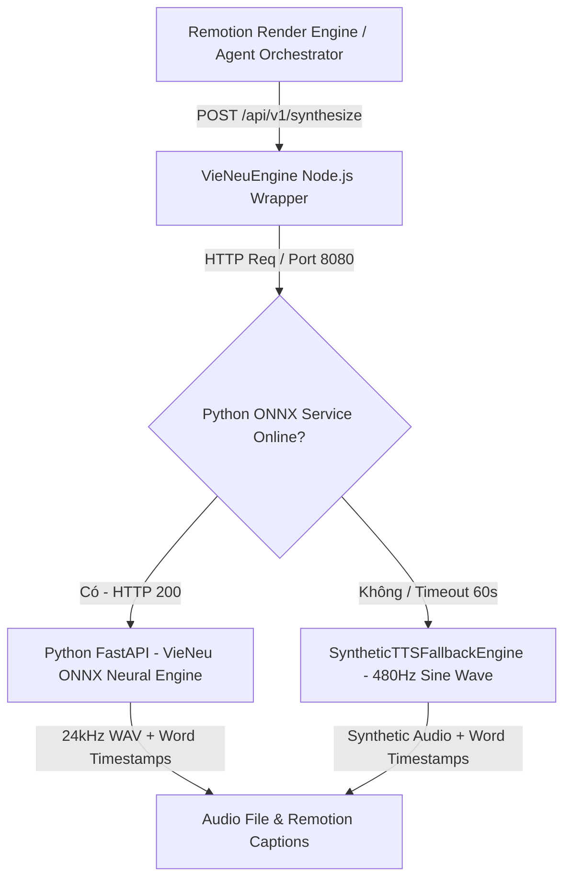
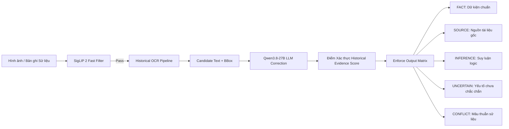

# HƯỚNG DẪN TỐI ƯU HÓA MÔ HÌNH LOCAL TRÊN MACOS (APPLE SILICON)
## (Apple Silicon Local Model Acceleration & Historical Document Intelligence Architecture Spec for ChronoViet - 2026 Edition)

---

## 1. TỔNG QUAN HẠ TẦNG & TƯ DUY THIẾT KẾ CỐT LÕI (HISTORICAL DOCUMENT INTELLIGENCE SYSTEM)

Hệ thống **ChronoViet** xử lý đồng thời nhiều tác vụ AI phức tạp: từ trích xuất tri thức lịch sử (GraphRAG), tổng hợp giọng đọc di sản (VieNeu TTS), giải mã tư liệu cổ (Historical OCR Hán-Nôm & Quốc ngữ cổ), đến kiểm định tính xác thực của hình ảnh tư liệu (Visual Verification).

### 🌟 CHUYỂN ĐỔI TRIẾT LÝ NỀN TẢNG: HISTORICAL DOCUMENT INTELLIGENCE SYSTEM
> **ChronoViet KHÔNG ĐƯỢC thiết kế như một hệ thống "Qwen + RAG" thông thường. ChronoViet là một Hệ thống Trí tuệ Tư liệu Lịch sử (Historical Document Intelligence System).**

Sự khác biệt cốt lõi: Thay vì cố gắng chọn một mô hình LLM tổng quát duy nhất rồi xây dựng mọi thứ xung quanh nó, ChronoViet phân rã và gán **mỗi loại bằng chứng lịch sử** (văn bản Quốc ngữ cổ, triện ấn, văn bản Hán-Nôm, bản đồ cổ, hiện vật, âm thanh di sản) cho một **mô hình / engine chuyên trách tối ưu nhất**.

---

### 🌟 TIÊU CHUẨN HÓA NỀN TẢNG HẠ TẦNG: `llama.cpp` METAL ENGINE

ChronoViet chính thức lựa chọn **`llama.cpp` (Metal & GGML Ecosystem)** làm **công nghệ hạ tầng cốt lõi (Core Local AI Engine)** trên Apple Silicon nhờ tận dụng kiến trúc **Unified Memory Architecture (UMA)** (băng thông từ 100GB/s đến 800GB/s).

#### Lý do chọn `llama.cpp` làm Nền tảng Công nghệ Chuẩn:
1. **Hiệu năng Metal Native tối đa:** Tối ưu hóa sâu cho Apple Silicon thông qua Metal API (`GGML_USE_METAL`), ARM NEON vector instructions và Accelerate framework, khai thác trọn vẹn băng thông UMA.
2. **Hệ sinh thái Tính năng & API Endpoints Chuẩn:** Gateway hỗ trợ 3 chuẩn API Endpoints linh hoạt:
   * `POST /v1/chat/completions` (OpenAI Chat Completions format compatible).
   * `POST /v1/responses` (OpenAI Responses API format compatible).
   * `POST /v1/messages` (Anthropic Messages API format compatible).
   * Continuous Batching & Prompt Caching cho xử lý đa truy vấn.
   * Native Embedding & Reranking Endpoints (hỗ trợ GGUF quantized embeddings & rerankers).
   * Multimodal VLM Support (`mmproj` cho vision-language models như Qwen3.8/Qwen3-VL).
   * Structured JSON Schema Output & Function Calling cho Agentic workflows.
3. **Độ ổn định & Quản lý Bộ nhớ Production-Grade:** Quản lý RAM/VRAM chặt chẽ, hỗ trợ cơ chế tự động chuyển vùng (fallback) sang Cloud API (**`Agnes 2.5 Flash`**) khi tài nguyên local quá tải hoặc cạn kiệt RAM.

---

## 2. KIẾN TRÚC THỰC THI & QUẢN LÝ VÒNG ĐỜI BỘ NHỚ UMA (32GB RAM TARGET)

### 2.1. Phân định vai trò các Runtime trên macOS

ChronoViet duy trì lớp trừu tượng **Local Model Gateway** (`ModelProvider`) để linh hoạt điều phối các runtime backend và Cloud Fallback Provider:

```text
                                 ChronoViet Application Layer
                                              │
                                    LocalModelGateway API
                  (Endpoints: /v1/chat/completions | /v1/responses | /v1/messages)
                                              │
        ┌───────────────────┬────────────────┼───────────────────┬──────────────────┐
        │                   │                │                   │                  │
  LLM Provider      Embedding Provider Rerank Provider    Vision & OCR        TTS Provider
        │                   │                │                   │                  │
 ┌──────┴──────┐      ┌─────┴──────┐   ┌─────┴──────┐      ┌─────┴──────┐     ┌─────┴──────┐
 │             │      │            │   │            │      │            │     │            │
llama-server Agnes 2.5 llama-server MLX llama-server MLX SigLIP 2 Qwen3-VL  VieNeu   MPS/CPU
(Qwen3.8-27B-Q4) (Flash API) (llama.cpp)      (llama.cpp)      (CoreML) PaddleOCR (ONNX)   Benchmark
 (Primary)   (Fallback)
```

* **`llama-server` (`Qwen3.8-27B-Q4` Local Metal Engine) — PRIMARY PRODUCTION ENGINE:**
  Backend chính cho LLM Generation, Text Embedding, Reranking và VLM Inspection chạy cục bộ trên macOS.
* **`Agnes 2.5 Flash` (Remote API Fallback Engine) — ZERO-DOWNTIME CLOUD FALLBACK:**
  Chế độ dự phòng linh hoạt qua API Key (`AGNES_API_KEY`). Tự động kích hoạt khi local Metal OOM, server local bận hoặc khi truy vấn đòi hỏi tốc độ xử lý tức thì (Flash speed).
* **Ollama — DEVELOPMENT WRAPPER:**
  Công cụ đóng gói/quản lý model weights cho Developer trong quá trình phát triển (Dev UI / Quick Pull).
* **Apple MLX (`mlx-lm`) — RESEARCH & BENCHMARK CANDIDATE:**
  Backend tham chiếu để đo đạc và benchmark hiệu năng single-stream khi cần thiết.

---

### 2.2. Chiến lược Quản lý Bộ nhớ UMA (32GB RAM Target Benchmark Profile)

Khi vận hành nhiều mô hình AI đồng thời trên Mac 32GB RAM, tổng dung lượng RAM nếu nạp tất cả mô hình cùng lúc có thể đạt 36.5GB+, gây ra **Memory Swapping / Compression** và dẫn tới **Metal OOM Crash**. 

ChronoViet thiết kế chiến lược nạp mô hình phân tầng **Resident vs. On-Demand**:

```text
                                 32GB UMA RAM ALLOCATION (OPTIMIZED UNIFIED STACK)
┌─────────────────────────────────────────────────────────────────────────────────────────┐
│ RESIDENT MODELS (Thường trực ~18.5 GB)                                                   │
│ ├── Qwen3.8-27B Unified LLM & VLM (GGUF Q4_K_M + mmproj): ~16.5 GB                      │
│ ├── bge-m3 Vector Embedding (GGUF / Dense 1024d): ~1.0 GB                               │
│ └── Qwen3-Reranker-0.6B (GGUF Q8_0): ~0.8 GB                                            │
├─────────────────────────────────────────────────────────────────────────────────────────┤
│ DYNAMIC WORKING MEMORY (Dynamic ~7.5 GB)                                                │
│ ├── KV Cache (Dynamic Context Buffer 32K–64K): ~4.0 – 6.0 GB                            │
│ └── ON-DEMAND UTILITIES & INGESTION (Nạp khi cần / Batch Ingestion): ~1.0 – 1.5 GB      │
│     ├── SigLIP 2 ONNX Fast Filter (Chỉ dùng khi bulk-filter ảnh): ~0.4 GB               │
│     ├── Historical OCR Ingestion Worker (PaddleOCR v5 Hán-Nôm): ~1.0 GB                 │
│     └── VieNeu TTS ONNX Service: ~0.8 GB                                                │
├─────────────────────────────────────────────────────────────────────────────────────────┤
│ OS & CORE SYSTEM (Hệ điều hành macOS & App Core): ~6.0 GB                               │
└─────────────────────────────────────────────────────────────────────────────────────────┘
```

#### Quy tắc Vận hành Concurrency & Tinh gọn:
1. **Resident Unified Tier:** Giữ `Qwen3.8-27B` (đảm nhiệm cả suy luận ngôn ngữ lẫn phân tích hình ảnh đa phương thức), `bge-m3` Embedding và `Qwen3-Reranker-0.6B` thường trực trong UMA RAM.
2. **Loại bỏ phân mảnh VLM:** Không cần nạp thêm mô hình VLM 8B riêng biệt. `Qwen3.8-27B` tích hợp sẵn vision encoder qua `mmproj` xử lý toàn bộ các tác vụ thẩm định visual và bố cục.
3. **SSOT Không gian Vector (1024 Dimensions):** Cố định duy nhất chuẩn biểu diễn `bge-m3` cho toàn bộ quá trình Data Ingestion, pgvector Indexing và RAG Dense Retrieval.
4. **Quantization Precision Hygiene:** Đối với domain lịch sử, các sai sót nhỏ về con số và danh xưng (như *1788 vs 1789*, *Nguyễn Huệ vs Nguyễn Nhạc*, *Lê sơ vs Lê Trung Hưng*) là không thể chấp nhận được. ChronoViet bắt buộc benchmark đối chiếu giữa `Q4_K_M` và `Q5_K_M` để đảm bảo độ chính xác dữ kiện cao nhất.

---

## 3. RECOMMENDED MODEL STACK TIÊU CHUẨN CHO CHRONOVIET (2026 EDITION)

### 📊 BẢNG TỔNG HỢP SO SÁNH MA TRẬN MODEL STACK

| Thành phần | File Spec Cũ | Đánh giá / Cập nhật 2026 | Lựa chọn Chính thức (ChronoViet Spec 2026) |
| :--- | :--- | :--- | :--- |
| **LLM & Multimodal** | Qwen3.6-27B + Qwen3-VL-8B | 🟢 Hợp nhất 1 Core Multimodal duy nhất, tránh lãng phí RAM | **Qwen3.8-27B-Instruct (Q4_K_M + mmproj)** (Unified Core) |
| **Embedding** | qwen3-embedding 0.6B/4B | 🟢 Cố định 1 Vector Space SSOT 1024d tránh phân mảnh DB | **bge-m3 (Dense 1024-dim Vector Space)** |
| **Reranker** | Qwen3-Reranker-0.6B | 🟢 Rất tốt, tốc độ <30ms | **Qwen3-Reranker-0.6B** |
| **Visual Filter** | SigLIP | 🟡 Dùng cho bulk ingestion filter | **SigLIP 2 ONNX** (Multilingual Fast Filter) |
| **Visual Inspection**| Qwen3-VL-8B | 🟢 Hợp nhất trực tiếp vào Core Model 27B | **Qwen3.8-27B Multimodal Gateway** |
| **Historical OCR** | Chưa có engine riêng | 🔴 Cần pipeline offline chuyên biệt cho Hán-Nôm cổ | **Historical OCR Pipeline** (PaddleOCR v5 Hán-Nôm + LLM Correction) |
| **TTS Engine** | VieNeu | 🟢 Đã triển khai | **VieNeu ONNX (Port 8080)** |
| **Runtime Engine** | llama.cpp Metal | 🟢 Rất hợp lý | **`llama-server` (`llama.cpp` Metal)** + **Agnes 2.5 Flash Fallback** |

---

### 3.1. Core Multimodal & Historical Reasoning Engine (`Qwen3.8-27B`)

ChronoViet chọn **`Qwen3.8-27B-Instruct` làm Mô hình Thống nhất Toàn diện (Unified Core)**. 

#### Lý do lựa chọn:
* **Unified Vision-Language Foundation:** Tích hợp trực tiếp vision encoder vào lõi 27B parameters, giải quyết đồng thời cả tác vụ viết kịch bản, trích xuất tri thức quan hệ lịch sử lẫn thẩm định y phục, kiến trúc, bản đồ cổ trong một endpoint duy nhất (`/v1/chat/completions`).
* **Đa ngữ vượt trội (201 languages/dialects):** Hiểu sâu cấu trúc từ vựng Hán-Nôm, âm Hán-Việt, văn ngôn cổ và các bản dịch tiếng Pháp/Anh thời Nguyễn và Pháp thuộc.
* **Context Window dài (262K native, mở rộng 1M):** Hỗ trợ xử lý các bộ sử liệu lớn khi cần tổng hợp chuỗi sự kiện.

---

### 3.2. Không gian Vector Thống nhất (SSOT Embedding `bge-m3` & Reranker)

Tư liệu lịch sử Việt Nam yêu cầu tính toàn vẹn cao của không gian vector:

1. **SSOT Embedding (`bge-m3`):**
   * Chuẩn hóa vector 1024 chiều thống nhất cho bảng `chronoviet_chunks` trong PostgreSQL (pgvector).
   * Phục vụ cả tác vụ batch ingestion lẫn realtime retrieval, loại bỏ rủi ro lệch khoảng cách Cosine.
2. **Reranker Layer (`Qwen3-Reranker-0.6B`):**
   * Tinh lọc top 40–80 ứng viên hỗn hợp (Dense + BM25 + Graph) xuống **Top 5–12 evidence tinh tế nhất**.

---

### 3.3. Multi-Layer Visual Verification Pipeline

Quy trình thẩm định hình ảnh tư liệu:

```text
                     Hình ảnh Tư liệu / Minh họa
                                 │
                                 ▼
                Tier 1: SigLIP 2 ONNX (Fast Filter - Ingestion)
                  Lọc nhanh loại bỏ ảnh không liên quan (<10ms)
                                 │
                                 ▼
                Tier 2: Qwen3.8-27B Unified Multimodal Inspector
                  Phân tích chi tiết y phục, niên đại, anachronisms, bố cục tranh
```

---

### 3.5. Historical OCR & Document Intelligence Pipeline (Mắt xích Chuyên biệt Hán-Nôm)

> **Lưu ý Kiến trúc Quan trọng:** VLM tổng quát (như Qwen3-VL) KHÔNG THỂ thay thế cho một OCR Engine chuyên dụng trong bài toán xử lý tài liệu cổ (Chữ Hán, Chữ Nôm, Văn ngôn, sách khắc gỗ nhòe, văn bản khắc đá, ấn triện, chữ viết tay, văn bản kẻ cột đứng).

ChronoViet xây dựng một **Historical OCR Pipeline độc lập**:

```text
                     Tư liệu Lịch sử (Scan / Photo)
                                │
                                ▼
                   Document & Layout Detection
                 (Phân lập khung chữ, dòng, cột)
                                │
                                ▼
                            OCR Router
                                │
      ┌─────────────────────────┼─────────────────────────┐
      ▼                         ▼                         ▼
Quốc ngữ Cổ Engine       Hán / Nôm Engine           Ấn triện / VLM
(ViOCR Fine-tuned)   (Fine-tuned PaddleOCRv5/  (Qwen3-VL / Deep Vision)
                      NomOCR Models)
      │                         │                         │
      └─────────────────────────┼─────────────────────────┘
                                ▼
                     OCR Text Candidates + BBox
                                │
                                ▼
              Historical LLM Post-OCR Correction
         (Qwen3.8-27B khôi phục dấu, từ cổ & ngữ cảnh)
                                │
                                ▼
             Văn bản Sạch + Độ tin cậy + Provenance
```

#### Các giai đoạn trong Historical OCR Pipeline:
1. **Layout & Reading Order Detection:** Phân tích trang tư liệu cổ, xác định hướng đọc (ngang/dọc, từ phải sang trái đối với sách Hán-Nôm).
2. **OCR Router & Specialized Engines:**
   * Văn bản Chữ Quốc ngữ cổ: Sử dụng ViOCR / Tesseract fine-tuned.
   * Văn bản Chữ Hán / Chữ Nôm: Sử dụng mô hình **PaddleOCRv5 fine-tuned trên tập dữ liệu Hán-Nôm cổ** (giúp nâng cao accuracy vượt trội so với OCR tiêu chuẩn).
3. **Historical LLM Post-OCR Processing:** Áp dụng phương pháp nghiên cứu tiên tiến (AAAI 2025), đưa văn bản đầu ra của OCR qua `Qwen3.8-27B` để tự động sửa lỗi ký tự diacritic, khôi phục từ cổ bị nhòe dựa vào ngữ cảnh câu và tri thức lịch sử.
4. **Provenance & Confidence Metadata:** Mỗi từ/dòng OCR thu được đều đi kèm điểm độ tin cậy (`confidence_score`) và tọa độ bounding box để bảo tồn nguồn gốc tư liệu.

---

### 3.6. VieNeu TTS Engine & Heritage Speech Evaluation (`services/vieneu-tts`)

Dịch vụ tổng hợp giọng đọc di sản đã được triển khai hoàn chỉnh tại [`services/vieneu-tts`](../../services/vieneu-tts) với kiến trúc 2 lớp phòng thủ **Dual-Layer Architecture (Zero-Downtime Fallback)**:



#### Mở rộng Tiêu chí Đánh giá Giọng đọc Lịch sử (Heritage TTS Evaluation):
Không chỉ đo lường bằng chỉ số **Real-Time Factor (RTF)**, ChronoViet mở rộng bộ tiêu chí đánh giá giọng đọc di sản:

$$\text{RTF} = \frac{\text{Thời gian tổng hợp (sec)}}{\text{Thời lượng file âm thanh đầu ra (sec)}}$$

* **Tone & Prosody Accuracy:** Độ chính xác thanh điệu tiếng Việt và nhịp ngắt nghỉ câu văn biền ngẫu / lịch sử.
* **Historical Proper-Name Pronunciation Benchmark:** Đánh giá riêng khả năng phát âm chính xác các danh xưng, địa danh và niên hiệu lịch sử khó:
  $$\text{Các từ bắt buộc benchmark:} \quad \text{Nguyễn Huệ, Quang Trung, Đại Việt, Vạn Kiếp, Thuận Hóa, Gia Long, Minh Mạng, Thiệu Trị...}$$

---

## 4. LUỒNG TRUY XUẤT HISTORICAL RAG, TEMPORAL GRAPHRAG & SOURCE-AWARE GROUNDING

### 4.1. Ngân sách Ngữ cảnh Động (Dynamic Evidence Budget)

ChronoViet **hủy bỏ việc hard-code cố định 5K–15K tokens context**. Hệ thống áp dụng **Ngân sách Ngữ cảnh Động (Dynamic Evidence Budget)** dựa trên độ phức tạp của câu hỏi:

```text
                              Phân loại Truy vấn Lịch sử
                                           │
         ┌───────────────────┬─────────────┴─────────────┬───────────────────┐
         ▼                   ▼                           ▼                   ▼
 Truy vấn Factual       Hỏi Đa nguồn               Suy luận Temporal     Đối chiếu Sử liệu Gốc
  (Ví dụ: Năm sinh)   (Sự kiện phức tạp)         (Nhiều mốc thời gian)    (Primary Sources)
         │                   │                           │                   │
  Target Context:     Target Context:             Target Context:     Target Context:
    2K – 4K tok         5K – 10K tok               10K – 20K tok       20K – 40K tok
```

---

### 4.2. Chuẩn hóa Mốc Thời gian (Temporal Normalization) trong GraphRAG

Các tư liệu lịch sử Việt Nam ghi nhận thời gian dưới nhiều hệ thống khác nhau. ChronoViet GraphRAG tích hợp bộ **Temporal Normalizer** để quy đổi tất cả mốc thời gian về một chỉ số biểu diễn thống nhất:

$$\text{Ví dụ Chuẩn hóa:} \quad \left. \begin{array}{l} \text{Dương lịch: 1788} \\ \text{Âm lịch / Can Chi: Mậu Thân} \\ \text{Niên hiệu: Năm Quang Trung thứ 1} \end{array} \right\} \implies \text{Normalized Index: } \mathbf{1788 \text{ CE (Epoch: 1788-01-01)}}$$

---

### 4.3. Source-Aware RAG & Điểm Xác thực Lịch sử Đa chiều (Multi-Factor Evidence Score)

Mỗi chunk dữ liệu trong cơ sở tri thức của ChronoViet bắt buộc chứa thông tin nguồn gốc đầy đủ (**Source Provenance Metadata**):
* `chunk_id`, `embedding`, `source_name`, `author`, `publication_date`, `historical_period`, `document_type`, `OCR_confidence`, `entity_ids`, `temporal_range`.

Khi LLM đưa ra câu trả lời, mô hình phải đánh giá điểm bằng chứng dựa trên **Công thức Điểm Xác thực Lịch sử Đa chiều (Historical Evidence Score)**:

$$\text{Historical Evidence Score} = 0.20 \times S_{\text{Visual}} + 0.30 \times S_{\text{SourceReliability}} + 0.20 \times S_{\text{TemporalConsistency}} + 0.15 \times S_{\text{EntityConsistency}} + 0.15 \times S_{\text{CrossSourceAgreement}}$$

#### Yêu cầu Enforce Structured Output đối với LLM:
Bản trả lời của LLM phải phân rã cấu trúc câu trả lời theo ma trận:
* **`FACT`**: Dữ kiện lịch sử có nguồn xác thực rõ ràng.
* **`SOURCE`**: Trích dẫn tài liệu gốc (tên sách, trang, niên đại).
* **`INFERENCE`**: Suy luận logic dựa trên các dữ kiện sẵn có.
* **`UNCERTAIN`**: Các yếu tố chưa đủ căn cứ khẳng định chắc chắn.
* **`CONFLICT`**: Mâu thuẫn giữa các nguồn sử liệu (VD: *Nguồn A ghi X, Nguồn B ghi Y*).

---

## 5. MA TRẬN CÔNG NGHỆ CHÍNH THỨC & BENCHMARK HARNESS

### 5.1. Ma trận Công nghệ Chính thức (Recommended Stack Matrix 2026)

| Tác vụ AI | Primary Backend | Secondary Backend | Không khuyến nghị |
| :--- | :--- | :--- | :--- |
| **LLM Historical Reasoning** | **`Qwen3.8-27B` (`llama-server` Metal)** | `Qwen3.6-27B` / `MLX` | vLLM (Chỉ tối ưu CUDA), Hardcode CoreML |
| **Text Embedding Tier 1** | **`Qwen3-Embedding-0.6B` (`llama-server`)**| ONNX CoreML EP | Model tiếng Việt generic cũ (`e5-base`) |
| **Text Embedding Tier 2** | **`Qwen3-Embedding-4B` (`llama-server`)**  | MLX | Embedding quá nhỏ không hiểu từ Hán-Việt |
| **Reranking Layer** | **`Qwen3-Reranker-0.6B` (`llama-server`)**   | `Qwen3-Reranker-4B` | Bỏ qua lớp Reranker |
| **Vision Fast Filter** | **`SigLIP 2` ONNX (CoreML/MPS)** | FastEmbed | SigLIP v1 cũ |
| **Vision General Inspector** | **`Qwen3-VL-8B` (`llama.cpp` mmproj / MLX)** | CoreML | Bắt Heavy VLM làm toàn bộ OCR |
| **Historical OCR Engine** | **PaddleOCRv5 Hán-Nôm + ViOCR + LLM** | Tesseract | Tin tưởng tuyệt đối vào VLM OCR |
| **Heritage TTS Engine** | **VieNeu ONNX (`services/vieneu-tts`)** | MPS / CoreML | Giả định sai về ANE Hardware |

---

### 5.2. ChronoViet Historical Model Benchmark Suite Requirement

Để loại bỏ định kiến từ các benchmark chung (như MTEB/MMEB), ChronoViet quy định xây dựng **Bộ Benchmark Lịch sử Việt Nam (ChronoViet Historical Benchmark Suite)** gồm 300 – 1,000 bộ câu hỏi/tư liệu thực tế.

#### Khung Ma trận Benchmark Harness:

| Model ID | Backend Runtime | Quant / Precision | Context Size | Target Metrics | UMA RAM Peak | Status |
| :--- | :--- | :--- | :---: | :---: | :---: | :---: |
| Qwen3.8-27B | llama-server | Q4_K_M vs Q5_K_M | 8,192 tok | tok/s & Fact Acc % | ~16 - 18 GB | Active Flagship |
| Qwen3.6-27B | llama-server | Q4_K_M | 8,192 tok | tok/s & Agentic Score | ~16 GB | Candidate |
| Qwen3-Embed-0.6B | llama-server | GGUF Q8_0 | 512 tok | Recall@10 & Latency | ~0.8 GB | Active Default |
| Qwen3-Embed-4B | llama-server | GGUF Q4_K_M | 512 tok | Recall@10 & Latency | ~2.5 GB | Active High-Tier |
| SigLIP 2 | ONNX CoreML | FP16 | Image 384x384 | Zero-shot Acc & Latency | ~0.4 GB | Active Filter |
| PaddleOCRv5 Hán-Nôm| ONNX / PyTorch | FP16 | Scan Page | Exact Character Acc % | ~0.8 GB | Active OCR Engine |
| VieNeu-TTS | ONNX MPS | FP32 | 10s Audio | RTF & Proper-Name Acc | ~0.5 GB | Active Heritage TTS |

---

## 6. CẤU HÌNH & THỰC THI CHO DEVELOPER (SPEC UPDATES)

### Bước 1: Khai báo Biến Môi Trường (`.env`)
```env
# Cấu hình Local Model Gateway & Endpoints
USE_LOCAL_LLM=true
LOCAL_LLM_BACKEND=llama_cpp # Lựa chọn: llama_cpp | ollama | mlx
LLM_BASE_URL=http://localhost:8091

# Supported Gateway Endpoints:
# - POST /v1/chat/completions  (OpenAI Format)
# - POST /v1/responses         (OpenAI Responses API)
# - POST /v1/messages          (Anthropic Messages API)

# LLM Primary Local & Cloud Fallback Strategy (Unified Text Reasoning & Multimodal Inspector)
LOCAL_LLM_PRIMARY_MODEL=qwen3.8-27b-instruct-q4_k_m

# Cloud API Fallback Configuration (Agnes 2.5 Flash)
ENABLE_CLOUD_FALLBACK=true
REMOTE_FALLBACK_MODEL=agnes-2.5-flash
AGNES_API_KEY=your_agnes_api_key_here
REMOTE_FALLBACK_TIMEOUT_MS=120000

# Embedding & Rerank Strategy (SSOT 1024-dim Vector Space)
LOCAL_EMBEDDING_MODEL=bge-m3
LOCAL_EMBEDDING_DEFAULT=bge-m3
EMBEDDING_DIMENSION=1024
LOCAL_RERANK_MODEL=qwen3-reranker-0.6b

# Vision & Historical OCR Settings
LOCAL_VISION_FILTER=siglip-2-multilingual-onnx
LOCAL_VLM_INSPECTOR=qwen3.8-27b-instruct-q4_k_m
HISTORICAL_OCR_ENGINE=paddleocr_v5_hannom

# TTS Provider (VieNeu TTS FastAPI Microservice / Port 8080)
TTS_BACKEND_PROVIDER=auto
VIENEU_PYTHON_URL=http://localhost:8080
```

---

### Bước 2: Khởi chạy Llama-Server Backend trên macOS

```bash
# 1. Khởi chạy llama-server Metal Engine cho Primary LLM (Qwen3.8-27B trên Port 8091)
# (Trang bị Flash Attention + Q8_0 KV Cache + Continuous Batching 2 Slots)
llama-server \
  --model ./models/qwen3.8-27b-instruct-q4_k_m.gguf \
  --alias qwen3.8-27b \
  --ctx-size 16384 \
  --n-gpu-layers 99 \
  --flash-attn \
  --cache-type-k q8_0 \
  --cache-type-v q8_0 \
  --cont-batching \
  --parallel 2 \
  --port 8091

# 2. Khởi chạy Embedding Server (BGE-M3 1024d trên Port 8090)
llama-server \
  --model ./models/bge-m3.gguf \
  --alias bge-m3 \
  --embedding \
  --ctx-size 4096 \
  --n-gpu-layers 99 \
  --flash-attn \
  --port 8090
```

---

## 7. SƠ ĐỒ KIẾN TRÚC TỔNG THỂ (SYSTEM ARCHITECTURE MERMAID)

### 7.1. Sơ đồ Luồng Xử lý Tổng thể (Historical Document Intelligence Architecture)

```mermaid
flowchart TD
    subgraph AppLayer [ChronoViet Core Orchestrator]
        UserQuery[Query Lịch sử / Tư liệu Đầu vào]
    end

    subgraph Gateway [Local Model Gateway & Memory Controller]
        Router{API Router: /v1/chat/completions | /v1/responses | /v1/messages}
    end

    subgraph LLM_Tier [LLM Primary Reasoning & Fallback Tier]
        LlamaServer[llama-server Metal Engine]
        Qwen38[Qwen3.8-27B-Q4 Local Primary Model]
        Qwen36[Qwen3.6-27B Benchmark Candidate]
        AgnesFlash[Agnes 2.5 Flash API Cloud Fallback]
        LlamaServer --> Qwen38
        LlamaServer -.-> Qwen36
        Router -.->|Fallback on Local OOM/Busy| AgnesFlash
    end

    subgraph Retrieval_Tier [Retrieval & Temporal Knowledge Tier]
        QEmbed06[Qwen3-Embedding-0.6B Default]
        QEmbed4B[Qwen3-Embedding-4B High-Quality]
        QRerank[Qwen3-Reranker-0.6B]
        GraphEngine[(Temporal GraphRAG + Source Metadata)]
    end

    subgraph Vision_OCR_Tier [Vision & Historical OCR Subsystem]
        SigLIP2[SigLIP 2 Multilingual Fast Filter]
        OCRRouter{Historical OCR Router}
        ViOCR[ViOCR Quốc ngữ Cổ]
        HanNomOCR[PaddleOCRv5 Hán-Nôm]
        LLMCorrect[Qwen3.8-27B Post-OCR Correction]
        QwenVL[Qwen3-VL-8B Fast Inspector]
    end

    subgraph Voice_Tier [Speech Synthesis Tier]
        VieNeu[VieNeu TTS Engine]
        Harness{Benchmark Harness: RTF & Proper Names}
        VieNeu --> Harness
    end

    UserQuery --> Router
    Router -->|LLM Tasks| LLM_Tier
    Router -->|Retrieval & Rerank| Retrieval_Tier
    Router -->|Visual Verification & OCR| Vision_OCR_Tier
    Router -->|Heritage Voice| Voice_Tier

    OCRRouter --> ViOCR
    OCRRouter --> HanNomOCR
    ViOCR --> LLMCorrect
    HanNomOCR --> LLMCorrect
```

---

### 7.2. Sơ đồ Chi tiết Quy trình Historical Verification & Provenance Grounding



---

> **Tóm lại:** Bản thiết kế cập nhật năm 2026 này nâng tầm ChronoViet từ một hệ thống RAG cơ bản thành một **Historical Document Intelligence System** thực sự: đặt **Qwen3.8-27B làm mô hình suy luận cốt lõi**, phân tầng **2-Tier Embedding**, nâng cấp **SigLIP 2**, xây dựng **Historical OCR Pipeline chuyên biệt cho chữ Hán-Nôm và Quốc ngữ cổ**, áp dụng **Temporal Normalization trong GraphRAG**, và quản lý bộ nhớ UMA 32GB RAM tối ưu, sẵn sàng cho sản xuất và nghiên cứu lịch sử chuyên sâu.
