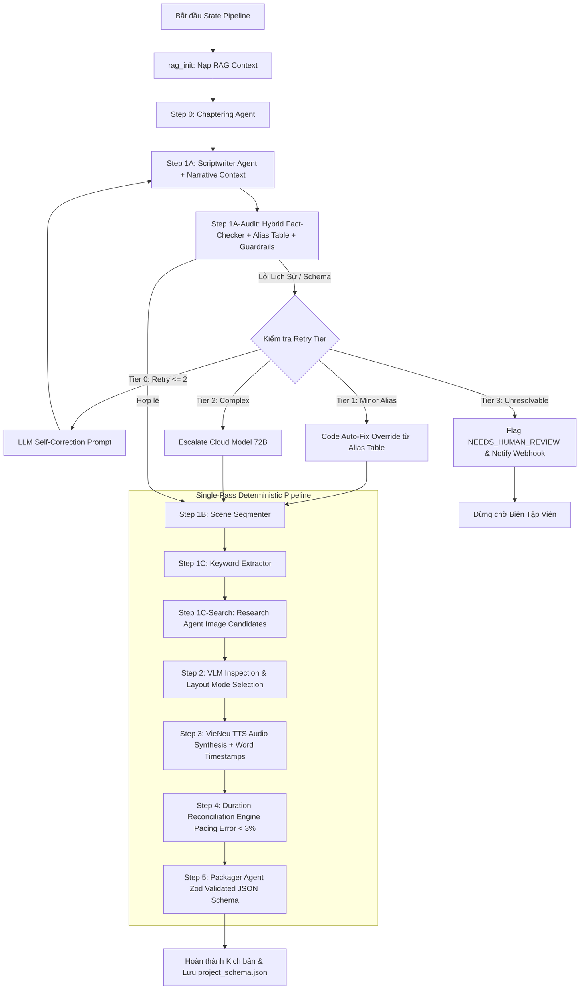

# CHI TIẾT MÔ-ĐUN 2: MULTI-AGENT ORCHESTRATOR
## (Content Synthesis, Cross-Chapter Continuity, Robust Fact-Checking & Small LLM Pipeline v4.1)

> **Trạng thái:** `[✅ IMPLEMENTED & VERIFIED 100% — LangGraph.js Multi-Agent Orchestrator & Sub-Intent Chatbot Pipeline v4.2]`
> **Cập nhật:** Tích hợp **Tiered Intent Routing & LLM Persona Stream** (`classifyChatIntent` + `handleChatQueryStream` với Multi-turn Continuation Guard `isContinuationOrCoreferenceQuery`), **Sub-Intent Chatbot Supervisor**, **VLM Cascade Early-Exit ($\ge 85$)** giảm 80% tải thị giác, Chuẩn hóa StateGraph với `Annotation.Root()`, tích hợp Native Checkpointer kế thừa `MemorySaver` lưu trữ PostgreSQL + Local Disk, phân luồng song song (Fan-out / Fan-in) cho TTS & VLM, Folklore Guardrail Gate (`folklore-validator.ts`), NLI Entailment Judge (`nli-hallucination-judge.ts`) và Human-In-The-Loop Streaming support.

---

## 1. Mục Đích & Vai Trò

Mô-đun **Multi-Agent Orchestrator** tiếp nhận dữ liệu tri thức lịch sử đã qua thẩm định từ Mô-đun 1 (Chrono-RAG) và đóng vai trò là **Hệ thống Điều phối Đa Agent (LangGraph.js State Machine trên Node.js/TypeScript)**. 

Mô-đun này được thiết kế và tối ưu hóa đặc biệt cho các **mô hình LLM nhỏ (Small LLM Models: Qwen-2.5-7B/14B, Llama-3.1-8B, DeepSeek-R1-Distill...)**, giải quyết triệt để bài toán quá tải context, đứt gãy JSON output, trôi giọng văn (tone reset) và ảo giác số liệu khi xử lý **video lịch sử dung lượng dài (5-15+ phút)** bằng phương pháp **Phân cấp Chapter (Hierarchical Chaptering)**, **Truyền Context Liên Tục (Cross-Chapter Narrative Flow)**, **Thẩm định Lịch sử Mềm Dẻo (Alias Table + Fuzzy Fact-Checking)**, **Cơ chế Thang Escalation Fallback 4 Tầng**, **Đối Soát Thời Lượng (Duration Reconciliation Engine)**, **VLM Hybrid Scorer (Gemini + Local CLIP)**, **Quản lý Bản quyền Ảnh (License Filtering & Attribution)** và **Idempotency Mịn Cấp Scene**.

Mô-đun chịu trách nhiệm:
1. **Phân chia Video Dài thành các Chương/Hồi (Micro-Step 0: Chaptering Agent)**: Mỗi chương từ 2-3 phút, khởi tạo `runningNarrativeState` giữ liền mạch giọng văn và mạch truyện xuyên suốt video dài.
2. **Quy trình sinh kịch bản 5 bước (Script Micro-Steps)**: 
   - Viết kịch bản lời thoại truyền `narrativeContext` (Micro-Step 1A).
   - Thẩm định lịch sử Hybrid Mềm Dẻo với Alias Table & Cross-Architecture/Heuristic Critic (Micro-Step 1A-Audit).
   - Chia Cảnh Scene Segmenter (Micro-Step 1B).
   - Đối soát & Cân bằng thời lượng Scene với Target Chapter Duration (Micro-Step 1B-Reconcile).
   - Trích xuất từ khóa crawl ảnh (Micro-Step 1C).
3. **Thực thi song song theo từng Cảnh (Scene-Level Parallelism & Fine-Grained Idempotency)** giữa công cụ sinh giọng nói TTS (VieNeu ONNX Engine) và thu thập tư liệu hình ảnh.
4. **Chiến lược 3+3 Candidates & Multi-Provider VLM Inspection (Research Agent tìm candidate pool + Local Unified Multimodal VLM `qwen3.5-9b-instruct-q4_k_m` / Cloud Gemini + Offline Local CLIP cho dev)**: Lọc ảnh theo giấy phép whitelisted (`Public Domain`, `CC0`, `CC-BY`), chấm điểm VLM linh hoạt với cơ chế auto failover khi ngắt kết nối/rate limit.
5. **Code Rules Engine & PURE_CODE Layout Rotation**: Tự động ép chuyển cảnh sang `PURE_CODE` khi cả 6 ảnh không đạt chuẩn và xoay vòng layout động (Animated Maps, Timelines, Quotes) để không gây chán mắt.
6. **Thang Xử Lý Lỗi 4 Tầng (4-Tier Escalation Path)**: Từ Self-Correction ➔ Code Override ➔ Cloud Model Escalation ➔ Human-in-the-Loop Review.
7. **Quản lý Checkpoint State vào PostgreSQL** qua LangGraph.js Postgres Checkpointer với Content Hash Keys cho phép resume chính xác từng scene/worker.
8. **Đóng gói JSON Schema v4.1 chuẩn xác (Zod Validated kèm License & Attribution)** và kích hoạt **Remotion Render Tool** (Mô-đun 4) để xuất video.

---

## 2. Sơ Đồ Kiến Trúc Đội Ngũ Agent & Tooling Ecosystem (v4.1 Tối Ưu Cho Small LLM & Video Dài)

```
                                   ┌───────────────────────────────┐
                                   │      Chrono-RAG Engine        │
                                   │   (Verified Context + Alias)  │
                                   └───────────────┬───────────────┘
                                                   │
                                                   ▼
                                   ┌───────────────────────────────┐
                                   │     MASTER ORCHESTRATOR       │
                                   │ (LangGraph.js + Postgres Check│
                                   │  + runningNarrativeState Flow)│
                                   └───────────────┬───────────────┘
                                                   │
                                                   ▼
                                   ┌───────────────────────────────┐
                                   │  MICRO-STEP 0: CHAPTER AGENT  │
                                   │ (Tách Video thành N Chapters) │
                                   └───────────────┬───────────────┘
                                                   │
                                                   ▼
┌────────────────────────────────────────────────────────────────────────────────────────────────────────────────────────┐
│                               CHAPTER-BASED SCRIPT PIPELINE (Vòng lặp từng Chapter kèm Narrative Context)            │
├───────────────────────┬───────────────────────────────┬─────────────────────────┬──────────────────────────────────────┤
│ (Micro-Step 1A)       │ (Micro-Step 1A-Audit)         │ (Micro-Step 1B)         │ (Micro-Step 1C)                      │
│ ▼                     │ ▼                             │ ▼                       │ ▼                                    │
│ ┌───────────────────┐ │ ┌───────────────────────────┐ │ ┌─────────────────────┐ │ ┌──────────────────────────────────┐ │
│ │ 1A. SCRIPTWRITER  │─┼─► 1A-AUDIT. FACT-CHECKER    │─┼─► 1B. SCENE SEGMENTER │─┼─► 1C. KEYWORD EXTRACTOR            │ │
│ │ - Nhận            │ │ │ - Alias Table & Fuzzy Match│ │ │ - Chia Scene (5s-25s)│ │ │ - Crawl Query (Entity/Alias)     │ │
│ │   narrativeContext│ │ │ - Cross-Model / Heuristic │ │ │ - Max 5-8 scenes     │ │ │ - Structured ImageSearchToolInput│ │
│ │ - Giữ tone liền   │ │ │ - 4-Tier Escalation Path  │ │ │                       │ │ │ - Bilingual Query Generation     │ │
│ └───────────────────┘ │ └───────────────────────────┘ │ └─────────────────────┘ │ └──────────────────────────────────┘ │
└───────────────────────┴───────────────────────────────┴────────────┬────────────┴──────────────────────────────────────┘
                                                                     │ (Scenes List Output)
                                                                     ▼
                                                     ┌───────────────────────────────────────────────┐
                                                     │    DETERMINISTIC SEQUENTIAL NODE PIPELINE     │
                                                     │    (In-Node Batch Parallelism via Promise.all)│
                                                     └───────────────┬───────────────────────────────┘
                                                                     │
                                                                     ▼
                                                     ┌───────────────────────────────────────────────┐
                                                     │       RESEARCH AGENT (Provider Chain)         │
                                                     │ - SerpAPI / Tavily / Brave / Wikimedia / Cat. │
                                                     │ - Domain Whitelist + License Pre-filtering    │
                                                     └───────────────┬───────────────────────────────┘
                                                                     │
                                                                     ▼
                                                     ┌───────────────────────────────────────────────┐
                                                     │       VLM INSPECTOR (3+3 Inspection)          │
                                                     │ - Visual Quality Gate + Gemini / Local CLIP   │
                                                     │ - PURE_CODE Layout Mode Auto-Fallback         │
                                                     └───────────────┬───────────────────────────────┘
                                                                     │
                                                                     ▼
                                                     ┌───────────────────────────────────────────────┐
                                                     │       VIE NEU TTS SYNTHESIS ENGINE            │
                                                     │ - Idempotent Audio Cache + Word Timestamps    │
                                                     └───────────────┬───────────────────────────────┘
                                                                     │
                                                                     ▼
                                                     ┌───────────────────────────────────────────────┐
                                                     │     DURATION RECONCILIATION ENGINE            │
                                                     │ - Auto-Sync durationInFrames (Pacing Err < 3%)│
                                                     └───────────────┬───────────────────────────────┘
                                                                     │
                                                                     ▼
                                                     ┌───────────────────────────────────────────────┐
                                                     │     JSON PACKAGER AGENT (shared-spec v4.1)    │
                                                     │ - Zod Validation -> project_schema.json       │
                                                     └───────────────┬───────────────────────────────┘
                                                                     │ (project_schema.json Validated)
                                                                     ▼
                                                     ┌───────────────────────────────────────────────┐
                                                     │    REMOTION RENDER ENGINE (render-worker)     │
                                                     │ (Pre-download + Chrome Headless Pool)         │
                                                     └───────────────────────────────────────────────┘
```

---

## 3. Phân Công Trách Nhiệm Chi Tiết Của Các Agent & Micro-Sub-Agents (v4.1)

### 3.1. Master Orchestrator (LangGraph.js Supervisor & Postgres Checkpointer)
* **Nhiệm vụ:** Quản lý vòng đời workflow, duy trì state liên chương (`runningNarrativeState`), lưu trữ Checkpoint State vào PostgreSQL qua LangGraph.js Postgres Checkpointer, điều phối các Micro-Agents và các Task thực thi song song, quản lý Thang Escalation Retry và khôi phục idempotent khi container rớt.
* **Quy tắc điều phối & State Schema:**
  * Quản lý chuyển thể trạng thái theo vòng đời đầy đủ: `INIT` ➔ `RAG_RETRIEVED` ➔ `OUTLINE_CHAPTERED` ➔ `CHAPTER_SCRIPT_GENERATED` ➔ `CHAPTER_FACT_CHECKED` ➔ `SCENES_SEGMENTED` ➔ `KEYWORDS_EXTRACTED` ➔ `RESEARCH_COMPLETED` ➔ `TTS_SYNTHESIZED` ➔ `DURATION_RECONCILED` ➔ `ASSETS_AUDITED` ➔ `PACKAGED` ➔ `RENDERING` ➔ `COMPLETED` / `NEEDS_HUMAN_REVIEW` / `FAILED` / `ABORTED`.
  * **Narrative Context Flow**: Lưu giữ và cập nhật `runningNarrativeState` sau mỗi Chapter gồm:
    ```typescript
    interface RunningNarrativeState {
      previousChapterSummary: string; // Tóm tắt Chapter vừa xong
      establishedTone: string;          // Hào hùng / Trầm lắng / Trang trọng...
      introducedEntities: string[];     // Các nhân vật/địa danh đã được giải thích
      transitionHook: string;           // Câu nối/gợi mở cho Chapter tiếp theo
    }
    ```
  * Ghi nhận checkpoint state mịn theo từng micro-step và từng Task (TTS/Crawl). Nếu container rớt, hệ thống resume dựa trên Content Hash Keys mà không gọi lại LLM hay sinh lại âm thanh/crawl lại ảnh.

### 3.2. Script Generation Pipeline (Tối Ưu Cho Small LLM & Video Dài)

#### 3.2.0. Chaptering & Outline Agent (Micro-Step 0)
* **Input:** Raw historical context từ Chrono-RAG + Yêu cầu độ dài video (`targetDurationMinutes`).
* **Nhiệm vụ:** Chia kịch bản tổng thể thành $N$ Chương/Hồi theo tỷ lệ động (`Math.max(1, Math.round(totalTargetSec / 150))`), mỗi Chapter có thời lượng target $T_{\text{target}}$ từ 2-3 phút (~120-180 giây), không áp đặt chặn cứng nhân tạo để hỗ trợ mượt mà các định dạng tài liệu dài 15-30+ phút. Khởi tạo cấu trúc `runningNarrativeState`.
* **Output:** Danh sách các Chapter Outline kèm tóm tắt nội dung, target duration, các sự kiện chính và bảng alias nhân vật/mốc lịch sử ban đầu.

#### 3.2.1. Scriptwriter Agent (Micro-Step 1A)
* **Input:** Context của Chapter $N$ từ Micro-Step 0 + `runningNarrativeState` từ Chapter $N-1$ + RAG Context chi tiết.
* **Nhiệm vụ:** Tập trung 100% khả năng sáng tạo lời thoại (Voiceover Script) hấp dẫn, giàu cảm xúc, chuẩn xác bối cảnh cho Chapter $N$. Sử dụng `runningNarrativeState` để:
  1. Tránh lặp lại câu từ giải thích thông tin đã giới thiệu ở các Chapter trước (`introducedEntities`).
  2. Duy trì giọng văn đồng nhất (`establishedTone`).
  3. Mở đầu bằng câu chuyển cảnh mượt nối tiếp `transitionHook`.
* **Cơ chế Serial Chained Generation & Lean 1+N Loop:**
  - Tự động điều phối theo cấu hình phần cứng: chạy tuần tự (Serial Loop) khi dùng single-slot local LLM nhằm tối đa hóa KV-cache và tránh tranh chấp tài nguyên; hỗ trợ parallel blueprint khi chạy Cloud/multi-slot.
  - Tiêm trực tiếp `previousChapterActualExit` (2 câu thực tế cuối cùng của Chapter $k-1$) vào prompt của Chapter $k$ kèm chỉ thị **Entity-Safe Anti-Echo**: nghiêm cấm sao chép nguyên văn cấu trúc câu hoặc tóm tắt lại cảnh trước, nhưng cho phép và khuyến khích các thực thể lịch sử cốt lõi tiếp tục xuất hiện tự nhiên.
  - Vòng lặp tinh chỉnh nhịp điệu (Pacing Refinement Loop) được chuẩn hóa kích hoạt khi WPM chệch khỏi ngưỡng $\pm 12\%$ so với WPM mục tiêu của template (bảo đảm tỷ lệ đạt chuẩn benchmark $\le 15\%$).
  - **Triệt tiêu 100% Static Canned Fallback**: Xóa bỏ hoàn toàn văn bản tĩnh đóng cứng. Khi LLM timeout hoặc rỗng kết quả, hệ thống chạy 1-pass Context-Reduction Retry (`temperature: 0.0`), sau đó sử dụng **Deterministic Historical Synthesizer** định dạng trực tiếp các sự kiện RAG đã thẩm định với dấu ngoặc kép (`"..."`) và nguồn trích dẫn.
  - Idempotency cấp Checkpoint: Lưu trữ và tái sử dụng `state.chapterScripts` để resume mượt mà từ Chapter $k$ khi có sự cố mà không cần sinh lại các chương trước.
* **Output:** Văn bản kịch bản thuần (Markdown/Text) của Chapter $N$.

#### 3.2.2. Hybrid Fact-Checker Agent Mềm Dẻo (Micro-Step 1A-Audit)
* **Input:** Kịch bản lời thoại từ Micro-Step 1A + RAG Verified Context + Historical Entity Alias Table.
* **Nhiệm vụ:** Thẩm định độ chính xác lịch sử của kịch bản một cách thông minh, cực nhanh qua 3 tầng (3-Tier Hybrid Fact-Checking):
  1. **Tier 1 - Safe Epoch Date Guard ($\le 1\text{ms}$)**:
     - Trích xuất mốc năm đối xứng (`extractHistoricalTimeBounds`) hỗ trợ cả năm 2 chữ số (năm 40, năm 43), năm trước Công nguyên (257 TCN $\rightarrow -257$), và bộ lọc phủ định đơn vị trường độ `(?!\s*(?:năm|tháng|ngày|vạn|nghìn|triệu|quân|lính))` để những cụm từ như *"1000 năm Bắc thuộc"* không bao giờ kích hoạt báo động niên đại giả.
     - Vùng biên niên đại an toàn $[\text{minYear}-50, \text{maxYear}+50]$ cho phép các sự kiện tiền đề/bối cảnh lịch sử diễn ra trước hoặc sau thời kỳ mà không bị cờ lỗi sai hoặc gọi LLM tốn kém.
  2. **Tier 2 - Entity & Historical Anchor Verification ($\le 5\text{ms}$)**:
     - Đối chiếu danh xưng và thực thể qua **Alias Table** động và Từ điển Thực thể Lịch sử chuẩn (`HISTORICAL_PERSON_DICTIONARY`, `HISTORICAL_LOCATION_DICTIONARY`).
     - Yêu cầu tỷ lệ thực thể được xác thực $\ge 60\%$ và kiểm tra không có sự xâm nhập của các triều đại/thời kỳ lệch pha.
     - Áp dụng Negative Lookbehind/Lookahead regex (`(?<!canonical\s*)\balias\b(?!\s*canonical)`) để bảo toàn nguyên vẹn danh xưng tôn kính (ví dụ: *"Tiền Ngô Vương Ngô Quyền"* không bị biến thành *"Ngô Quyền Ngô Quyền"*).
  3. **Tier 3 - Neural CoT NLI Judge (Chỉ chạy khi có dị thường thực sự)**:
     - Dự phòng cục bộ mô hình Qwen NLI Entailment Judge (`nli-hallucination-judge.ts`) chỉ kích hoạt khi phát hiện dị thường niên đại vượt ngưỡng hoặc thực thể ngoài thời kỳ.
     - Trả về `NEUTRAL` và điểm `0.0` (unverified) khi không có ground truth từ RAG, ngăn chặn triệt để silent false-passes.
  4. **Folklore Tone Guardrail (`folklore-validator.ts`)**:
     - Quét nhận diện linh hoạt các biến thể ngữ nghĩa dã sử/truyền thuyết (*"theo truyền thuyết dân gian"*, *"dân gian lưu truyền"*, *"huyền sử chép"*, *"truyện xưa tích cũ"*, *"tương truyền"*).
* **Cơ chế Thang Escalation Fallback 4 Tầng (4-Tier Escalation Path)**:
  - *Lần 1 & 2 (Tier 0 - LLM Self-Correction)*: Gửi Self-Correction Prompt kèm lỗi diff chính xác để LLM nhỏ viết lại (hỗ trợ chuẩn hóa văn phong truyền thuyết / dã sử).
  - *Lần 3 (Tier 1 - Context-Safe Code Auto-Fix Override)*: Nếu lỗi chỉ nằm ở việc dùng sai tên riêng đơn lẻ hoặc thiếu prefix giả thuyết, Code Engine tự động thay thế/bổ sung bằng tên chuẩn từ RAG mà không gọi lại LLM.
  - *Lần 4 (Tier 2 - NLI Hallucination Flag & Audit Logging)*: Đánh dấu cờ phát hiện Hallucination từ NLI Judge (`escalationTier = 2`) và ghi nhận audit log chi tiết phục vụ giám sát chất lượng.
  - *Lần 5 (Tier 3 - Human-in-the-Loop Flagging)*: Đánh dấu trạng thái Chapter là `NEEDS_HUMAN_REVIEW`, chuyển state sang chế độ chờ duyệt. Pipeline resume trực tiếp từ node `segmenter` khi được duyệt.

#### 3.2.3. Scene Segmenter & Layout Mapper Agent (Micro-Step 1B)
* **Input:** Kịch bản lời thoại đã được Fact-Check từ Micro-Step 1A-Audit + `templateId`.
* **Nhiệm vụ:** Chia kịch bản Chapter thành các Cảnh (Scenes, thời lượng 5s–25s/scene).
  - **Bảo vệ Từ Viết Tắt Nâng Cao (Context-Aware Lookahead Masking):**
    - Chức danh/địa danh: `/(?:GS|PGS|TS|ThS|TP|TX|TT)\.\s+(?=[A-ZÀ-Ỹ])/g`
    - Cụm từ "v.v.": `/(v\.v)\.(?=\s*[,a-zà-ỹ])/gi` (bảo toàn ngắt câu nếu theo sau là chữ hoa).
  - **Nhận diện Layout Trích Dẫn & Thơ Ca:** Regex phi tham lam `/["“'‘][^"”'’\n]{5,300}["”'’]/` bảo đảm các trích dẫn dài hoặc đoạn thơ lịch sử được ánh xạ chuẩn layout `QUOTE_SLIDE` hoặc `POEM_RECITING` mà không bị cắt xén qua ranh giới câu.
  - **Hợp nhất câu ngắn (Sentence Merging):** Tự động gộp các câu thoại ngắn ($< 8$ từ hoặc $< 2.5\text{s}$) vào câu liền kề để loại trừ các phân cảnh manh mún ($< 3.0\text{s}$).
  - **Dự toán thời lượng mục tiêu theo số từ (Word Count Target Duration):**
    $$\text{targetDurationSeconds} = \max(5, \min(25, \lceil \text{wordCount} / (\text{targetWpm} / 60) \rceil))$$
    với `targetWpm` cấu hình động theo template (145 WPM cho Documentary, 160 WPM cho Shorts, 150 WPM cho News).

#### 3.2.4. Duration Reconciliation Engine (Micro-Step 1B-Reconcile)
* **Input:** Danh sách các Cảnh + Target Chapter Duration ($T_{\text{target}}$).
* **Nhiệm vụ:** Sau khi Worker A sinh file âm thanh TTS cho các Scene, Code Engine thực hiện điều hòa thời lượng hai chế độ (Dual-Mode Reconciliation) bảo đảm **zero dead silence** (khoảng lặng $\le 0.5\text{s}$) và **pacing error $< 1.5\%$**:
  - **Mode A ($|totalAudio - targetTotalSec| \le 10\%$):** Phân bổ độ lệch dư vào các cảnh, khống chế trần đệm an toàn tối đa $\minRequiredSec + 0.6\text{s}$ trên mỗi phân cảnh nhằm loại bỏ hoàn toàn khoảng lặng chết trên timeline Remotion.
  - **Mode B ($|totalAudio - targetTotalSec| > 10\%$):** Kích hoạt cơ chế Audio-Driven Grounding, tôn trọng thời lượng phát âm thanh thực tế của mô hình TTS và bổ sung 1 thẻ kết (outro card) $1.5\text{s}$ ở cuối thay vì kéo giãn nhân tạo thời lượng hình ảnh.

#### 3.2.5. Visual Query Planning & Keyword Extractor Agent (Micro-Step 1C)
* **Input:** Danh sách các scenes trong Chapter có `contentType: "IMAGE"`, `ragContext` và `userPrompt`.
* **Nhiệm vụ:** Hoạt động như một **Query Planning Agent**:
  - Khi có LLM: Phân tích `voiceoverText` của từng cảnh, tự động sinh ra cấu trúc **`ImageSearchToolInput`** chuẩn (`sceneId`, `primaryQuery` tiếng Việt giàu ngữ cảnh lịch sử, `englishQuery` chuẩn xác cho kho ảnh quốc tế, `visualType`: `PORTRAIT` / `BATTLE_SCENE` / `MAP_CHRONO` / `ARTIFACT` / `LANDSCAPE` / `ARCHAEOLOGY` / `GENERAL_HISTORICAL`, `historicalPeriod`, `aspectRatio`: `16:9` / `9:16` / `1:1`, và `minResolution`: `HD` / `FHD` / `4K`).
  - Khi Offline/Fallback: Áp dụng thuật toán bóc tách thực thể song ngữ (loại bỏ dấu tiếng Việt + nhận diện `inferVisualTypeHeuristic`) để tạo ra `searchParams` và mảng `searchKeywords` hợp lệ.

#### 3.2.6. Research Agent (Micro-Step 1C — Agentic Tool Image Search)
* **Input:** `searchParams` (`ImageSearchToolInput`) của từng Scene từ Keyword Planning Agent.
* **Nhiệm vụ:** Thực thi Tool **`executeImageSearchTool`** qua **Provider Chain**: `SerpAPI (Google Images)` → `Tavily` → `Brave Search API` → `Wikimedia Commons Live` → `Curated Catalog` (14 tư liệu lịch sử verified).
* **Bilingual Multi-Query Strategy:** Tìm kiếm đồng thời với `englishQuery` và `primaryQuery` để tối đa hóa khả năng tìm được tư liệu lịch sử chính thống từ Wikimedia Commons và các bảo tàng thế giới.
* **Concurrency Pool & License Safety:** Xử lý theo batch (concurrency pool = 4), chỉ chấp nhận ảnh từ **domain whitelist** (`upload.wikimedia.org`, `commons.wikimedia.org`, `flickr.com`, bảo tàng) với giấy phép bản quyền hợp lệ (`Public Domain`, `CC0`, `CC-BY`, `CC-BY-SA`).
* **Output:** Lưu vào state `researchResults[sceneId]` gồm `candidates` (gắn mã `cand_${sceneId}_XX`), `provenance` và `resolvedAt` cho VLM Inspector.

---

### 3.3. Parallel Worker A: Sound Design & TTS Agent
* **Nhiệm vụ:** Nhận `voiceoverText` của từng Scene, tính toán tỷ lệ tốc độ thích ứng:
  $$\text{speedRatio} = \text{clamp}(0.95, 1.15, \text{estimatedAudioSec} / \text{targetDurationSeconds})$$
  và kiểm tra **Idempotency Hash Key** kết hợp `speedRatio`:
  $$\text{hash}(chapterId + sceneId + voiceoverText + speedRatio)$$
  Nếu file audio đã tồn tại trên local/S3, tái sử dụng ngay. Ngược lại, gọi **VieNeu ONNX TTS Engine** qua API `POST /api/v1/synthesize` kèm tham số `speedRatio` để xuất WAV + `wordTimestamps` được chuẩn hóa tỉ lệ chuẩn xác.

---

### 3.4. Parallel Worker B: Research Agent & Lazy Sequential VLM Inspector
* **Nhiệm vụ:** 
  1. **Nhận candidate pool từ Research Agent** (state `researchResults[sceneId]`).
  2. **Tiền Lọc Giấy Phép Bản Quyền (Pre-Download Whitelist Filter)**: Kiểm tra siêu dữ liệu giấy phép (`Public Domain`, `CC0`, `CC-BY-4.0`, `CC-BY-SA-4.0`) ngay trước khi tải file ảnh lớn về máy.
  3. **Xếp Hạng Nguồn Gốc (Provenance Ranking)**: Ưu tiên ứng viên theo thứ tự chất lượng tư liệu: `catalog` (Rank 3) > `wikimedia` (Rank 2) > web search (Rank 1).
  4. **Thẩm Định Tuần Tự Tinh Gọn (Lazy Sequential VLM Curation)**:
     - Đánh giá ứng viên tốt nhất (#1): Chạy kiểm tra kỹ thuật (Sharp resizer, format header), sau đó gọi VLM Inspector. Nếu đạt yêu cầu ($\ge 60$ điểm), lập tức chọn và kết thúc ngay (chỉ tốn đúng 1 lượt gọi VLM).
     - Chỉ khi ứng viên #1 không đạt kỹ thuật hoặc bị từ chối, hệ thống mới tiếp tục thẩm định ứng viên #2 trước khi kích hoạt `PURE_CODE`.
  5. **Chế Độ Scorer**:
     - *Eval strict (`EVAL_STRICT=true`)*: **Local Unified VLM (`qwen3.5-9b-instruct-q4_k_m` qua llama-server)** là scorer bắt buộc.
     - *Dev Fast Mode (`FAST_DEV_MODE=true` & `EVAL_STRICT=false`)*: Cho phép sử dụng bộ heuristic CLIP nội bộ tốc độ cao.
     - *Dev primary*: VLM Cloud API (Gemini 3.6 Flash) khi có API key.
  6. **Code Fallback Trigger**: Khi không có ứng viên nào đạt chuẩn $\ge 60$ ➔ Ép cảnh sang `PURE_CODE` và xoay vòng layout.

---

### 3.5. Code Rules Engine (TypeScript Helper & Layout Rotation)
* **Nhiệm vụ:**
  1. Tính toán `durationInFrames` theo chuẩn 30 FPS với giới hạn đệm an toàn bảo vệ âm thanh:
     $$\text{durationInFrames} = \max(90, \max(\lceil \text{targetDurationSeconds} \times \text{FPS} \rceil, \lceil (\text{audioDurationSeconds} + 0.2) \times \text{FPS} \rceil))$$
     Bảo đảm mỗi phân cảnh tối thiểu 3 giây ($90\text{ frames}$), âm thanh không bao giờ bị cắt cụt, và khoảng đệm đuôi luôn $\le 0.5\text{s}$.
  2. **PURE_CODE Layout Rotation Engine**: Luân phiên tự động chọn giữa `STAT_CARD`, `VERSUS_CARD`, `TIMELINE_CHRONO`, `QUOTE_SLIDE`, `POEM_RECITING`, `CHAPTER_CARD` khi nhiều cảnh liên tiếp không có ảnh tư liệu.

---

### 3.6. Fine-Grained Idempotency & Resume Layer
* **Cơ chế:** Để đảm bảo khi container restart mid-execution không gây tốn tài nguyên hoặc crawl/TTS lại:
  - **Audio Key:** `hash(chapter_id + scene_id + voiceover_text).wav`
  - **Image Key:** `hash(chapter_id + scene_id + query_string).json` (Chứa 6 candidate URLs + scores)
  - Postgres Checkpointer ghi nhận chính xác trạng thái từng Scene. Khi resume, worker bỏ qua bất kỳ Task nào đã có Output Hash hợp lệ.

---

### 3.7. Remotion Render Engine Tool (Mô-đun 4)
* **Nhiệm vụ:** Nhận JSON Schema v4.1 đã qua Zod validation hoàn chỉnh (bao gồm cả dữ liệu `license` & `attribution`), thực hiện pre-download asset và render video MP4.

---

### 3.8. Web Chatbot Supervisor & Video Brief Compiler (`src/chat/` & `src/brief/`)
* **Web Chatbot Supervisor (`chat/chat-supervisor.ts`):**
  - Trợ lý hội thoại lịch sử đa lượt hỗ trợ Server-Sent Events (SSE) Streaming.
  - **Entity-Anchor First Multi-Clause Router & Composite Intent Synthesizer (`IntentClassifier` - ADR-8 & ADR-15):**
    - **Non-Destructive Semantic Clause Decomposition (`splitQueryIntoSemanticClauses`):** Tách câu phức/đa ý định dựa trên dấu câu ngắt câu (`?`, `.`, `!`, `;`, `\n`) và liên từ chuyển tiếp câu (`và`, `đồng thời`, `nhân tiện`, `với lại`), đồng thời bảo vệ các thực thể liên từ song song (ví dụ: *"Quang Trung và Nguyễn Huệ"* không bị cắt đôi).
    - **Entity-Anchor Isolation (`cleanHistoricalClause`):** Định vị chính xác mệnh đề lịch sử dựa trên Master Historical Entities Table (`packages/shared-spec`). Tách rời các mệnh đề chào hỏi (`CHITCHAT`), hỏi phạm vi (`BOT_CAPABILITY_INQUIRY`) hoặc lạc đề (`OUT_OF_SCOPE`) mà không dùng chuỗi regex cắt xén xói mòn (anti-overfitting).
    - **Pristine Search Topic Extraction:** Xuất ra `cleanSearchTopic` tinh khiết (ví dụ: `"Bác Hồ là ai"` thay vì chuỗi bị ô nhiễm bởi lời chào) chuyển trực tiếp cho BM25 + BGE-M3 Vector RAG, đảm bảo Recall $\ge 95\%$ ngay cả với câu hỏi hỗn hợp nhiều ý định.
    - **2-Tier Cascading Intent Router:**
      - **Tier 1 (Fast Regex Filter <1ms):** Lọc siêu tốc các câu thuần `CHITCHAT`, `OUT_OF_SCOPE`, `AMBIGUOUS` mà không tốn token LLM.
      - **Tier 2 (Semantic Sub-Intent Router):** Phân loại chuyên sâu các câu hỏi lịch sử thành 4 nhóm: `FACTOID_LOOKUP` (tra cứu sự kiện, niên đại), `GENEALOGY_RELATION` (thế thứ, dòng tộc), `BATTLE_TACTICS` (diễn biến trận đánh), `COMPARATIVE_SYNTHESIS` (so sánh đa thời kỳ) để phân bổ ngân sách tìm kiếm RAG động.
    - **Composite Intent & Video Handover Contract (`CompositeIntentResultSchema` & `VideoHandoverMetadataSchema`):** Gói toàn bộ danh sách mệnh đề (`clauses`), tín hiệu tổng hợp (`signals: hasHistorical, hasChitchat, hasCapabilityInquiry...`) và đối tượng `videoHandover` vào payload SSE (`intent` và `done` events). Frontend 1-click CTA tiêu thụ trực tiếp metadata này mà không cần cào trích xuất (anti-scraping).
  - **Static Prefix KV-Caching Architecture (ADR-14):**
    - Cố định 100% `SYSTEM_PERSONA_PREFIX` ở đầu System Prompt.
    - Chuyển toàn bộ ngữ cảnh động (RAG context, Graph triples, Entity warnings) vào tin nhắn User dưới thẻ XML-like `<historical_context>`, đảm bảo `llama-server` đạt $>95\%$ KV-Cache hit rate và giảm TTFT từ 30s xuống **$<2$ giây**.
  - **Bridge Graph & Entity-Priority Context Pruner (`context-pruner.ts` - ADR-9):**
    - Thay thế việc cắt tỉa ngẫu nhiên bằng cơ chế xếp hạng ưu tiên: (1) **Direct Bridge Triples** kết nối trực tiếp 2 thực thể có trong câu hỏi ($Entity_A \leftrightarrow Entity_B$), (2) **Core Identity Triples** (Tên húy, niên hiệu, năm sinh/mất), (3) **1-Hop Active Relations** theo confidence score, triệt tiêu hoàn toàn ảo giác phả hệ.
  - **`QueryRewriter`**: Tự động bổ sung ngữ cảnh lịch sử từ các lượt chat trước vào câu hỏi mơ hồ của người dùng trước khi truy vấn RAG.
* **Video Brief Compiler (`brief/chat-to-brief-compiler.ts`):**
  - Trích xuất và tổng hợp ý định làm video từ luồng hội thoại thành cấu trúc **`VideoBrief`** chuẩn (`briefId`, `conversationId`, `topic`, `title`, `historicalPeriod`, `keyEntities`, `targetDurationSec`, `aspectRatio`, `narrativeTone`).
  - Lưu trữ trực tiếp vào bảng `video_briefs` trong PostgreSQL phục vụ khởi tạo pipeline video tự động.

---

### 3.9. Historical Guardrails & Quality Assurance (`src/guardrails/`)
* **Anti-Sycophancy Guardrail (`anti-sycophancy.ts`):** Ngăn chặn mô hình đồng thuận mù quáng với các khẳng định sai lệch hoặc câu hỏi gài bẫy lịch sử từ người dùng.
* **Folklore Tone Guardrail (`folklore-validator.ts`):** Quét phát hiện các câu chuyện truyền thuyết / dã sử (Level 3) và bắt buộc chèn prefix giả thuyết (*"Theo truyền thuyết dân gian..."*, *"Tương truyền rằng..."*).
* **NLI Hallucination Judge (`nli-hallucination-judge.ts`):** Sử dụng mô hình Natural Language Inference chấm điểm Entailment Score giữa kịch bản sinh ra và trích đoạn RAG gốc (ngưỡng $\ge 0.80$). Trả về trạng thái `NEUTRAL` và điểm `0.0` (unverified) khi không có ground truth từ RAG, ngăn chặn silent false-passes.
* **Stream De-duplicator (`stream-dedup.ts`):** Loại bỏ hiện tượng lặp từ và câu trong token stream thời gian thực.

---

## 4. Cơ Chế Kiểm Tra Lỗi, Retry & Thang Escalation Fallback (v4.1)

Hệ thống thiết lập **Cơ chế Kiểm tra Lỗi 4 Tầng & Escalation Matrix** bảo đảm không bao giờ bị "treo" ở trạng thái `FAILED`:

```
┌────────────────────────────────────────────────────────────────────────────────────────────────────────┐
│                               MASTER ORCHESTRATOR ESCALATION MATRIX (v4.1)                            │
├────────────────────────┼───────────────────────────┼───────────────────────────────────────────────────┤
│ Điểm Phát Sinh Lỗi     │ Loại Lỗi Runtime          │ Chiến Lược Kiểm Tra, Retry & Thang Escalation     │
├────────────────────────┼───────────────────────────┼───────────────────────────────────────────────────┤
│ 1. Fact-Check & Script │ Lỗi mốc năm/tên riêng     │ - Tier 0: LLM Self-Correction (Retry <= 2 lần).   │
│    Micro-Steps         │ sai hoặc JSON schema hỏng │ - Tier 1: Deterministic Code Auto-Fix Override    │
│                        │                           │   (Tự sửa tên riêng dựa trên Alias Table).        │
│                        │                           │ - Tier 2: Escalate Cloud Model 72B (sửa 1 pass).  │
│                        │                           │ - Tier 3: Flag trạng thái NEEDS_HUMAN_REVIEW,     │
│                        │                           │   gửi Alert Webhook/UI để biên tập viên duyệt.   │
├────────────────────────┼───────────────────────────┼───────────────────────────────────────────────────┤
│ 2. TTS Voiceover       │ API VieNeu Timeout hoặc   │ - Idempotency Check Hash Key trước khi gọi.       │
│                        │ file âm thanh hỏng/0-byte │ - Retry Exponential Backoff (1s, 2s, 4s).         │
│                        │                           │ - Dev: Dual-Layer Fallback `SyntheticTTSFallbackEngine`│
│                        │                           │   sinh audio tone 480Hz để render không ngắt.      │
│                        │                           │ - Eval strict: TTS fail → throw `[EVAL_STRICT]`,   │
│                        │                           │   KHÔNG dùng sine-wave giả.                        │
├────────────────────────┼───────────────────────────┼───────────────────────────────────────────────────┤
│ 3. Asset Research &    │ Research 404 / VLM < 60 /│ - Lọc Whitelisted License (PD, CC0, CC-BY).       │
│    VLM Inspection      │ Gemini API Rate Limit 429 │ - Chiến lược 3+3 Candidates (Research Agent).     │
│                        │                           │ - Dev: Cloud VLM Gemini fail ➔ Auto-Fallback sang  │
│                        │                           │   Local CLIP/SigLIP Cosine Scorer (Offline).      │
│                        │                           │ - Eval strict: Local VLM fail → throw `[EVAL_STRICT]`.│
│                        │                           │ - Cả 6 ảnh < 60 ➔ Code Layout Rotation PURE_CODE. │
├────────────────────────┼───────────────────────────┼───────────────────────────────────────────────────┤
│ 4. Duration Mismatch   │ Tổng Scene Duration lệch  │ - Micro-Step 1B-Reconcile đối soát:               │
│                        │ > 15% so với Chapter Target│ - Quá ngắn (<85%): Tự chèn Timeline/Quote layout. │
│                        │                           │ - Quá dài (>115%): Auto-gộp scene/micro-trim.     │
├────────────────────────┼───────────────────────────┼───────────────────────────────────────────────────┤
│ 5. Remotion Render     │ Remotion CLI lỗi bundle   │ - Pre-flight Check: Pre-download asset về local.  │
│    Execution           │ hoặc thiếu file asset     │ - Auto-Sanitize JSON: Xóa props hư hỏng.          │
└────────────────────────┴───────────────────────────┴───────────────────────────────────────────────────┘
```

### 4.1. Sơ Đồ Luồng Xử Lý State Machine (v4.1 State Machine Flow Diagram)



---

## 5. Giao Tiếp Với Remotion Tool & JSON Schema v4.1 (TypeScript Zod Specs)

Master Orchestrator truyền dữ liệu chuẩn hóa cho Remotion Tool và các gói con thông qua Single Source of Truth tại `@chronoviet/shared-spec`:

```typescript
import { z } from 'zod';

// 1. License & Attribution Schemas
export const LicenseTypeSchema = z.enum([
  'PUBLIC_DOMAIN',
  'CC0',
  'CC_BY_4_0',
  'CC_BY_SA_4_0',
  'UNKNOWN',
]);

export const AttributionSchema = z.object({
  author: z.string(),
  sourceUrl: z.string().optional(),
  license: z.string().optional(),
});

// 2. Audio Timestamps & Karaoke Captions Schemas
export const CaptionWordSchema = z.object({
  word: z.string(),
  startFrame: z.number().int().min(0),
  endFrame: z.number().int().min(0),
});

export const WordTimestampSchema = z.object({
  word: z.string(),
  startMs: z.number().min(0),
  endMs: z.number().min(0),
});

// 3. Layout Modes & Classification Sets
export const LayoutModeSchema = z.enum([
  'BLUR_BG',
  'HISTORICAL_FRAME',
  'QUOTE_CANVAS',
  'QUOTE_SLIDE',
  'CHAPTER_CARD',
  'ARTICLE_UI',
  'SPONSOR_UI',
  'OUTRO_CARD',
  'SPLIT_COMPARE',
  'FULL_CONTAIN',
  'FULL_COVER',
  'TITLE_CARD',
  'STAT_CARD',
  'VERSUS_CARD',
  'BULLET_HIGHLIGHT',
  'MUSEUM_TAG',
  'SPLIT_THEORY',
  'VIGNETTE_DARK',
  'CENTER_SCALE',
  'PURE_IMAGE_FULL',
  'DOCUMENTARY_GRID',
  'NEWSPAPER_ARCHIVE',
  'GALLERY_3D',
  'HERO_SPOTLIGHT',
  'TIMELINE_CHRONO',
  'MAP_TACTICAL',
  'ARMY_STRENGTH',
  'CHARACTER_PROFILE',
  'ROYAL_DECREE',
  'ARTIFACT_INSPECT',
  'POEM_RECITING',
]);

export const PURE_IMAGE_LAYOUTS = new Set([
  'BLUR_BG',
  'HISTORICAL_FRAME',
  'FULL_COVER',
  'FULL_CONTAIN',
  'CENTER_SCALE',
  'VIGNETTE_DARK',
  'SPLIT_COMPARE',
  'PURE_IMAGE_FULL',
  'DOCUMENTARY_GRID',
  'NEWSPAPER_ARCHIVE',
  'GALLERY_3D',
]);

// 4. Orchestrator Internal Scene Generation (Graph State)
export const VisualCandidateSchema = z.object({
  candidateId: z.string(),
  imageUrl: z.string().min(1),
  sourceUrl: z.string().optional(),
  title: z.string().optional(),
  author: z.string().optional(),
  license: LicenseTypeSchema,
  localPath: z.string().optional(),
  sha256: z.string().optional(),
  pHash: z.string().optional(),
  score: z
    .object({
      historicalContextScore: z.number().min(0).max(100),
      visualNoiseScore: z.number().min(0).max(100),
      artisticFitScore: z.number().min(0).max(100),
      overallScore: z.number().min(0).max(100),
    })
    .optional(),
  verdict: z.enum(['PASS', 'REJECT']).optional(),
  candidateBatch: z.union([z.literal(1), z.literal(2)]).default(1),
});

export const SceneGenerationSchema = z.object({
  sceneId: z.string(),
  sceneIndex: z.number().int().min(0),
  voiceoverText: z.string().min(1),
  layoutMode: LayoutModeSchema,
  contentType: z.enum(['IMAGE', 'PURE_CODE']).default('IMAGE'),
  targetDurationSeconds: z.number().positive(),
  searchKeywords: z.array(z.string()).default([]),
  searchParams: z
    .object({
      sceneId: z.string().optional(),
      primaryQuery: z.string().min(1),
      englishQuery: z.string().optional(),
      visualType: z.string().optional(),
      historicalPeriod: z.string().optional(),
      limit: z.number().optional(),
    })
    .optional(),
  candidates: z.array(VisualCandidateSchema).default([]),
  selectedAsset: VisualCandidateSchema.optional(),
  audioPath: z.string().optional(),
  audioDurationSeconds: z.number().optional(),
  wordTimestamps: z.array(WordTimestampSchema).optional(),
  usePureCodeFallback: z.boolean().default(false),
});

// 5. Remotion Render Engine Output Scene (TimelineSceneSchema)
export const TimelineSceneSchema = z.object({
  id: z.string(),
  type: z.enum(['PURE_CODE', 'PURE_IMAGE']).optional(),
  durationInFrames: z.number().optional(),
  durationInSeconds: z.number().optional(),
  startTime: z.number().optional(),
  endTime: z.number().optional(),
  layoutMode: LayoutModeSchema.optional(),
  overlayType: z.string().optional(),
  component: z.string().optional(),
  text: z.string().optional(),
  captions: z.array(CaptionWordSchema).optional(),
  assetUrl: z.string().optional(),
  assetMetadata: AssetMetadataSchema.optional(),
  secondaryAssetUrl: z.string().optional(),
  secondaryAssetMetadata: AssetMetadataSchema.optional(),
  effect: KenBurnsEffectSchema.optional(),
  customKenBurns: CustomKenBurnsSchema.optional(),
  filterStyle: FilterStyleSchema.optional(),
  rotateDeg: z.number().optional(),
  fallbackLayoutMode: LayoutModeSchema.optional(),
  fallbackOverlayData: OverlayDataSchema.optional(),
  transition: TransitionTypeSchema.optional(),
  transitionDurationFrames: z.number().optional(),
  sceneAudioUrl: z.string().optional(),
  sfxUrl: z.string().optional(),
  soundEffects: z.array(SoundEffectSchema).optional(),
  attribution: AttributionSchema.optional(),
  license: LicenseTypeSchema.optional(),
  overlayData: OverlayDataSchema.optional(),
  hideSubtitle: z.boolean().optional(),
  hideHeader: z.boolean().optional(),
  layoutProps: z.record(z.string(), z.unknown()).optional(),
});

// 6. Complete Video Project Schema (ChronoVideoScriptSchema / VideoProjectSchema)
export const ChronoVideoScriptSchema = z.object({
  title: z.string(),
  subtitle: z.string().optional(),
  videoType: VideoDomainSchema.optional(),
  templateId: TemplateIdSchema.optional(),
  theme: ThemeConfigSchema.optional(),
  aspectRatio: AspectRatioSchema.default('16:9'),
  audioUrl: z.string().optional(),
  captionsUrl: z.string().optional(),
  bgmUrl: z.string().optional(),
  bgmVolume: z.number().optional(),
  defaultLayoutMode: LayoutModeSchema.optional(),
  defaultFilterStyle: FilterStyleSchema.optional(),
  defaultTransition: TransitionTypeSchema.optional(),
  enableTransitions: z.boolean().optional(),
  timeline: z.array(TimelineSceneSchema),
  captions: z.array(CaptionWordSchema).optional(),
  fps: z.number().optional(),
});

export const VideoProjectSchema = ChronoVideoScriptSchema;

// 7. Orchestrator Lifecycle Statuses & Checkpointing
export const OrchestratorStatusSchema = z.enum([
  'INIT',
  'RAG_RETRIEVED',
  'OUTLINE_CHAPTERED',
  'CHAPTER_SCRIPT_GENERATED',
  'CHAPTER_FACT_CHECKED',
  'SCENES_SEGMENTED',
  'RESEARCH_COMPLETED',
  'TTS_SYNTHESIZED',
  'DURATION_RECONCILED',
  'KEYWORDS_EXTRACTED',
  'ASSETS_AUDITED',
  'PACKAGED',
  'RENDERING',
  'COMPLETED',
  'NEEDS_HUMAN_REVIEW',
  'FAILED',
  'ABORTED',
]);

export type ChronoVideoScript = z.infer<typeof ChronoVideoScriptSchema>;
export type VideoProject = ChronoVideoScript;
export type TimelineScene = z.output<typeof TimelineSceneSchema>;
export type SceneGeneration = z.infer<typeof SceneGenerationSchema>;
export type VisualCandidate = z.infer<typeof VisualCandidateSchema>;
export type OrchestratorStatus = z.infer<typeof OrchestratorStatusSchema>;
export type Attribution = z.infer<typeof AttributionSchema>;
```

---

## 6. Tiêu Chí Nghiệm Thu Mô-đun Multi-Agent (v4.1)

1. **Độ Tin Cậy & Tính Liền Mạch (Cross-Chapter Continuity):** Giọng văn, từ ngữ giải thích và bối cảnh được duy trì mượt mà xuyên suốt video 10-15+ phút nhờ `runningNarrativeState` truyền qua các Chapter.
2. **Đảm Bảo Chất Lượng Lịch Sử Mềm Dẻo (Alias-Aware Fact-Checking):** Tránh false-positive nhờ **Historical Entity Alias Table**, diacritics normalization và kiểm tra logic đa mô hình / heuristic rules.
3. **Không Bao Giờ Bị Treo Pipeline (4-Tier Escalation Path):** Khi retry quá 2 lần, tự động kích hoạt Code Auto-Fix Override, Cloud Model Escalation hoặc flag `NEEDS_HUMAN_REVIEW` cho biên tập viên.
4. **Đối Soát Thời Lượng Chuẩn Xác (Duration Reconciliation):** Tổng thời lượng âm thanh và cảnh thực tế không lệch quá $\pm 10\%$ so với target chapter duration.
5. **Hạ Tầng Linh Hoạt & Độc Lập (Hybrid VLM Scorer):** Chạy mượt mà với Local Unified VLM (`qwen3.5-9b-instruct-q4_k_m`, eval strict) hoặc Gemini Cloud VLM + Local CLIP fallback (dev) khi bị rate-limit hoặc ngắt mạng.
6. **An Toàn Bản Quyền Hình Ảnh (License Compliance):** 100% ảnh crawl có nhãn giấy phép whitelisted (`Public Domain`, `CC0`, `CC-BY`) kèm metadata `attribution` chuẩn xác.
7. **Khôi Phục Tốc Độ Cao & An Toàn (Fine-Grained Idempotency):** Resume chính xác từng task (TTS/Crawl) khi rớt container dựa trên Hash Keys, không tiêu tốn lại token LLM hay băng thông network.

---

## 7. Khung Đánh Giá & Benchmark Mô-đun (Evaluation Framework)

Mô-đun được đánh giá qua cả cấp độ thành phần (Component A0–A5) lẫn cấp độ quy trình kịch bản Stage 1 và quy trình hình ảnh Stage 2:

```bash
# Đánh giá nội bộ từng Node & System Ablation
pnpm eval:orchestrator       # Toàn bộ benchmark Agent Orchestrator

# Đánh giá Kịch bản Video Stage 1 (Text-only preflight: postgres + embedding + llm)
pnpm eval:video:stage1       # Planned Pacing (145 WPM), Fact-Check Pass Rate, Entity Recall

# Đánh giá Curation Ảnh & VLM Stage 2 (Vision preflight: llm + vlm + search)
pnpm eval:video:stage2       # Chạy nối tiếp từ Stage 1
pnpm eval:video:golden       # Chạy độc lập trên 5 Golden Fixtures chuẩn hóa
```

👉 *Xem chi tiết tại:* [`eval/README.md`](../../eval/README.md)
