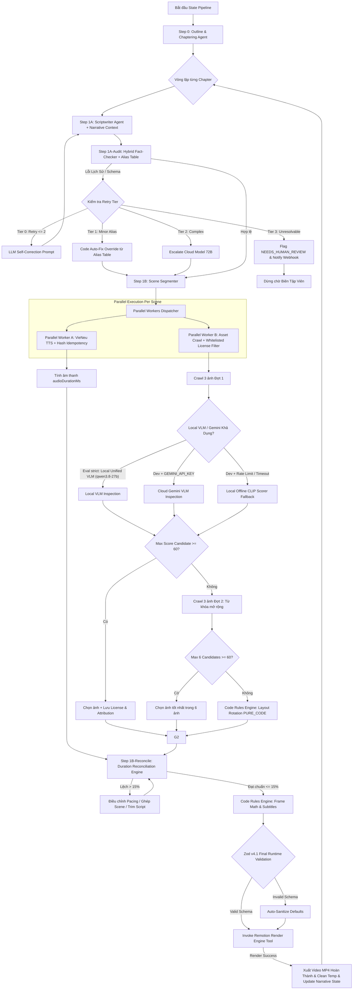

# CHI TIẾT MÔ-ĐUN 2: MULTI-AGENT ORCHESTRATOR
## (Content Synthesis, Cross-Chapter Continuity, Robust Fact-Checking & Small LLM Pipeline v4.1)

> **Trạng thái:** `[✅ IMPLEMENTED — LangGraph.js Multi-Agent Orchestrator Pipeline v4.1 (LangGraph.js Annotation.Root, Native Checkpointing & Parallel Workers)]`
> **Cập nhật:** Chuẩn hóa StateGraph với `Annotation.Root()`, tích hợp Native Checkpointer kế thừa `MemorySaver` lưu trữ PostgreSQL + Local Disk, phân luồng song song (Fan-out / Fan-in) cho TTS & VLM, Folklore Guardrail Gate (`folklore-validator.ts`), NLI Entailment Judge (`nli-hallucination-judge.ts`) và Human-In-The-Loop Streaming support.

---

## 1. Mục Đích & Vai Trò

Mô-đun **Multi-Agent Orchestrator** tiếp nhận dữ liệu tri thức lịch sử đã qua thẩm định từ Mô-đun 1 (Chrono-RAG) và đóng vai trò là **Hệ thống Điều phối Đa Agent (LangGraph.js State Machine trên Node.js/TypeScript)**. 

Mô-đun này được thiết kế và tối ưu hóa đặc biệt cho các **mô hình LLM nhỏ (Small LLM Models: Qwen-2.5-7B/14B, Llama-3.1-8B, DeepSeek-R1-Distill...)**, giải quyết triệt để bài toán quá tải context, đứt gãy JSON output, trôi giọng văn (tone reset) và ảo giác số liệu khi xử lý **video lịch sử dung lượng dài (5-15+ phút)** bằng phương pháp **Phân cấp Chapter (Hierarchical Chaptering)**, **Truyền Context Liên Tục (Cross-Chapter Narrative Flow)**, **Thẩm định Lịch sử Mềm Dẻo (Alias Table + Fuzzy Fact-Checking)**, **Cơ chế Thang Escalation Fallback 4 Tầng**, **Đối Soát Thời Lượng (Duration Reconciliation Engine)**, **VLM Hybrid Scorer (Gemini + Local CLIP)**, **Quản lý Bản quyền Ảnh (License Filtering & Attribution)** và **Idempotency Mịn Cấp Scene**.

Mô-đun chịu trách nhiệm:
1. **Phân chia Video Dài thành các Chương/Hồi (Micro-Step 0: Chaptering Agent)**: Mỗi chương từ 2-3 phút, khởi tạo `runningNarrativeState` giữ liền mạch giọng văn và mạch truyện xuyên suốt video dài.
2. **Quy trình sinh kịch bản 5 bước (Script Micro-Steps)**: 
   - Viết kịch bản lời thoại truyền `narrativeContext` (Micro-Step 1A).
   - Thẩm định lịch sử Hybrid Mềm Dẻo với Alias Table & Cross-Architecture/Heuristic Critic (Micro-Step 1A-Audit).
   - Chia Cảnh Scene Segmenter (Micro-Step 1B).
   - Đối soát & Cân bằng thời lượng Scene với Target Chapter Duration (Micro-Step 1B-Reconcile).
   - Trích xuất từ khóa crawl ảnh (Micro-Step 1C).
3. **Thực thi song song theo từng Cảnh (Scene-Level Parallelism & Fine-Grained Idempotency)** giữa công cụ sinh giọng nói TTS (VieNeu ONNX Engine) và thu thập tư liệu hình ảnh.
4. **Chiến lược Crawl ảnh 3+3 Candidates & Multi-Provider VLM Inspection (Local Unified Multimodal VLM `qwen3.8-27b-instruct-q4_k_m` / Cloud Gemini + Offline Local CLIP cho dev)**: Lọc ảnh theo giấy phép whitelisted (`Public Domain`, `CC0`, `CC-BY`), chấm điểm VLM linh hoạt với cơ chế auto failover khi ngắt kết nối/rate limit.
5. **Code Rules Engine & PURE_CODE Layout Rotation**: Tự động ép chuyển cảnh sang `PURE_CODE` khi cả 6 ảnh không đạt chuẩn và xoay vòng layout động (Animated Maps, Timelines, Quotes) để không gây chán mắt.
6. **Thang Xử Lý Lỗi 4 Tầng (4-Tier Escalation Path)**: Từ Self-Correction ➔ Code Override ➔ Cloud Model Escalation ➔ Human-in-the-Loop Review.
7. **Quản lý Checkpoint State vào PostgreSQL** qua LangGraph.js Postgres Checkpointer với Content Hash Keys cho phép resume chính xác từng scene/worker.
8. **Đóng gói JSON Schema v4.1 chuẩn xác (Zod Validated kèm License & Attribution)** và kích hoạt **Remotion Render Tool** (Mô-đun 4) để xuất video.

---

## 2. Sơ Đồ Kiến Trúc Đội Ngũ Agent & Tooling Ecosystem (v4.1 Tối Ưu Cho Small LLM & Video Dài)

```
                                   ┌───────────────────────────────┐
                                   │      Chrono-RAG Engine        │
                                   │   (Verified Context + Alias)  │
                                   └───────────────┬───────────────┘
                                                   │
                                                   ▼
                                   ┌───────────────────────────────┐
                                   │     MASTER ORCHESTRATOR       │
                                   │ (LangGraph.js + Postgres Check│
                                   │  + runningNarrativeState Flow)│
                                   └───────────────┬───────────────┘
                                                   │
                                                   ▼
                                   ┌───────────────────────────────┐
                                   │  MICRO-STEP 0: CHAPTER AGENT  │
                                   │ (Tách Video thành N Chapters) │
                                   └───────────────┬───────────────┘
                                                   │
                                                   ▼
┌────────────────────────────────────────────────────────────────────────────────────────────────────────────────────────┐
│                               CHAPTER-BASED SCRIPT PIPELINE (Vòng lặp từng Chapter kèm Narrative Context)            │
├───────────────────────┬───────────────────────────────┬─────────────────────────┬───────────────────┬──────────────────┤
│ (Micro-Step 1A)       │ (Micro-Step 1A-Audit)         │ (Micro-Step 1B)         │ (Step 1B-Reconcile│ (Micro-Step 1C)  │
│ ▼                     │ ▼                             │ ▼                       │ ▼                 │ ▼                │
│ ┌───────────────────┐ │ ┌───────────────────────────┐ │ ┌─────────────────────┐ │ ┌───────────────┐ │ ┌──────────────────────────────┐ │
│ │ 1A. SCRIPTWRITER  │─┼─► 1A-AUDIT. FACT-CHECKER    │─┼─► 1B. SCENE SEGMENTER │─┼─► RECONCILIATION│─┼─► 1C. KEYWORD EXT. + RESEARCH │ │
│ │ - Nhận            │ │ │ - Alias Table & Fuzzy Match│ │ │ - Chia Scene (5s-25s)│ │ │ - Đối soát    │ │ │ - Crawl Query (Entity/Alias) │ │
│ │   narrativeContext│ │ │ - Cross-Model / Heuristic │ │ │ - Max 5-8 scenes     │ │ │   thời lượng    │ │ │ - Research Agent: SerpAPI /  │ │
│ │ - Giữ tone liền   │ │ │ - 4-Tier Escalation Path  │ │ │                       │ │ │   (deviation<15%) │ Tavily / Brave / Wikimedia   │ │
│ │ └───────────────────┘ │ └───────────────────────────┘ │ └─────────────────────┘ │ └───────────────┘ │ - Domain Whitelist (License)  │ │
│ └───────────────────┘ │ └───────────────────────────┘ │ └─────────────────────┘ │ └───────────────┘ │ └──────────────────────────────┘ │
└───────────────────────┴───────────────────────────────┴────────────┬────────────────────────────────┴──────────────────┘
                                                                     │ (Scenes List Output)
                                                                     ▼
                                                     ┌───────────────────────────────────────────────┐
                                                     │    SCENE-LEVEL PARALLEL WORKERS EXECUTION     │
                                                     │    (Fine-Grained Task Idempotency Check)     │
                                                     └───────────────┬───────────────┴───────────────┘
                                                                     │                               │
                             ┌───────────────────────────────────────┘                               └───────────────────────────────────────┐
                             ▼                                                                                                               ▼
              ┌─────────────────────────────┐                                                                                 ┌─────────────────────────────┐
              │   PARALLEL WORKER A: TTS    │                                                                                 │ PARALLEL WORKER B: RESEARCH │
              │ - Hash Key Idempotency Check│                                                                                 │ AGENT (1C) -> VLM INSPECTOR  │
              │ - VieNeu ONNX TTS Engine    │                                                                                 │ - Provider Chain Online      │
              │ - Xuất WAV + Word Timestamps│                                                                                 │ - Multi-Provider VLM         │
              └──────────────┬──────────────┘                                                                                 │ - Strategy 3+3 Candidates    │
                             │                                                                                                │ - Dual VLM (Gemini / CLIP)   │
                             │                                                                                                └──────────────┬──────────────┘
                             │                                                                                                               │
                             └───────────────────────────────────────────────┬───────────────────────────────────────────────────────────────┘
                                                                             │
                                                                             ▼
                                                             ┌───────────────────────────────┐
                                                             │    CODE RULES ENGINE (TS)     │
                                                             │ - Auto-Sync durationInFrames  │
                                                             │ - Layout Rotation PURE_CODE   │
                                                             └───────────────┬───────────────┘
                                                                             │
                                                                             ▼
                                                             ┌───────────────────────────────┐
                                                             │     JSON PACKAGER AGENT       │
                                                             │  (Zod v4.1 Schema Validation) │
                                                             └───────────────┬───────────────┘
                                                                             │ (JSON Schema v4.1 Validated)
                                                                             ▼
                                                             ┌───────────────────────────────┐
                                                             │    REMOTION RENDER TOOL       │
                                                             │ (Pre-download + Chrome Pool)  │
                                                             └───────────────┬───────────────┘
```

---

## 3. Phân Công Trách Nhiệm Chi Tiết Của Các Agent & Micro-Sub-Agents (v4.1)

### 3.1. Master Orchestrator (LangGraph.js Supervisor & Postgres Checkpointer)
* **Nhiệm vụ:** Quản lý vòng đời workflow, duy trì state liên chương (`runningNarrativeState`), lưu trữ Checkpoint State vào PostgreSQL qua LangGraph.js Postgres Checkpointer, điều phối các Micro-Agents và các Task thực thi song song, quản lý Thang Escalation Retry và khôi phục idempotent khi container rớt.
* **Quy tắc điều phối & State Schema:**
  * Quản lý chuyển thể trạng thái qua các bước: `DRAFT` ➔ `OUTLINE_CHAPTERED` ➔ `CHAPTER_SCRIPT_GENERATED` ➔ `CHAPTER_FACT_CHECKED` ➔ `SCENES_SEGMENTED` ➔ `RECONCILED` ➔ `ASSETS_AUDITED` ➔ `RENDERING` ➔ `COMPLETED` / `NEEDS_HUMAN_REVIEW` / `FAILED`.
  * **Narrative Context Flow**: Lưu giữ và cập nhật `runningNarrativeState` sau mỗi Chapter gồm:
    ```typescript
    interface RunningNarrativeState {
      previousChapterSummary: string; // Tóm tắt Chapter vừa xong
      establishedTone: string;          // Hào hùng / Trầm lắng / Trang trọng...
      introducedEntities: string[];     // Các nhân vật/địa danh đã được giải thích
      transitionHook: string;           // Câu nối/gợi mở cho Chapter tiếp theo
    }
    ```
  * Ghi nhận checkpoint state mịn theo từng micro-step và từng Task (TTS/Crawl). Nếu container rớt, hệ thống resume dựa trên Content Hash Keys mà không gọi lại LLM hay sinh lại âm thanh/crawl lại ảnh.

### 3.2. Script Generation Pipeline (Tối Ưu Cho Small LLM & Video Dài)

#### 3.2.0. Chaptering & Outline Agent (Micro-Step 0)
* **Input:** Raw historical context từ Chrono-RAG + Yêu cầu độ dài video.
* **Nhiệm vụ:** Chia kịch bản tổng thể thành $N$ Chương/Hồi (mỗi Chapter có thời lượng target $T_{\text{target}}$ từ 2-3 phút, tương ứng 5-8 cảnh). Khởi tạo cấu trúc `runningNarrativeState`.
* **Output:** Danh sách các Chapter Outline kèm tóm tắt nội dung, target duration, các sự kiện chính và bảng alias nhân vật/mốc lịch sử ban đầu.

#### 3.2.1. Scriptwriter Agent (Micro-Step 1A)
* **Input:** Context của Chapter $N$ từ Micro-Step 0 + `runningNarrativeState` từ Chapter $N-1$ + RAG Context chi tiết.
* **Nhiệm vụ:** Tập trung 100% khả năng sáng tạo lời thoại (Voiceover Script) hấp dẫn, giàu cảm xúc, chuẩn xác bối cảnh cho Chapter $N$. Sử dụng `runningNarrativeState` để:
  1. Tránh lặp lại câu từ giải thích thông tin đã giới thiệu ở các Chapter trước (`introducedEntities`).
  2. Duy trì giọng văn đồng nhất (`establishedTone`).
  3. Mở đầu bằng câu chuyển cảnh mượt nối tiếp `transitionHook`.
* **Output:** Văn bản kịch bản thuần (Markdown/Text) của Chapter $N$.

#### 3.2.2. Hybrid Fact-Checker Agent Mềm Dẻo (Micro-Step 1A-Audit)
* **Input:** Kịch bản lời thoại từ Micro-Step 1A + RAG Verified Context + Historical Entity Alias Table.
* **Nhiệm vụ:** Thẩm định độ chính xác lịch sử của kịch bản một cách thông minh, tránh false-positive:
  1. **Lớp 1 - Code Rule-based Sanitizer với Alias Table & Diacritics Normalization (TypeScript)**:
     - Trích xuất mốc năm, tên nhân vật, địa danh.
     - Tra cứu qua **Alias Table** (ví dụ: `{"Quang Trung": ["Nguyễn Huệ", "Vua Quang Trung", "Bình Định Vương", "Anh hùng áo vải"]}`).
     - Chuẩn hóa dấu tiếng Việt và chữ hoa/thường trước khi so sánh. Hỗ trợ mốc thế kỷ ("thế kỷ 18" ➔ 1701-1800) và mốc thời gian tương đối.
     - Chỉ gắn cờ lỗi nếu mốc năm/nhân vật hoàn toàn không tồn tại trong RAG và Alias Table.
  2. **Lớp 2 - Cross-Architecture / Heuristic Logic Critic**:
     - Sử dụng mô hình LLM thuộc họ kiến trúc khác (ví dụ: Scriptwriter dùng Qwen-2.5-7B ➔ Critic dùng Llama-3.1-8B) HOẶC sử dụng **Timeline Heuristic Rules Engine** (Code kiểm tra chuỗi câu có thỏa mãn $t_1 \le t_2 \le t_3$). Tránh điểm mù trùng lặp (correlated blind spots).
* **Cơ chế Thang Escalation Fallback 4 Tầng (4-Tier Escalation Path)**:
  - *Lần 1 & 2 (Tier 0 - LLM Self-Correction)*: Gửi Self-Correction Prompt kèm lỗi diff chính xác để LLM nhỏ viết lại.
  - *Lần 3 (Tier 1 - Deterministic Code Auto-Fix Override)*: Nếu lỗi chỉ nằm ở việc dùng sai tên riêng chưa có trong alias, Code Engine tự động thay thế bằng tên chuẩn từ RAG mà không gọi lại LLM.
  - *Lần 4 (Tier 2 - Cloud Model Escalation)*: Chuyển kịch bản lên mô hình lớn hơn (Qwen-72B / Cloud API) để sửa nhanh 1 pass.
  - *Lần 5 (Tier 3 - Human-in-the-Loop Flagging)*: Đánh dấu trạng thái Chapter là `NEEDS_HUMAN_REVIEW`, lưu diff lỗi lên UI/Webhook để nhân sự biên tập duyệt/sửa bằng tay, không làm sập cả pipeline.

#### 3.2.3. Scene Segmenter & Layout Mapper Agent (Micro-Step 1B)
* **Input:** Kịch bản lời thoại đã được Fact-Check từ Micro-Step 1A-Audit.
* **Nhiệm vụ:** Chia kịch bản Chapter thành 5–8 Cảnh (Scenes, thời lượng 5s–25s/scene). Mỗi cảnh được gán `layoutMode` và `contentType` (`"IMAGE"` hoặc `"PURE_CODE"`).

#### 3.2.4. Duration Reconciliation Engine (Micro-Step 1B-Reconcile)
* **Input:** Danh sách các Cảnh + Target Chapter Duration ($T_{\text{target}}$).
* **Nhiệm vụ:** Sau khi Worker A sinh file âm thanh TTS cho các Scene, Code Engine tính tổng thời lượng âm thanh thực tế:
  $$T_{\text{total}} = \sum_{i=1}^{M} \text{audioDurationMs}_i$$
* **Quy tắc Cân Bằng (Reconciliation Rules):**
  - Tính độ lệch: $\Delta = \frac{|T_{\text{total}} - T_{\text{target}}|}{T_{\text{target}}}$
  - Nếu $\Delta \le 15\%$: Đạt chuẩn, tiếp tục pipeline.
  - Nếu $T_{\text{total}} < 0.85 \times T_{\text{target}}$ (Quá ngắn): Tự động bổ sung cảnh giải thích/tóm tắt bằng Code Layout (`TIMELINE_CHRONO` / `QUOTE_SLIDE`) hoặc chèn pause padding hợp lý.
  - Nếu $T_{\text{total}} > 1.15 \times T_{\text{target}}$ (Quá dài): Tự động thực hiện gộp cảnh ngắn liền kề hoặc yêu cầu Scriptwriter micro-trim 1-2 câu không quan trọng.

#### 3.2.5. Keyword Extractor Agent (Micro-Step 1C)
* **Input:** Danh sách các scenes trong Chapter có `contentType: "IMAGE"`.
* **Nhiệm vụ:** Trích xuất từ khóa crawl ảnh kèm Whitelisted License Tags (`Public Domain`, `CC0`, `CC-BY-4.0`).
* **Triển khai:** Node `keyword` (`src/graph/nodes/keyword-node.ts`) làm giàu `searchKeywords` từ `voiceoverText` + canonical entities/aliases trong RAG context.

#### 3.2.6. Research Agent (Micro-Step 1C — Online Image Search)
* **Input:** `searchKeywords` của từng Scene (sau Keyword Extractor) + `userPrompt`.
* **Nhiệm vụ:** Tìm kiếm ảnh tư liệu lịch sử online qua **Provider Chain**: `SerpAPI (Google Images)` → `Tavily` → `Brave Search API` → `Wikimedia Commons` → `Curated Catalog` (offline). Mỗi provider implement interface `ImageSearchProvider`; provider thiếu key / rate-limit / fail sẽ tự fallback sang provider kế.
* **License safety:** Chỉ chấp nhận ảnh từ **domain whitelist** (`upload.wikimedia.org`, `commons.wikimedia.org`, `flickr.com`/`live.staticflickr.com`, kho bảo tàng). URL ngoài whitelist bị loại ngay — không tốn token VLM cho ảnh rác. License gắn tự động theo host (Wikimedia → `PUBLIC_DOMAIN`, Flickr → `CC_BY_SA_4_0`, kho bảo tàng → `CC0`, khác → `UNKNOWN` để license-filter reject).
* **Output:** Lưu vào state `researchResults[sceneId]` (candidate pool + provenance: provider, số lượng, latency) để VLM Inspector chấm điểm. Cho phép resume/checkpoint chính xác.
* **Triển khai:** Node `research` (`src/graph/nodes/research-node.ts`) + module `packages/vlm-inspector/src/search/` (3 adapter SerpAPI/Tavily/Brave + Wikimedia/Catalog provider + chain resolver).

---

### 3.3. Parallel Worker A: Sound Design & TTS Agent
* **Nhiệm vụ:** Nhận `voiceoverText` của từng Scene, thực hiện check **Idempotency Hash Key** `hash(chapterId + sceneId + voiceoverText)`. Nếu file audio đã tồn tại trên local/S3, dùng lại ngay. Ngược lại, gọi **VieNeu ONNX TTS Engine** qua API `POST /api/v1/synthesize` để xuất WAV + `wordTimestamps`.

---

### 3.4. Parallel Worker B: Asset Crawler & Hybrid VLM Inspector (Strategy 3+3 Candidates & Licensing)
* **Nhiệm vụ:** 
  1. **Nhận candidate pool từ Research Agent** (state `researchResults[sceneId]`) thay vì tự crawl. Fallback: nếu chưa có (resume checkpoint cũ), tự gọi `resolveImageCandidates` inline.
  2. **License Whitelist Filter**: Chỉ nhận ảnh từ các nguồn minh bạch (Wikimedia Commons, Kho tư liệu lịch sử) thuộc giấy phép `Public Domain`, `CC0`, `CC-BY-4.0`, `CC-BY-SA-4.0`. Lưu thông tin `license` và `attribution` (tác giả, URL nguồn).
  3. **Strategy 3+3 Candidates**: Crawl đợt 1 (3 ảnh). Nếu không đạt $\ge 60$ điểm ➔ Crawl đợt 2 (3 ảnh bổ sung từ khóa mở rộng).
  4. **Hybrid Dual-Tier VLM Inspection**:
     - *Eval strict (`EVAL_STRICT=true`)*: **Local Unified VLM (`qwen3.8-27b-instruct-q4_k_m` qua llama-server)** là scorer bắt buộc. Local VLM lỗi → pipeline throw, không dùng Gemini/CLIP.
     - *Dev primary*: VLM Cloud API (Gemini 2.5 Flash) chấm điểm độ phù hợp lịch sử và thẩm mỹ (khi có `GEMINI_API_KEY`, `EVAL_STRICT=false`).
     - *Dev offline fallback*: Nếu Gemini API gặp lỗi HTTP 429/500, timeout hoặc ngắt internet, tự động chuyển sang **Local CLIP/SigLIP Cosine Similarity Scorer** (ONNX model chạy offline, chỉ khi `EVAL_STRICT=false`).
  5. **Code Fallback Trigger**: Nếu điểm cao nhất cả 6 ảnh vẫn $< 60$ ➔ Ép cảnh sang `PURE_CODE`.

---

### 3.5. Code Rules Engine (TypeScript Helper & Layout Rotation)
* **Nhiệm vụ:**
  1. Tính toán `durationInFrames` theo chuẩn 30 FPS:
     $$\text{durationInFrames} = \left\lceil \frac{\text{audioDurationMs} + 300}{1000} \times 30 \right\rceil$$
  2. **PURE_CODE Layout Rotation Engine**: Luân phiên tự động chọn giữa `STAT_CARD`, `VERSUS_CARD`, `TIMELINE_CHRONO`, `QUOTE_SLIDE`, `MUSEUM_TAG` khi nhiều cảnh liên tiếp không có ảnh tư liệu.

---

### 3.6. Fine-Grained Idempotency & Resume Layer
* **Cơ chế:** Để đảm bảo khi container restart mid-execution không gây tốn tài nguyên hoặc crawl/TTS lại:
  - **Audio Key:** `hash(chapter_id + scene_id + voiceover_text).wav`
  - **Image Key:** `hash(chapter_id + scene_id + query_string).json` (Chứa 6 candidate URLs + scores)
  - Postgres Checkpointer ghi nhận chính xác trạng thái từng Scene. Khi resume, worker bỏ qua bất kỳ Task nào đã có Output Hash hợp lệ.

---

### 3.7. Remotion Render Engine Tool (Mô-đun 4)
* **Nhiệm vụ:** Nhận JSON Schema v4.1 đã qua Zod validation hoàn chỉnh (bao gồm cả dữ liệu `license` & `attribution`), thực hiện pre-download asset và render video MP4.

---

## 4. Cơ Chế Kiểm Tra Lỗi, Retry & Thang Escalation Fallback (v4.1)

Hệ thống thiết lập **Cơ chế Kiểm tra Lỗi 4 Tầng & Escalation Matrix** bảo đảm không bao giờ bị "treo" ở trạng thái `FAILED`:

```
┌────────────────────────────────────────────────────────────────────────────────────────────────────────┐
│                               MASTER ORCHESTRATOR ESCALATION MATRIX (v4.1)                            │
├────────────────────────┼───────────────────────────┼───────────────────────────────────────────────────┤
│ Điểm Phát Sinh Lỗi     │ Loại Lỗi Runtime          │ Chiến Lược Kiểm Tra, Retry & Thang Escalation     │
├────────────────────────┼───────────────────────────┼───────────────────────────────────────────────────┤
│ 1. Fact-Check & Script │ Lỗi mốc năm/tên riêng     │ - Tier 0: LLM Self-Correction (Retry <= 2 lần).   │
│    Micro-Steps         │ sai hoặc JSON schema hỏng │ - Tier 1: Deterministic Code Auto-Fix Override    │
│                        │                           │   (Tự sửa tên riêng dựa trên Alias Table).        │
│                        │                           │ - Tier 2: Escalate Cloud Model 72B (sửa 1 pass).  │
│                        │                           │ - Tier 3: Flag trạng thái NEEDS_HUMAN_REVIEW,     │
│                        │                           │   gửi Alert Webhook/UI để biên tập viên duyệt.   │
├────────────────────────┼───────────────────────────┼───────────────────────────────────────────────────┤
│ 2. TTS Voiceover       │ API VieNeu Timeout hoặc   │ - Idempotency Check Hash Key trước khi gọi.       │
│                        │ file âm thanh hỏng/0-byte │ - Retry Exponential Backoff (1s, 2s, 4s).         │
│                        │                           │ - Dev: Dual-Layer Fallback `SyntheticTTSFallbackEngine`│
│                        │                           │   sinh audio tone 480Hz để render không ngắt.      │
│                        │                           │ - Eval strict: TTS fail → throw `[EVAL_STRICT]`,   │
│                        │                           │   KHÔNG dùng sine-wave giả.                        │
├────────────────────────┼───────────────────────────┼───────────────────────────────────────────────────┤
│ 3. Asset Crawling &    │ Crawl 404 / VLM < 60 /    │ - Lọc Whitelisted License (PD, CC0, CC-BY).       │
│    VLM Inspection      │ Gemini API Rate Limit 429 │ - Chiến lược 3+3 Candidates Crawl.                │
│                        │                           │ - Dev: Cloud VLM Gemini fail ➔ Auto-Fallback sang  │
│                        │                           │   Local CLIP/SigLIP Cosine Scorer (Offline).      │
│                        │                           │ - Eval strict: Local VLM fail → throw `[EVAL_STRICT]`.│
│                        │                           │ - Cả 6 ảnh < 60 ➔ Code Layout Rotation PURE_CODE. │
├────────────────────────┼───────────────────────────┼───────────────────────────────────────────────────┤
│ 4. Duration Mismatch   │ Tổng Scene Duration lệch  │ - Micro-Step 1B-Reconcile đối soát:               │
│                        │ > 15% so với Chapter Target│ - Quá ngắn (<85%): Tự chèn Timeline/Quote layout. │
│                        │                           │ - Quá dài (>115%): Auto-gộp scene/micro-trim.     │
├────────────────────────┼───────────────────────────┼───────────────────────────────────────────────────┤
│ 5. Remotion Render     │ Remotion CLI lỗi bundle   │ - Pre-flight Check: Pre-download asset về local.  │
│    Execution           │ hoặc thiếu file asset     │ - Auto-Sanitize JSON: Xóa props hư hỏng.          │
└────────────────────────┴───────────────────────────┴───────────────────────────────────────────────────┘
```

### 4.1. Sơ Đồ Luồng Xử Lý State Machine (v4.1 State Machine Flow Diagram)



---

## 5. Giao Tiếp Với Remotion Tool & JSON Schema v4.1 (TypeScript Zod Specs)

Master Orchestrator truyền dữ liệu chuẩn hóa cho Remotion Tool qua Zod Schema v4.1:

```typescript
import { z } from "zod";

export const ContentTypeSchema = z.enum(["IMAGE", "PURE_CODE"]);

export const LayoutModeSchema = z.enum([
  "IMAGE_FULL",
  "IMAGE_SPLIT",
  "STAT_CARD",
  "VERSUS_CARD",
  "TIMELINE_CHRONO",
  "QUOTE_SLIDE",
  "MUSEUM_TAG"
]);

export const LicenseTypeSchema = z.enum([
  "PUBLIC_DOMAIN",
  "CC0",
  "CC_BY_4_0",
  "CC_BY_SA_4_0",
  "UNKNOWN"
]);

export const AttributionSchema = z.object({
  author: z.string().optional(),
  sourceUrl: z.string().url().optional(),
  license: LicenseTypeSchema,
  licenseUrl: z.string().url().optional()
});

export const CaptionWordSchema = z.object({
  word: z.string(),
  startMs: z.number(),
  endMs: z.number(),
  confidence: z.number().optional()
});

export const SceneSchema = z.object({
  id: z.string(),
  chapterId: z.string().optional(),
  contentType: ContentTypeSchema,
  layoutMode: LayoutModeSchema,
  voiceoverText: z.string(),
  text: z.string().optional(), // Alias cho Remotion timeline text
  audioUrl: z.string().url().optional(),
  sceneAudioUrl: z.string().url().optional(), // Alias cho Remotion sceneAudioUrl
  durationInFrames: z.number().int().positive(),
  captions: z.array(CaptionWordSchema).optional(),
  imageUrl: z.string().url().optional(),
  assetUrl: z.string().url().optional(), // Alias cho Remotion assetUrl
  imageSource: z.string().optional(),
  license: LicenseTypeSchema.optional(),
  attribution: AttributionSchema.optional(),
  requiresAttribution: z.boolean().default(false),
  vlmScore: z.number().min(0).max(100).optional(),
  vlmScorerType: z.enum(["LOCAL_VLM", "GEMINI_CLOUD", "CLIP_LOCAL_FALLBACK", "REDIS_CACHE"]).optional(),
  overlayData: z.record(z.unknown()).optional(), // Direct Remotion UI Props
  customProps: z.record(z.unknown()).optional()
});

export const RunningNarrativeStateSchema = z.object({
  previousChapterSummary: z.string(),
  establishedTone: z.string(),
  introducedEntities: z.array(z.string()),
  transitionHook: z.string()
});

export const VideoPayloadSchema = z.object({
  compositionId: z.enum(["BattleVideoDoc", "ShortsVideoDoc", "BiographyVideoDoc", "DynastyVideoDoc", "MysteryVideoDoc", "ArtifactVideoDoc"]).optional(),
  fps: z.literal(30).default(30),
  width: z.number().int().optional(),
  height: z.number().int().optional(),
  title: z.string(),
  scenes: z.array(SceneSchema).min(1).optional(),
  timeline: z.array(SceneSchema).min(1).optional(), // Direct Remotion timeline alias
  narrativeState: RunningNarrativeStateSchema.optional(),
  bgmUrl: z.string().url().optional(),
  bgmVolume: z.number().min(0).max(1).optional().default(0.25)
});

export type VideoPayload = z.infer<typeof VideoPayloadSchema>;
export type Scene = z.infer<typeof SceneSchema>;
export type Attribution = z.infer<typeof AttributionSchema>;
```

---

## 6. Tiêu Chí Nghiệm Thu Mô-đun Multi-Agent (v4.1)

1. **Độ Tin Cậy & Tính Liền Mạch (Cross-Chapter Continuity):** Giọng văn, từ ngữ giải thích và bối cảnh được duy trì mượt mà xuyên suốt video 10-15+ phút nhờ `runningNarrativeState` truyền qua các Chapter.
2. **Đảm Bảo Chất Lượng Lịch Sử Mềm Dẻo (Alias-Aware Fact-Checking):** Tránh false-positive nhờ **Historical Entity Alias Table**, diacritics normalization và kiểm tra logic đa mô hình / heuristic rules.
3. **Không Bao Giờ Bị Treo Pipeline (4-Tier Escalation Path):** Khi retry quá 2 lần, tự động kích hoạt Code Auto-Fix Override, Cloud Model Escalation hoặc flag `NEEDS_HUMAN_REVIEW` cho biên tập viên.
4. **Đối Soát Thời Lượng Chuẩn Xác (Duration Reconciliation):** Tổng thời lượng âm thanh và cảnh thực tế không lệch quá $\pm 10\%$ so với target chapter duration.
5. **Hạ Tầng Linh Hoạt & Độc Lập (Hybrid VLM Scorer):** Chạy mượt mà với Local Unified VLM (`qwen3.8-27b-instruct-q4_k_m`, eval strict) hoặc Gemini Cloud VLM + Local CLIP fallback (dev) khi bị rate-limit hoặc ngắt mạng.
6. **An Toàn Bản Quyền Hình Ảnh (License Compliance):** 100% ảnh crawl có nhãn giấy phép whitelisted (`Public Domain`, `CC0`, `CC-BY`) kèm metadata `attribution` chuẩn xác.
7. **Khôi Phục Tốc Độ Cao & An Toàn (Fine-Grained Idempotency):** Resume chính xác từng task (TTS/Crawl) khi rớt container dựa trên Hash Keys, không tiêu tốn lại token LLM hay băng thông network.
