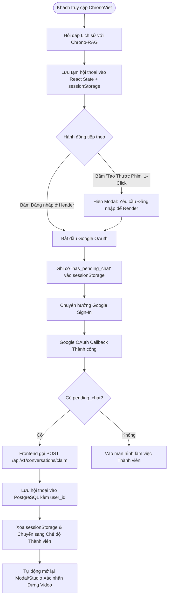

# Đặc Tả Kỹ Thuật: Quản Lý Người Dùng & Phân Quyền (User Auth & Access Control Spec)

* **Tên tài liệu:** ChronoViet User Authentication, Permissions & Access Control Specification
* **Trạng thái:** 🚀 Approved Technical Specification (Đã hoàn thiện & phê duyệt toàn diện)
* **Phiên bản:** v1.1
* **Công nghệ cốt lõi:** Next.js 14 App Router, Auth.js / NextAuth v5 (Stateless JWT), Google OAuth 2.0, PostgreSQL (pgvector), Redis (BullMQ & Rate Limiter)
* **Quy chuẩn SSOT:** [`packages/shared-spec`](../../packages/shared-spec), [`packages/infra`](../../packages/infra)

---

## 1. Tổng Quan & Mục Tiêu Thiết Kế (Overview & Objectives)

Hệ thống **ChronoViet** hướng tới trải nghiệm nghiên cứu sử liệu mở, mượt mà và tiện lợi tương tự phong cách **NotebookLM**. Nhằm cân bằng giữa việc **tối ưu trải nghiệm dùng thử không rào cản (Frictionless Onboarding)** và **bảo vệ tài nguyên tính toán đắt đỏ (GPU / VieNeu-TTS / Qwen2.5-VL / Remotion Render)**, cơ chế xác thực và phân quyền được thiết kế theo 4 nguyên tắc cốt lõi:

1. **Đăng nhập 1-Chạm (1-Tap Google OAuth):** Sử dụng duy nhất **Google OAuth 2.0**, không duy trì mật khẩu truyền thống, không yêu cầu xác minh email thủ công rườm rà.
2. **Khách vãng lai (Guest / Anonymous):** 
   - **ĐƯỢC:** Hỏi đáp và tra cứu tri thức lịch sử chuyên sâu với Hybrid GraphRAG (phiên hỏi đáp tạm thời).
   - **CHẶN:** Tuyệt đối không được khởi tạo tác vụ render video 1-Click (bảo vệ GPU/TTS).
   - **BẢO TOÀN TRẢI NGHIỆM (Zero Data Loss):** Khi khách bấm "Đăng nhập Google" giữa chừng, toàn bộ ngữ cảnh hội thoại đang chat dở sẽ được bảo lưu qua cơ chế *Guest Session Handoff & Claiming* mà không bị mất trắng.
3. **Người dùng đã đăng nhập (Authenticated User):** Được cấp quyền lưu trữ và quản lý lịch sử hội thoại/dự án đa phiên, khởi tạo dựng video tài liệu 1-Click tự động theo hạn ngạch (Quota & Concurrency Guard).
4. **Bảo vệ Đa Tầng (End-to-End Ownership Guard):** Kiểm soát nghiêm ngặt quyền sở hữu trên toàn bộ 100% API endpoints (từ Chat, SSE Streaming, Video Download, đến Abort/Resume Render) và đảm bảo dọn dẹp triệt để (PostgreSQL + Workspace Disk).

---

## 2. Ma Trận Phân Quyền & Luồng Trải Nghiệm (RBAC Matrix & User Journey)

### 2.1. Bảng Ma Trận Quyền Hạn (Access Control Matrix)

| Chức Năng / Tài Nguyên | Khách Vãng Lai (Anonymous Guest) | Người Dùng Đã Đăng Nhập (Google Auth) | Ghi Chú Kỹ Thuật & Hạn Mức |
| :--- | :---: | :---: | :--- |
| **Tra cứu & Hỏi đáp RAG Lịch sử** | ✅ **Cho phép** (Rate Limited) | ✅ **Cho phép** (Unrestricted) | Guest: Max 10 reqs/5 phút (IP-based). User: Unrestricted. |
| **Lưu trữ Lịch sử Hội thoại** | ❌ Lưu tạm SessionStorage | ✅ **Lưu vĩnh viễn PostgreSQL** | Guest: State lưu tạm client. User: Lưu bảng `conversations` & `conversation_messages`. |
| **Chuyển giao Hội thoại Khách (Claiming)** | ✅ Tự động lưu khi vừa đăng nhập | ✅ Tự động đồng bộ vào tài khoản | Chuyển toàn bộ hội thoại dở dang từ `sessionStorage` lên DB sau OAuth. |
| **Xem Danh Sách Chat & Dự Án (Sidebar)** | ❌ Chỉ hiện CTA Đăng nhập | ✅ Hiển thị đầy đủ theo tài khoản | Filter strictly theo `WHERE user_id = :current_user_id`. |
| **Quản lý & Xóa Chat (`/conversations/[id]`)** | ❌ Không áp dụng | ✅ **Toàn quyền Quản lý/Xóa** | `DELETE /api/v1/conversations/[id]`, CASCADE xóa messages. |
| **Tạo Video Sử Liệu 1-Click (Studio)** | ❌ **Chặn khởi tạo (Hiện Modal)** | ✅ **Cho phép (Theo Quota)** | Tối đa 1-2 video render đồng thời, 5 video/ngày (Bảo vệ tài nguyên máy chủ). |
| **Theo dõi Tiến độ SSE (`/stream`)** | ❌ Bị chặn (401) | ✅ **Realtime SSE Stream** | Token/Cookie Auth guard, chỉ user sở hữu mới kết nối được stream. |
| **Xem & Tải về Video MP4 (`/video`)** | ❌ Bị chặn (401/403) | ✅ **Cho phép** | Pipe stream file `/media/projects/{id}/output/video.mp4`. |
| **Can thiệp Render (`abort`, `resume`, `render`)** | ❌ Bị chặn (401) | ✅ **Toàn quyền điều khiển** | Kiểm tra quyền sở hữu trước khi phát signal vào BullMQ/Worker. |
| **Xóa Dự Án / Thước Phim (`/projects/[id]`)** | ❌ Không áp dụng | ✅ **Xóa Triệt Để 3 Tầng** | Xóa DB Checkpoint/Brief, xóa Output MP4, và xóa toàn bộ thư mục Workspace Disk. |
| **Gọi API VieNeu-TTS Trực Tiếp (`/tts`)** | ❌ Chặn gọi trực tiếp | ⚠️ Rate Limited (Chỉ Test/Dev) | Production chỉ cho phép gọi nội bộ qua Multi-Agent Worker. |

---

### 2.2. Luồng Trải Nghiệm Khách & Cơ Chế Chuyển Giao Phiên (Guest Session Handoff & Claiming)



---

## 3. Mô Hình Dữ Liệu Hai Tầng (Dual-Layer Database & Workspace Schema)

Hệ thống quản lý định danh người dùng đồng bộ trên cả 2 tầng: **Cơ sở dữ liệu PostgreSQL** (quản lý metadata/quan hệ) và **Workspace Disk Storage** (quản lý asset video/audio).

### 3.1. Cập Nhật Schema PostgreSQL ([`packages/infra/src/db/schema.ts`](../../packages/infra/src/db/schema.ts))

```sql
-- 1. Bảng Người dùng (Tích hợp Google OAuth 2.0)
CREATE TABLE IF NOT EXISTS users (
    id TEXT PRIMARY KEY,                 -- Định dạng: 'usr_' + nanoId hoặc Google sub ID
    email TEXT UNIQUE NOT NULL,          -- Email tài khoản Google
    name TEXT NOT NULL,                  -- Tên hiển thị
    avatar_url TEXT,                     -- Ảnh đại diện Google Profile
    google_id TEXT UNIQUE,               -- Sub ID định danh duy nhất từ Google
    role TEXT DEFAULT 'USER',            -- 'USER', 'ADMIN'
    metadata JSONB DEFAULT '{}'::jsonb,  -- Cấu hình cá nhân, preferences
    created_at TIMESTAMP WITH TIME ZONE DEFAULT CURRENT_TIMESTAMP,
    updated_at TIMESTAMP WITH TIME ZONE DEFAULT CURRENT_TIMESTAMP
);

CREATE INDEX IF NOT EXISTS idx_users_email ON users(email);
CREATE INDEX IF NOT EXISTS idx_users_google_id ON users(google_id);

-- 2. Cập nhật Khóa Ngoại & Index cho Bảng Cuộc trò chuyện (Conversations)
ALTER TABLE conversations 
ADD COLUMN IF NOT EXISTS user_id TEXT REFERENCES users(id) ON DELETE CASCADE;

CREATE INDEX IF NOT EXISTS idx_conversations_user_id ON conversations(user_id);
CREATE INDEX IF NOT EXISTS idx_conversations_user_updated ON conversations(user_id, updated_at DESC);

-- 3. Cập nhật Khóa Ngoại cho Tóm tắt Dự án Video (Video Briefs)
ALTER TABLE video_briefs 
ADD COLUMN IF NOT EXISTS user_id TEXT REFERENCES users(id) ON DELETE CASCADE;

CREATE INDEX IF NOT EXISTS idx_video_briefs_user_id ON video_briefs(user_id);

-- 4. Cập nhật Khóa Ngoại & Index kép cho Checkpoint LangGraph (Orchestrator Checkpoints)
ALTER TABLE orchestrator_checkpoints 
ADD COLUMN IF NOT EXISTS user_id TEXT REFERENCES users(id) ON DELETE CASCADE;

CREATE INDEX IF NOT EXISTS idx_checkpoints_user_id ON orchestrator_checkpoints(user_id);
CREATE INDEX IF NOT EXISTS idx_checkpoints_user_project ON orchestrator_checkpoints(user_id, project_id);
```

### 3.2. Cập Nhật Workspace Disk Schema (`metadata.json`)

Mỗi thư mục dự án trên đĩa (`/media/projects/{projectId}/metadata.json`) bắt buộc phải ghi nhận trường `userId` để đảm bảo cô lập dữ liệu ngay cả khi chạy ở chế độ offline/file-fallback:

```json
{
  "projectId": "proj_1724601234567_a1b2c",
  "userId": "usr_google_sub_1092837465",
  "topic": "Trận Bạch Đằng năm 938",
  "status": "COMPLETED",
  "currentStep": 12,
  "targetDurationMinutes": 1,
  "videoType": "BATTLE",
  "templateId": "HISTORICAL_DOCUMENTARY",
  "aspectRatio": "16:9",
  "tone": "HERITAGE_EPIC",
  "createdAt": "2026-08-25T20:00:00.000Z",
  "updatedAt": "2026-08-25T20:03:30.000Z"
}
```

---

## 4. Kiến Trúc Xác Thực & Chuẩn Hóa SSOT (Technical Architecture & SSOT)

### 4.1. Luồng Xác Thực Stateless JWT với Auth.js v5

Hệ thống sử dụng **Stateless JWT Cookie**, không tạo bảng `sessions` dư thừa trong PostgreSQL, nhưng tự động **Upsert Profile** vào bảng `users` tại callback `jwt` / `signIn`:

```
[Browser Client] 
      │ (HTTPS Cookie chứa JWT token đã ký bằng AUTH_SECRET)
      ▼
[Next.js 14 Middleware / Route Handlers]
      │ 1. Giải mã JWT bằng NextAuth auth() (0ms DB Latency)
      │ 2. Trích xuất session.user ({ id, email, name, image, role })
      ▼
[NextAuth Callbacks: signIn / jwt]
      │ Khi đăng nhập mới hoặc token refresh:
      │   -> UPSERT INTO users (id, email, name, avatar_url, google_id) 
      │      ON CONFLICT (email) DO UPDATE SET name = EXCLUDED.name, avatar_url = EXCLUDED.avatar_url
      ▼
[API Route Handlers: /api/v1/*]
      └── Thực thi Guard & Ownership Validation
```

### 4.2. Khai Báo Schema Trung Tâm ([`packages/shared-spec/src/schema.ts`](../../packages/shared-spec/src/schema.ts))

Toàn bộ kiểu dữ liệu liên quan đến Auth và User Profile được định nghĩa tập trung:

```typescript
import { z } from 'zod';

export const UserRoleSchema = z.enum(['USER', 'ADMIN']);
export type UserRole = z.infer<typeof UserRoleSchema>;

export const UserProfileSchema = z.object({
  id: z.string(),
  email: z.string().email(),
  name: z.string(),
  avatarUrl: z.string().url().nullable().optional(),
  role: UserRoleSchema.default('USER'),
  createdAt: z.string().optional(),
  updatedAt: z.string().optional(),
});
export type UserProfile = z.infer<typeof UserProfileSchema>;

export const SessionUserSchema = z.object({
  id: z.string(),
  email: z.string().email(),
  name: z.string(),
  image: z.string().nullable().optional(), // Chuẩn OAuth Profile
  role: UserRoleSchema.default('USER'),
});
export type SessionUser = z.infer<typeof SessionUserSchema>;

// Bổ sung userId vào ChronoGraphState để Worker nhận biết chủ sở hữu
export const ChronoGraphStateSchema = z.object({
  projectId: z.string(),
  userId: z.string().optional(), // ID người dùng khởi tạo
  correlationId: z.string().optional(),
  userPrompt: z.string(),
  status: z.string(),
  currentStep: z.number().int().default(0),
  // ... các trường kịch bản, âm thanh, visual storyboard hiện hữu
});
```

### 4.3. Cấu Hình Biến Môi Trường (Environment Variables)

Bổ sung vào `.env` và `.env.example`:

```env
# ==============================================================================
# AUTHENTICATION (Auth.js / NextAuth v5 - Google OAuth)
# ==============================================================================
AUTH_SECRET="chuoi_bi_mat_ngau_nhien_64_ky_tu_openssl_rand_base64_32"
NEXTAUTH_URL="http://localhost:3000"

# Google Cloud Console OAuth 2.0 Credentials (https://console.cloud.google.com)
AUTH_GOOGLE_ID="xxxxxxxxxxxx-xxxxxxxxxxxxxxxxxxxxxxxx.apps.googleusercontent.com"
AUTH_GOOGLE_SECRET="GOCSPX-xxxxxxxxxxxxxxxxxxxxxxxx"

# Rate Limiting & Quota
RATE_LIMIT_GUEST_RPM="10"
MAX_CONCURRENT_RENDERS_PER_USER="2"
DAILY_PROJECT_QUOTA_PER_USER="5"
```

---

## 5. Đặc Tả Chi Tiết Toàn Bộ API Routes & Ownership Guards

### 5.1. `POST /api/v1/chat` (Hỏi đáp Sử liệu Hybrid RAG)
* **Xác thực:** Tùy chọn (Optional Auth).
* **Bảo vệ:** Rate limit IP cho Guest (10 requests / 5 phút).
* **Luồng xử lý:**
  1. Kiểm tra session qua `auth()`.
  2. Thực thi Hybrid GraphRAG và stream tokens/citations về client.
  3. **Nếu có session (`session.user.id`):** Tự động insert/update vào `conversations` (với `user_id`) và `conversation_messages`.
  4. **Nếu là Guest:** Trả kết quả streaming trực tiếp, không ghi DB.

---

### 5.2. `POST /api/v1/conversations/claim` (Chuyển giao phiên hội thoại của Khách)
* **Mục đích:** Lưu lại toàn bộ lịch sử chat tạm từ `sessionStorage` sau khi khách vừa đăng nhập Google thành công.
* **Xác thực:** **Bắt buộc (Strict 401)**.
* **Payload:** `{ title: string, messages: Array<{ role: string, content: string, citations?: any[] }> }`.
* **Luồng xử lý:**
  1. Trích xuất `userId = session.user.id`.
  2. Sinh `conversationId = conv_${Date.now()}_${nanoId}`.
  3. Tạo bản ghi `conversations` với `user_id = userId`.
  4. Bulk insert danh sách tin nhắn vào `conversation_messages`.
  5. Trả về `{ success: true, conversationId }` (HTTP 201).

---

### 5.3. `GET /api/v1/conversations` & `POST /api/v1/conversations`
* **Xác thực:** Bắt buộc (Strict 401).
* **GET:** Truy vấn danh sách đoạn chat `WHERE user_id = session.user.id ORDER BY updated_at DESC LIMIT 50`. Khách vãng lai gọi route này nhận về `{ conversations: [] }` (HTTP 200) hoặc `401`.
* **POST:** Tạo đoạn chat mới gắn liền với `user_id = session.user.id`.

---

### 5.4. `GET /api/v1/conversations/[id]`, `DELETE /api/v1/conversations/[id]` & Messages Sub-routes
* **Xác thực:** **Bắt buộc (Strict 401 & Ownership Check)**.
* **GET / DELETE `[id]`:** Kiểm tra quyền sở hữu:
  ```sql
  -- Kiểm tra quyền
  SELECT id FROM conversations WHERE id = $1 AND user_id = $2;
  -- Khi xóa:
  DELETE FROM conversations WHERE id = $1 AND user_id = $2 RETURNING id;
  ```
  Nếu không tồn tại hoặc không thuộc quyền sở hữu $\rightarrow$ Trả về `404 Not Found` hoặc `403 Forbidden`. Nhờ `ON DELETE CASCADE`, toàn bộ `conversation_messages` liên quan tự động được dọn sạch.
* **`GET/POST /api/v1/conversations/[id]/messages`:** Bắt buộc verify `conversation.user_id === session.user.id` trước khi đọc hoặc ghi thêm message mới.

---

### 5.5. `POST /api/v1/projects` (Khởi tạo Tạo Video 1-Click)
* **Xác thực:** **Bắt buộc (Strict 401 Guard)**.
* **Luồng xử lý:**
  1. Chưa đăng nhập $\rightarrow$ Trả về ngay lập tức `401 Unauthorized` kèm mã lỗi `AUTH_REQUIRED`.
  2. **Kiểm tra Hạn ngạch (Quota & Concurrency Guard):**
     - Đếm số project của `session.user.id` đang có `status IN ('PROCESSING', 'RENDERING', 'INIT')`. Nếu $\ge 2 \rightarrow$ Trả về `429 Too Many Requests` (*"Bạn đang có dự án đang dựng, vui lòng đợi hoàn tất"*).
     - Kiểm tra số project tạo trong ngày $\ge 5 \rightarrow$ Báo quá hạn ngạch ngày.
  3. Khởi tạo Project Workspace Disk, ghi `userId` vào `metadata.json`.
  4. Đẩy payload kèm `userId: session.user.id` vào BullMQ `orchestrator-queue`.

---

### 5.6. `GET /api/v1/projects` & `GET /api/v1/projects/[id]`
* **Xác thực:** Bắt buộc (Strict 401).
* **GET `/projects`:** Lọc danh sách dự án strictly theo `user_id = session.user.id` (qua PostgreSQL và filter thư mục đĩa theo `metadata.json.userId == session.user.id`).
* **GET `/projects/[id]`:** Kiểm tra `user_id` sở hữu. Nếu không khớp $\rightarrow$ Trả về `403 Forbidden` (*"Bạn không có quyền truy cập dự án này"*).

---

### 5.7. `GET /api/v1/projects/[id]/stream` (SSE Event Stream) & `/video` (Tải/Xem Video)
* **Xác thực:** Bắt buộc (Strict 401 & Ownership Check).
* **Luồng xử lý:** 
  - Trích xuất session từ Cookie hoặc Query Token.
  - Xác thực dự án `[id]` thuộc về `session.user.id`.
  - Nếu hợp lệ $\rightarrow$ Cho phép lắng nghe SSE Stream hoặc pipe video stream `video.mp4`.
  - Nếu không hợp lệ $\rightarrow$ Chặn ngay từ tầng bắt đầu kết nối (`403 Forbidden`).

---

### 5.8. `POST /api/v1/projects/[id]/abort`, `/resume`, `/render`
* **Xác thực:** **Bắt buộc (Strict 401 & Ownership Check)**.
* **Luồng xử lý:** Kiểm tra quyền sở hữu trước khi gửi tín hiệu hủy/chạy lại vào worker pipeline, ngăn chặn kẻ xấu can thiệp hoặc ép server tốn GPU ngoài ý muốn.

---

### 5.9. `DELETE /api/v1/projects/[id]` (Xóa Dự Án Triệt Để 3 Tầng)
* **Mục đích:** Xóa vĩnh viễn dự án, giải phóng toàn bộ tài nguyên DB và Dung lượng đĩa.
* **Xác thực:** **Bắt buộc (Strict 401 & Ownership Check)**.
* **Quy trình Xóa 3 Tầng:**
  1. **Tầng 1 (PostgreSQL):**
     ```sql
     DELETE FROM orchestrator_checkpoints WHERE project_id = $1 AND user_id = $2;
     DELETE FROM video_briefs WHERE project_id = $1 AND user_id = $2;
     ```
  2. **Tầng 2 (Output Video):** Xóa file `/media/renders/{project_id}.mp4` (nếu có).
  3. **Tầng 3 (Workspace Disk):** Xóa toàn bộ thư mục workspace `rm -rf /media/projects/{project_id}` (giải phóng toàn bộ storyboard JSON, raw audio WAV, frame images PNG).
  4. Trả về `{ success: true, projectId: id }` (HTTP 200).

---

### 5.10. `POST /api/v1/tts` (VieNeu-TTS Synthesizer Guard)
* **Xác thực:** Chặn Guest gọi trực tiếp; yêu cầu session người dùng đã đăng nhập hoặc API secret nội bộ từ Multi-Agent Worker.
* **Bảo vệ:** Rate limit 5 requests / phút nhằm bảo vệ card âm thanh / GPU.

---

## 6. Cơ Chế Phòng Chống Lạm Dụng Tài Nguyên & Hạn Ngạch (Rate Limiting & Fair-Use Quotas)

> [!NOTE]
> **ChronoViet** là nền tảng nghiên cứu lịch sử mở, hoàn toàn **phi thương mại / không thu phí**. Hệ thống phân quyền chỉ bao gồm duy nhất 2 đối tượng: **Khách vãng lai** và **Người dùng đã đăng nhập**. Các hạn ngạch dưới đây được thiết lập thuần túy nhằm **bảo vệ hạ tầng tính toán (GPU / VieNeu-TTS / Remotion)** khỏi bị spam, đảm bảo tài nguyên chia sẻ công bằng (Fair-Use) cho tất cả mọi người.

| Đối Tượng | Tài Nguyên | Hạn Mức (Rate Limit / Fair-Use Quota) | Cơ Chế Triển Khai |
| :--- | :--- | :--- | :--- |
| **Khách Vãng Lai (Guest)** | Chat RAG (`/api/v1/chat`) | 10 requests / 5 phút | Redis Sliding Window / Token Bucket theo Client IP (`x-forwarded-for`). |
| **Khách Vãng Lai (Guest)** | Tạo Video 1-Click | **0 (Bị chặn 100%)** | Chặn ở UI Modal & API Route 401 Guard (yêu cầu đăng nhập). |
| **Người Dùng Đã Đăng Nhập** | Render Đồng Thời (Concurrency) | Tối đa **1-2 jobs** chạy cùng lúc | Đếm số project `status IN ('PROCESSING', 'RENDERING')` trong DB. |
| **Người Dùng Đã Đăng Nhập** | Tổng Video Render Trong Ngày | Tối đa **5 video / 24h** | Redis Key `quota:render:{userId}:{YYYY-MM-DD}` (TTL 24h). |
| **Toàn Hệ Thống** | VieNeu-TTS Direct Endpoint | 5 requests / phút | Token Bucket trên Redis cho route `/api/v1/tts`. |

---

## 7. Đặc Tả Giao Diện Người Dùng & Trải Nghiệm (UI/UX Specification)

Tuân thủ thẩm mỹ **Sơn Mài Di Sản (Heritage Lacquer & Gold Leaf)** từ [`docs/specs/UI_UX_DESIGN_SPECIFICATION.md`](UI_UX_DESIGN_SPECIFICATION.md):

### 7.1. Header Component ([`apps/web/src/components/layout/Header.tsx`](../../apps/web/src/components/layout/Header.tsx))
* **Chưa đăng nhập:** Nút **"Đăng nhập bằng Google"** sang trọng (`bg-primary/20 hover:bg-primary/30`, viền `border-primary/40`, icon Google màu vàng hoàng kim `gold-300`).
* **Đã đăng nhập:** Avatar bo tròn viền vàng sáng nhẹ, tên người dùng. Dropdown menu chứa: Email, link *"Kho video của tôi"*, nút *"Đăng xuất"* (`signOut()`).

### 7.2. Sidebar Component ([`apps/web/src/components/layout/Sidebar.tsx`](../../apps/web/src/components/layout/Sidebar.tsx))
* **Chưa đăng nhập:** Hiển thị Banner gợi ý đăng nhập để lưu trữ lịch sử đàm thoại và video.
* **Đã đăng nhập:** Phân nhóm danh sách Chat & Dự án theo thời gian ("Hôm nay", "Tuần này", "Cũ hơn").
* **Thao tác Xóa (Delete Interaction):**
  - Hover từng item hiện icon **Thùng rác (`Trash2`)**.
  - Bấm Xóa $\rightarrow$ Mở hộp thoại `AlertDialog` xác nhận ("Hành động không thể hoàn tác").
  - Xác nhận $\rightarrow$ Xóa Optimistic UI tức thì, reset màn hình chính nếu đang xem mục bị xóa.

### 7.3. Khung Chat & Modal Tạo Thước Phim ([`ChatContainer.tsx`](../../apps/web/src/components/chat/ChatContainer.tsx) & `AuthModal.tsx`)
* **Khách chat RAG:** Hiển thị thanh thông báo nhỏ tinh tế ở trên cùng: *"Đoạn chat này đang ở chế độ khách và sẽ được lưu tự động khi bạn đăng nhập."*
* **Khách bấm "Tạo Thước Phim 1-Click":**
  - Mở `AuthModal`: Tiêu đề *"Đăng nhập để Khởi Tạo Thước Phim"*, mô tả ngắn gọn lý do (cần tài khoản để lưu trữ tài nguyên render và theo dõi tiến độ).
  - Bấm *"Tiếp tục với Google"* $\rightarrow$ Lưu `sessionStorage` $\rightarrow$ Đăng nhập $\rightarrow$ Tự động claim hội thoại và mở tiếp màn hình Studio.

---

## 8. Tích Hợp Multi-Agent Worker & Checkpointer (Worker Integration)

1. **Lan truyền Định danh `userId` trong LangGraph State:**
   - Trong [`packages/agent-orchestrator`](../../packages/agent-orchestrator), `ChronoGraphState` luôn mang theo `userId`.
   - `BullMQ` Job Data nhận `userId` từ `apps/web` và chuyển vào `runOrchestratorPipeline(state)`.
2. **Cập nhật `ChronoCheckpointer` ([`checkpointer.ts`](../../packages/agent-orchestrator/src/graph/checkpointer.ts)):**
   ```typescript
   // Lưu kèm user_id khi lưu checkpoint vào PostgreSQL
   await pool.query(
     `INSERT INTO orchestrator_checkpoints (project_id, user_id, current_step, status, state_data, updated_at)
      VALUES ($1, $2, $3, $4, $5, NOW())
      ON CONFLICT (project_id)
      DO UPDATE SET current_step = EXCLUDED.current_step,
                    status = EXCLUDED.status,
                    state_data = EXCLUDED.state_data,
                    user_id = COALESCE(EXCLUDED.user_id, orchestrator_checkpoints.user_id),
                    updated_at = NOW()`,
     [projectId, state.userId || null, state.currentStep || 1, state.status || 'INIT', JSON.stringify(state)]
   );
   ```

---

## 9. Kế Hoạch Triển Khai Kỹ Thuật (Implementation Checklist)

- [ ] **Bước 1 (Schema & DB Migration):**
  - Cập nhật [`packages/shared-spec/src/schema.ts`](../../packages/shared-spec/src/schema.ts) thêm `UserProfileSchema`, `SessionUserSchema`, `ChronoGraphState.userId`.
  - Cập nhật [`packages/infra/src/db/schema.ts`](../../packages/infra/src/db/schema.ts) thêm bảng `users`, cột `user_id` và các index liên quan.
  - Chạy kiểm tra: `pnpm --filter @chronoviet/shared-spec typecheck`.
- [ ] **Bước 2 (Cài đặt & Cấu hình Auth.js v5):**
  - Cài đặt `next-auth@beta` trong `apps/web`.
  - Tạo `apps/web/src/auth.ts` cấu hình Google Provider, JWT callbacks và logic Upsert Profile vào bảng `users`.
  - Tạo route handler `apps/web/src/app/api/auth/[...nextauth]/route.ts`.
- [ ] **Bước 3 (Bảo vệ Toàn Bộ API Routes & Triển Khai Claiming):**
  - Cập nhật `/api/v1/chat/route.ts` (lưu DB khi có auth, rate limit cho guest).
  - Hiện thực hóa route `POST /api/v1/conversations/claim/route.ts`.
  - Cập nhật `/api/v1/conversations/route.ts`, `[id]/route.ts`, `[id]/messages/route.ts`.
  - Cập nhật `/api/v1/projects/route.ts`, `[id]/route.ts`, `[id]/stream/route.ts`, `[id]/video/route.ts`.
  - Cập nhật `/api/v1/projects/[id]/abort`, `resume`, `render`.
  - Cập nhật `DELETE /api/v1/projects/[id]` (dọn dẹp 3 tầng: DB, MP4, Workspace Disk `rm -rf`).
  - Bảo vệ `/api/v1/tts/route.ts`.
- [ ] **Bước 4 (Cập nhật Checkpointer & Worker Pipeline):**
  - Cập nhật `ChronoCheckpointer.ts` trong `@chronoviet/agent-orchestrator` để lưu `user_id`.
  - Đảm bảo BullMQ Worker nhận và bảo toàn `userId` trong suốt quá trình render.
- [ ] **Bước 5 (Cập nhật UI/UX & Tương tác Xóa/Claiming):**
  - Tạo các component `AuthButton.tsx`, `AuthModal.tsx`, `UserDropdown.tsx`.
  - Tích hợp logic lưu `sessionStorage` & tự động Claiming sau đăng nhập.
  - Tích hợp nút Xóa Thùng rác (`Trash2`) và `AlertDialog` vào `Sidebar.tsx`.
- [ ] **Bước 6 (Kiểm thử & Verification Gate):**
  - Viết unit tests kiểm thử phân quyền, ownership guards, rate limiting trong `apps/web/src/__tests__/api-routes.test.ts`.
  - Chạy toàn bộ Verification Gate: `pnpm check` (Typecheck $\rightarrow$ Lint $\rightarrow$ Test $\rightarrow$ Build).

---

## 10. Kết Luận

Tài liệu đặc tả **v1.1** đã hoàn thiện 100% các khoảng trống kỹ thuật, giải quyết triệt để vấn đề mất dữ liệu của khách vãng lai, đồng bộ hóa kiến trúc lưu trữ giữa PostgreSQL và Filesystem, bảo vệ toàn diện hệ thống API routes và thiết lập rào chắn chi phí (Rate Limit & Quotas) vững chắc cho **ChronoViet**.

