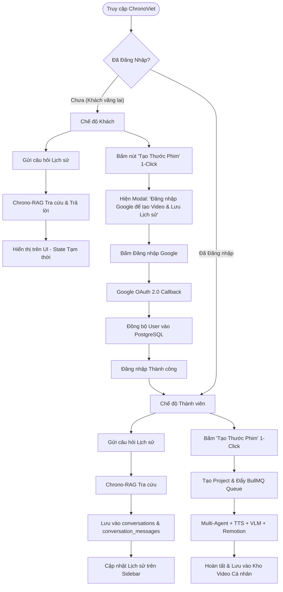

# Đặc Tả Kỹ Thuật: Quản Lý Người Dùng & Phân Quyền (User Auth & Access Control Spec)

* **Tên tài liệu:** ChronoViet User Authentication & Access Control Specification
* **Trạng thái:** 📐 Draft Specification (Đã duyệt phương án tổng quan)
* **Phiên bản:** v1.0
* **Công nghệ cốt lõi:** Next.js 14 App Router, Auth.js / NextAuth v5, Google OAuth 2.0, PostgreSQL (pgvector)
* **Quy chuẩn SSOT:** [`packages/shared-spec`](../../packages/shared-spec)

---

## 1. Tổng Quan & Mục Tiêu Thiết Kế (Overview & Objectives)

Hệ thống **ChronoViet** hướng tới trải nghiệm nghiên cứu sử liệu mở, mượt mà và tiện lợi tương tự phong cách **NotebookLM**. Nhằm cân bằng giữa việc **tối ưu trải nghiệm dùng thử không rào cản (Frictionless Onboarding)** và **bảo vệ tài nguyên tính toán đắt đỏ (GPU / TTS / VLM / Remotion Render)**, cơ chế xác thực và phân quyền được thiết kế tinh gọn theo nguyên tắc:

1. **Đăng nhập 1-Chạm:** Chỉ sử dụng duy nhất **Google OAuth 2.0** (Google Sign-In), không yêu cầu mật khẩu phức tạp hay đăng ký email rườm rà.
2. **Khách vãng lai (Guest / Anonymous):** 
   - **CHỈ ĐƯỢC:** Hỏi đáp và tra cứu tri thức lịch sử chuyên sâu với RAG Engine (phiên hỏi đáp tạm thời).
   - **TUYỆT ĐỐI KHÔNG ĐƯỢC:** Tạo video sử liệu 1-Click (bị chặn ở cả UI lẫn API Backend) và không lưu lịch sử vào Database.
3. **Người dùng đã đăng nhập (Authenticated User):** Được cấp quyền toàn diện để **lưu trữ và xóa lịch sử hội thoại/video đa phiên**, **tạo video tài liệu 1-Click tự động** và **quản lý kho thước phim cá nhân**.

---

## 2. Ma Trận Phân Quyền & Hành Trình Trải Nghiệm (RBAC Matrix & User Journey)

### 2.1. Bảng Ma Trận Quyền Hạn (Access Control Matrix)

| Chức Năng / Tài Nguyên | Khách Vãng Lai (Anonymous Guest) | Người Dùng Đã Đăng Nhập (Google Auth) | Ghi Chú Kỹ Thuật |
| :--- | :---: | :---: | :--- |
| **Tra cứu & Hỏi đáp RAG Lịch sử** | ✅ **Cho phép** | ✅ **Cho phép** | Sử dụng chung pipeline Hybrid GraphRAG + BM25 FTS. |
| **Lưu trữ Lịch sử Hội thoại** | ❌ **Không lưu DB** | ✅ **Lưu vĩnh viễn** | Guest: state lưu tạm trong React runtime (mất khi reload/đóng tab). User: lưu vào bảng `conversations` theo `user_id`. |
| **Xem Danh Sách Chat & Dự Án (Sidebar)** | ❌ Chỉ hiện CTA nhắc đăng nhập | ✅ Hiển thị đầy đủ theo tài khoản | Filter strictly theo `WHERE user_id = :current_user_id`. |
| **Xóa Lịch Sử Đoạn Chat (Delete Conversation)** | ❌ Không áp dụng | ✅ **Toàn quyền xóa** (Sở hữu riêng) | `DELETE /api/v1/conversations/[id]`, CASCADE xóa messages. |
| **Tạo Video Sử Liệu 1-Click (Studio)** | ❌ **Chặn khởi tạo** | ✅ **Toàn quyền khởi tạo** | Guest click $\rightarrow$ mở Modal yêu cầu đăng nhập Google. |
| **Theo dõi Tiến độ Render & Xem Video** | ❌ Không có dự án riêng | ✅ Realtime SSE / WebSocket / Player | Checkpoint gắn liền với `user_id`. |
| **Xóa Thước Phim / Dự Án (Delete Project)** | ❌ Không áp dụng | ✅ **Toàn quyền xóa** (Sở hữu riêng) | `DELETE /api/v1/projects/[id]`, dọn dẹp checkpoints & video file. |
| **Tải về Video MP4 Hoàn Thiện** | ❌ Không áp dụng | ✅ **Cho phép** | Đường dẫn `/media/renders/{project_id}.mp4`. |

---

### 2.2. Sơ Đồ Luồng Nghiệp Vụ Người Dùng (User Journey Flow)



---

## 3. Mô Hình Cơ Sở Dữ Liệu (Database Schema Design)

Cập nhật mã nguồn [`packages/infra/src/db/schema.ts`](../../packages/infra/src/db/schema.ts) để bổ sung bảng `users` và liên kết khóa ngoại với các bảng hiện hữu.

### 3.1. Bảng `users` Mới

```sql
-- Bảng Người dùng (Tích hợp Google OAuth)
CREATE TABLE IF NOT EXISTS users (
    id TEXT PRIMARY KEY,                 -- Sinh từ auth provider: 'usr_' + nanoId hoặc Google sub ID
    email TEXT UNIQUE NOT NULL,          -- Email tài khoản Google
    name TEXT NOT NULL,                  -- Tên hiển thị người dùng
    avatar_url TEXT,                     -- Ảnh đại diện từ Google Profile
    google_id TEXT UNIQUE,               -- Sub ID định danh duy nhất từ Google OAuth
    role TEXT DEFAULT 'USER',            -- 'USER', 'ADMIN'
    metadata JSONB DEFAULT '{}'::jsonb,  -- Tùy chọn ngôn ngữ, theme, cấu hình cá nhân
    created_at TIMESTAMP WITH TIME ZONE DEFAULT CURRENT_TIMESTAMP,
    updated_at TIMESTAMP WITH TIME ZONE DEFAULT CURRENT_TIMESTAMP
);

CREATE INDEX IF NOT EXISTS idx_users_email ON users(email);
CREATE INDEX IF NOT EXISTS idx_users_google_id ON users(google_id);
```

### 3.2. Cập Nhật Khóa Ngoại `user_id` Vào Các Bảng Nghiệp Vụ

```sql
-- 1. Bảng Cuộc trò chuyện (Conversations)
ALTER TABLE conversations 
ADD COLUMN IF NOT EXISTS user_id TEXT REFERENCES users(id) ON DELETE CASCADE;

CREATE INDEX IF NOT EXISTS idx_conversations_user_id ON conversations(user_id);

-- 2. Bảng Tóm tắt Dự án Video (Video Briefs)
ALTER TABLE video_briefs 
ADD COLUMN IF NOT EXISTS user_id TEXT REFERENCES users(id) ON DELETE SET NULL;

CREATE INDEX IF NOT EXISTS idx_video_briefs_user_id ON video_briefs(user_id);

-- 3. Bảng Checkpoint Trạng Thái Dự Án (Orchestrator Checkpoints)
ALTER TABLE orchestrator_checkpoints 
ADD COLUMN IF NOT EXISTS user_id TEXT REFERENCES users(id) ON DELETE CASCADE;

CREATE INDEX IF NOT EXISTS idx_checkpoints_user_id ON orchestrator_checkpoints(user_id);
```

---

## 4. Kiến Trúc Kỹ Thuật & Tích Hợp Hệ Thống (Technical Blueprint)

### 4.1. Kiến Trúc Xác Thực (Auth.js v5 Stateless JWT)

Để đảm bảo hiệu năng tối đa và không gây nghẽn PostgreSQL khi lượng request tăng cao, hệ thống sử dụng cơ chế **Stateless JWT Session** của Auth.js / NextAuth:

```
[Browser Client] 
      │ (HTTPS Cookie chứa JWT token đã mã hóa Auth Secret)
      ▼
[Next.js 14 Middleware / Route Handlers]
      │ (Giải mã JWT, trích xuất user_id & email trong 0ms DB overhead)
      ▼
[API Route Handler: /api/v1/*]
      ├── Nếu route công khai (/api/v1/chat):
      │     └── Check token? Có -> Lưu DB kèm user_id | Không -> Bỏ qua lưu DB
      └── Nếu route yêu cầu quyền (/api/v1/projects, /api/v1/conversations):
            └── Check token? Có -> Xử lý tiếp | Không -> 401 Unauthorized
```

### 4.2. Cấu Hình Biến Môi Trường (Environment Variables)

Các biến môi trường cần bổ sung vào `.env` và `.env.example`:

```env
# ==============================================================================
# AUTHENTICATION (Auth.js / NextAuth v5 - Google OAuth)
# ==============================================================================
AUTH_SECRET="chuoi_bi_mat_ngau_nhien_64_ky_tu_openssl_rand_base64_32"
NEXTAUTH_URL="http://localhost:3000"

# Google Cloud Console OAuth 2.0 Credentials (https://console.cloud.google.com)
# - Authorized JavaScript origins: http://localhost:3000
# - Authorized redirect URIs: http://localhost:3000/api/auth/callback/google
AUTH_GOOGLE_ID="xxxxxxxxxxxx-xxxxxxxxxxxxxxxxxxxxxxxx.apps.googleusercontent.com"
AUTH_GOOGLE_SECRET="GOCSPX-xxxxxxxxxxxxxxxxxxxxxxxx"
```

---

### 4.3. Tính Tương Thích Ngược & Dữ Liệu Hiện Hữu (Backward Compatibility & Migration)

1. **Khóa ngoại Nullable:** Toàn bộ cột `user_id` thêm mới vào `conversations`, `video_briefs`, `orchestrator_checkpoints` đều là **NULLABLE**.
2. **Dữ liệu cũ (Legacy Anonymous Data):** Các bản ghi tạo trước khi tích hợp Auth sẽ có `user_id = NULL`. Các bản ghi này không bị xóa và không làm vỡ logic hệ thống.
3. **Chế độ In-Memory Fallback:** Khi chạy không có PostgreSQL (`inMemoryStore`), hệ thống vẫn trích xuất session từ JWT để lưu map tạm theo `userId` mà không làm gián đoạn trải nghiệm local dev.

---

### 4.4. Quy Chuẩn Schema Dữ Liệu Trung Tâm ([`packages/shared-spec`](../../packages/shared-spec))

Khai báo các schema Zod tại `packages/shared-spec/src/schema.ts` theo nguyên tắc SSOT:

```typescript
import { z } from 'zod';

export const UserRoleSchema = z.enum(['USER', 'ADMIN']);
export type UserRole = z.infer<typeof UserRoleSchema>;

export const UserProfileSchema = z.object({
  id: z.string(),
  email: z.string().email(),
  name: z.string(),
  avatarUrl: z.string().url().nullable().optional(),
  role: UserRoleSchema.default('USER'),
  createdAt: z.string().optional(),
  updatedAt: z.string().optional(),
});
export type UserProfile = z.infer<typeof UserProfileSchema>;

export const SessionUserSchema = z.object({
  id: z.string(),
  email: z.string().email(),
  name: z.string(),
  image: z.string().nullable().optional(),
  role: UserRoleSchema,
});
export type SessionUser = z.infer<typeof SessionUserSchema>;
```

---

## 5. Đặc Tả Chi Tiết Xử Lý API (API Route Specifications)

### 5.1. `POST /api/v1/chat` (Hỏi đáp Sử liệu)
* **Mục đích:** Xử lý tin nhắn hỏi đáp lịch sử.
* **Xác thực:** Tùy chọn (Optional Auth).
* **Luồng xử lý:**
  1. Kiểm tra session từ request (qua Auth.js `auth()`).
  2. Thực hiện truy vấn Hybrid RAG (Dense vector + CTE Graph + BM25) $\rightarrow$ Sinh câu trả lời kèm citations.
  3. **Nếu đã đăng nhập (`session.user.id` tồn tại):**
     - Lưu phiên hội thoại vào bảng `conversations` (với `user_id`).
     - Lưu tin nhắn hỏi & đáp vào `conversation_messages`.
  4. **Nếu chưa đăng nhập (Guest):**
     - Trả về câu trả lời và trích dẫn trực tiếp cho client, **không insert vào DB**.

---

### 5.2. `GET /api/v1/conversations` (Lấy danh sách đoạn chat)
* **Mục đích:** Hiển thị danh sách hội thoại cũ trên Sidebar.
* **Xác thực:** Bắt buộc (Required Auth).
* **Luồng xử lý:**
  - Nếu chưa đăng nhập: Trả về `{ conversations: [] }` (HTTP 200) hoặc `401 Unauthorized`.
  - Nếu đã đăng nhập: Chạy câu lệnh SQL:
    ```sql
    SELECT id, title, mode, metadata, created_at, updated_at 
    FROM conversations 
    WHERE user_id = $1 
    ORDER BY updated_at DESC 
    LIMIT 50;
    ```

---

### 5.3. `POST /api/v1/projects` (Khởi tạo Tạo Video 1-Click)
* **Mục đích:** Bắt đầu quy trình tự động sinh kịch bản, thu âm TTS, thẩm định VLM và render Remotion.
* **Xác thực:** **Bắt buộc (Strict 401 Guard)**.
* **Luồng xử lý:**
  - Nếu chưa đăng nhập $\rightarrow$ Trả về ngay lập tức:
    ```json
    {
      "error": "UNAUTHORIZED",
      "message": "Vui lòng đăng nhập bằng tài khoản Google để khởi tạo thước phim lịch sử."
    }
    ```
  - Nếu đã đăng nhập $\rightarrow$ Tạo record `orchestrator_checkpoints` và `video_briefs` với `user_id = session.user.id`, sau đó đẩy task vào BullMQ `orchestrator-queue`.

---

### 5.4. `GET /api/v1/projects` (Lấy danh sách video dự án)
* **Mục đích:** Hiển thị danh sách các thước phim đã tạo ở tab "Dự Án" trên Sidebar.
* **Xác thực:** Bắt buộc (Required Auth).
* **Luồng xử lý:** Lọc danh sách dự án strictly theo `user_id` của session hiện tại (`SELECT * FROM orchestrator_checkpoints WHERE user_id = $1 ORDER BY updated_at DESC`).

---

### 5.5. `DELETE /api/v1/conversations/[id]` (Xóa đoạn hội thoại)
* **Mục đích:** Người dùng chủ động xóa vĩnh viễn một cuộc trò chuyện lịch sử khỏi cơ sở dữ liệu.
* **Xác thực:** **Bắt buộc (Strict 401 & Ownership Check)**.
* **Luồng xử lý:**
  1. Trích xuất `session.user.id`.
  2. Thực thi SQL:
     ```sql
     DELETE FROM conversations 
     WHERE id = $1 AND user_id = $2 
     RETURNING id;
     ```
  3. Nhờ cơ chế `ON DELETE CASCADE`, toàn bộ tin nhắn trong `conversation_messages` liên quan sẽ tự động được dọn sạch.
  4. Nếu không tìm thấy hoặc không thuộc sở hữu của user $\rightarrow$ Trả về `404 Not Found` hoặc `403 Forbidden`.
  5. Thành công $\rightarrow$ Trả về `{ success: true, id }` (HTTP 200).

---

### 5.6. `DELETE /api/v1/projects/[id]` (Xóa dự án / thước phim)
* **Mục đích:** Người dùng xóa một dự án video khỏi danh sách kho lưu trữ cá nhân.
* **Xác thực:** **Bắt buộc (Strict 401 & Ownership Check)**.
* **Luồng xử lý:**
  1. Trích xuất `session.user.id`.
  2. Xóa dữ liệu checkpoint và brief trong PostgreSQL:
     ```sql
     DELETE FROM orchestrator_checkpoints WHERE project_id = $1 AND user_id = $2;
     DELETE FROM video_briefs WHERE project_id = $1 AND user_id = $2;
     ```
  3. Kích hoạt dọn dẹp file media rendered trên ổ đĩa `/media/renders/{project_id}.mp4` (nếu tồn tại).
  4. Thành công $\rightarrow$ Trả về `{ success: true, projectId: id }` (HTTP 200).

---

## 6. Đặc Tả Giao Diện Người Dùng (UI/UX Specification)

Phù hợp với ngôn ngữ thiết kế **Sơn Mài Di Sản (Heritage Lacquer & Gold Leaf)** đã định nghĩa tại [`docs/specs/UI_UX_DESIGN_SPECIFICATION.md`](UI_UX_DESIGN_SPECIFICATION.md).

### 6.1. Header Component ([`apps/web/src/components/layout/Header.tsx`](../../apps/web/src/components/layout/Header.tsx))

1. **Trạng thái Chưa Đăng Nhập (Guest State):**
   - Hiển thị nút **"Đăng nhập bằng Google"** ở góc phải trên cùng.
   - Thiết kế: Nền `bg-primary/20 hover:bg-primary/30`, viền `border border-primary/40`, icon Google SVG màu đồng bộ với tông vàng hoàng kim (`gold-300`).
2. **Trạng thái Đã Đăng Nhập (Authenticated State):**
   - Hiển thị Avatar tròn (bo góc viền vàng), Tên người dùng vắn tắt.
   - Bấm vào Avatar mở Dropdown menu:
     - Thông tin Email người dùng.
     - Nút *"Kho video của tôi"*.
     - Nút *"Đăng xuất"* (`signOut()`).

---

### 6.2. Sidebar Component ([`apps/web/src/components/layout/Sidebar.tsx`](../../apps/web/src/components/layout/Sidebar.tsx))

1. **Khi Chưa Đăng Nhập:**
   - Tab "Dự Án" & "Đoạn Chat" hiển thị khối thông báo rỗng thẩm mỹ:
     - Icon cuộn giấy sử liệu mờ ảo.
     - Dòng chữ: *"Đăng nhập để lưu giữ các đoạn đàm thoại sử học & thước phim đã dựng."*
     - Nút nhỏ: *"Đăng nhập Google ngay"*.
2. **Khi Đã Đăng Nhập:**
   - Tự động gọi API lấy danh sách chat & dự án riêng của người dùng và hiển thị phân cấp thời gian ("Hôm nay", "Tuần này", "Cũ hơn").
   - **Tương tác Quản lý & Xóa (Delete Interaction):**
     - Khi người dùng rê chuột (hover) vào từng mục cuộc trò chuyện hoặc dự án video, hiển thị nút biểu tượng **Thùng rác (`Trash2`)** tinh tế ở góc phải item.
     - Khi bấm nút Xóa $\rightarrow$ Mở hộp thoại xác nhận (`AlertDialog`):
       - *Tiêu đề:* "Xóa đoạn trò chuyện này?" hoặc "Xóa thước phim này?"
       - *Mô tả:* "Hành động này sẽ xóa vĩnh viễn dữ liệu khỏi kho sử liệu cá nhân và không thể hoàn tác."
       - *Nút hành động:* "Hủy" và "Xác nhận xóa" (màu đỏ gạch / sơn mài trầm).
     - Khi xác nhận thành công $\rightarrow$ Gửi request `DELETE`, cập nhật state loại bỏ item khỏi danh sách tức thì (Optimistic UI), và nếu đang mở cuộc hội thoại/dự án bị xóa thì reset về màn hình làm việc mới.

---

### 6.3. Khung Chat & Studio ([`ChatContainer.tsx`](../../apps/web/src/components/chat/ChatContainer.tsx) & Nút "Tạo Thước Phim")

1. **Khách vãng lai gửi câu hỏi:**
   - Hệ thống streaming câu trả lời mượt mà, trích dẫn nguồn đầy đủ.
   - Trên thanh thông tin có một banner nhỏ tinh tế (có thể tắt): *"Đoạn chat này đang ở chế độ khách và sẽ không được lưu lại khi tải lại trang. [Đăng nhập để lưu]"*.
2. **Khách vãng lai bấm nút "Tạo Thước Phim Lịch Sử":**
   - Xuất hiện Modal Dialog sang trọng:
     - **Tiêu đề:** *"Đăng nhập để Khởi Tạo Thước Phim"*
     - **Nội dung:** *"Tính năng dựng video tự động 1-Click yêu cầu tài khoản để lưu trữ tài nguyên render và đồng bộ vào kho phim cá nhân của bạn."*
     - **Nút hành động:** Nút to *"Tiếp tục với Google"* (1-Click Google Sign-In) và nút phụ *"Để sau"*.

---

## 7. Kế Hoạch Triển Khai Kỹ Thuật (Implementation Checklist)

Khi tiến hành hiện thực hóa mã nguồn trong tương lai, quy trình sẽ tuân thủ 5 bước chuẩn mực:

- [ ] **Bước 1 (Schema & DB Migration):**
  - Cập nhật [`packages/shared-spec/src/schema.ts`](../../packages/shared-spec/src/schema.ts) bổ sung User & Session Zod schemas.
  - Cập nhật [`packages/infra/src/db/schema.ts`](../../packages/infra/src/db/schema.ts) thêm bảng `users` và cột `user_id`.
  - Chạy migration kiểm tra bằng `pnpm --filter @chronoviet/shared-spec typecheck`.
- [ ] **Bước 2 (Cài đặt & Cấu hình Auth.js):**
  - Cài đặt `next-auth@beta` trong `apps/web`.
  - Tạo file `apps/web/src/auth.ts` cấu hình Google Provider, adapter đồng bộ PostgreSQL, và JWT callbacks.
  - Tạo route handler `apps/web/src/app/api/auth/[...nextauth]/route.ts`.
- [ ] **Bước 3 (Bảo vệ API Routes & Phân luồng Lưu Trữ & Xóa):**
  - Cập nhật `/api/v1/chat/route.ts` (điều kiện lưu DB dựa trên auth session).
  - Cập nhật `/api/v1/projects/route.ts` (kiểm tra bắt buộc đăng nhập `POST/GET`).
  - Cập nhật `/api/v1/conversations/route.ts` (lọc theo `user_id` `GET`).
  - Hiện thực hóa route `DELETE /api/v1/conversations/[id]` (xóa cuộc trò chuyện cá nhân & cascade messages).
  - Hiện thực hóa route `DELETE /api/v1/projects/[id]` (xóa checkpoint dự án & dọn dẹp render media).
- [ ] **Bước 4 (Cập nhật UI/UX & Tương tác Xóa):**
  - Tạo `AuthButton.tsx`, `AuthModal.tsx` và `UserDropdown.tsx`.
  - Tích hợp nút Xóa (biểu tượng Thùng rác) và `AlertDialog` xác nhận xóa vào từng item cuộc trò chuyện / dự án trên `Sidebar.tsx`.
  - Tích hợp vào `Header.tsx`, `Sidebar.tsx`, `EmptyChatState.tsx` và `ChatContainer.tsx`.
- [ ] **Bước 5 (Kiểm thử & Verification):**
  - Viết unit tests kiểm thử phân quyền và API xóa (DELETE routes) trong `apps/web/src/__tests__/api-routes.test.ts`.
  - Chạy toàn bộ Verification Gate: `pnpm check` (Typecheck $\rightarrow$ Lint $\rightarrow$ Test $\rightarrow$ Build).

---

## 8. Kết Luận

Tài liệu này là **Quy chuẩn Duy nhất (SSOT)** định nghĩa toàn bộ hành vi, cấu trúc dữ liệu, luồng tương tác và phân quyền người dùng cho nền tảng **ChronoViet**. Thiết kế này đảm bảo tính tinh gọn, an toàn, tối ưu chi phí hạ tầng và mang lại trải nghiệm tiện lợi nhất cho người học lịch sử Việt Nam.
