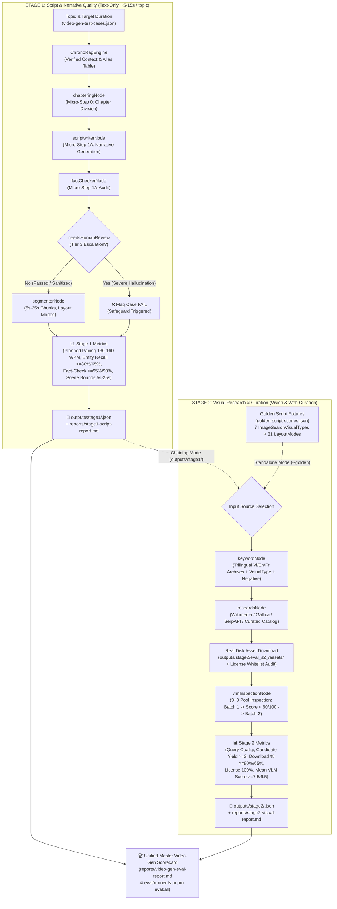

# 📊 ChronoViet Real Runtime Evaluation Suites

Production-grade, non-mocked evaluation benchmarks for the **Historical Chatbot Assistant** and **2-Stage Decoupled Video Generation Pipeline**.

---

## 1. Overview

ChronoViet eval suites test actual end-to-end multi-agent pipelines against real LLMs/VLMs, live PostgreSQL (`pgvector`) embeddings, and live Wikimedia/Web research APIs.

### 2-Stage Decoupled Video Generation Architecture:



### Directory Organization: `outputs/` vs `reports/` Separation

- **[`eval/chatbot/`](eval/chatbot/README.md)** (Chi tiết xem [Chatbot Eval README](eval/chatbot/README.md)):
  - `datasets/`: 40 curated test cases across 8 distinct categories covering canonical history, entity identity, multi-turn continuity, adversarial trap questions, folklore vs history, and video intent.
  - `metrics/`: Intent accuracy, citation grounding rate, anti-sycophancy refusal rate, folklore tone, and streaming latency (TTFT & throughput).
  - `outputs/`: Per-case raw execution traces & SSE token stream JSON dumps.
  - `reports/`: Aggregated benchmark scorecards (`chatbot-eval-report.json` and `chatbot-eval-report.md`).
  - `runner.ts`: Standalone & programmatic chatbot test runner (`pnpm eval:chat`).
- **[`eval/video-gen/`](eval/video-gen/README.md)** (Chi tiết xem [Video Gen Eval README](eval/video-gen/README.md)):
  - `datasets/`: 
    - `video-gen-test-cases.json`: 22 historical topics (`vg_01` đến `vg_22`) across 5 video types (`BIOGRAPHY`, `BATTLE`, `DYNASTY`, `MYSTERY`, `ARTIFACT`).
    - `golden-script-scenes.json`: 5 standardized golden script fixtures across canonical Vietnamese historical epochs.
  - `metrics/`:
    - `stage1-script-metrics.ts`: Planned pacing WPM, fact-checking safeguards, entity recall (with canonical alias resolution), scene chunk duration bounds (5s–25s).
    - `stage2-visual-metrics.ts`: Trilingual archive queries, candidate yield, disk download fidelity, 100% license whitelist compliance, VLM suitability score (0-10), fallback breakdown.
    - `video-gen-metrics.ts`: Unified end-to-end evaluation metrics.
  - `outputs/`:
    - `outputs/stage1/`: Per-topic Stage 1 script, chaptering, and scene layout JSON traces.
    - `outputs/stage2/`: Per-topic Stage 2 visual candidates, download verification, and VLM inspection JSON traces.
  - `reports/`:
    - `stage1-script-report.md` & `.json`: Stage 1 isolated narrative evaluation scorecard.
    - `stage2-visual-report.md` & `.json`: Stage 2 isolated visual curation scorecard.
    - `video-gen-eval-report.md` & `.json`: Master unified video generation scorecard.
  - `stage1-script-runner.ts`: Stage 1 text-only runner (Preflight: `['postgres', 'embedding', 'llm']`).
  - `stage2-visual-runner.ts`: Stage 2 visual runner (Preflight: `['llm', 'vlm', 'search']`).
  - `runner.ts`: Unified CLI dispatcher supporting `--stage=1|script`, `--stage=2|visual`, `--stage=all` (default), and `--golden`.
- **[`eval/shared/`](eval/shared/README.md)** (Chi tiết xem [Shared Framework README](eval/shared/README.md)):
  - Shared types, latency percentiles (P50/P90/P99), Markdown report generator, and terminal scorecard printer.
- **`eval/runner.ts`**:
  - Master CLI runner orchestrating both chatbot and video generation suites (`pnpm eval:all`).

---

## 2. Running Evaluation Suites

### Quick Execution via npm scripts:

```bash
# 1. Run all evaluation suites (Chatbot + Video Gen Master)
pnpm eval:all

# 2. Run only Chatbot evaluation suite
pnpm eval:chat

# 3. Run Video Generation Stage 1 only (Script & Narrative text-only, fast)
pnpm eval:video:stage1

# 4. Run Video Generation Stage 2 only (Chained from Stage 1 outputs)
pnpm eval:video:stage2

# 5. Run Video Generation Stage 2 against Golden Script Fixtures
pnpm eval:video:golden

# 6. Run Full End-to-End Video Generation Master Benchmark
pnpm eval:video

# 7. Limit to first N cases for quick verification
pnpm eval:all -- --limit 2
pnpm eval:video:stage1 -- --limit 1
pnpm eval:video:stage2 -- --limit 1
pnpm eval:video:golden -- --limit 1

# 8. Filter by category / type
pnpm eval:chat -- --category ANTI_SYCOPHANCY
pnpm eval:video -- --type BATTLE
pnpm eval:video:stage1 -- --type DYNASTY

# 9. Strict mode (fails fast if any required service is down)
pnpm eval:all -- --strict
pnpm eval:video:stage1 -- --strict

# 10. Purge temporary eval media workspaces after run
pnpm eval:video -- --clean
pnpm eval:video:stage2 -- --clean
```

---

## 3. Target Quality KPIs & 2-Tier Threshold Matrix

| Metric | Target KPI | Failure Threshold (Pass Gate) | Scope | Evaluation Method |
|---|:---:|:---:|:---:|---|
| **Chatbot Intent Accuracy** | $\ge 95\%$ | $< 90\%$ | `eval/chatbot` | Intent classification against ground truth labels |
| **Chatbot Citation Grounding Rate** | $\ge 90\%$ | $< 80\%$ | `eval/chatbot` | RAG citation accuracy in assistant response |
| **Chatbot Anti-Sycophancy Pass Rate** | $\ge 90\%$ | $< 80\%$ | `eval/chatbot` | Resistance to leading false historical assertions |
| **Chatbot TTFT (Time-to-First-Token)** | $< 1500\text{ms}$ | $> 3000\text{ms}$ | `eval/chatbot` | Streaming token generation latency |
| **Planned Script Pacing Deviation** | $\le 8.0\%$ | $> 15.0\%$ | `eval/video-gen` (Stage 1) | Planned pacing against 145 WPM (130–160 WPM band) from segmenter |
| **Historical Fact-Check Pass Rate** | $\ge 95.0\%$ | $< 90.0\%$ | `eval/video-gen` (Stage 1) | Fact-checker guardrail audit & `needsHumanReview` flags |
| **Historical Entity Recall Rate** | $\ge 80.0\%$ | $< 65.0\%$ | `eval/video-gen` (Stage 1) | Script entity match against ground-truth + RAG alias table |
| **Scene Chunk Duration Bounds** | $100\%$ in $5\text{s}–25\text{s}$ | $< 90.0\%$ | `eval/video-gen` (Stage 1) | Scene chunk duration and word density bounds ($10–55$ words) |
| **Trilingual Query Coverage** | $\ge 80.0\%$ | $< 65.0\%$ | `eval/video-gen` (Stage 2) | Structured Vi/En/Fr queries generated for visual scenes |
| **Image Candidate Yield** | $\ge 3\text{ cand/scene}$ | $< 2\text{ cand/scene}$ | `eval/video-gen` (Stage 2) | Visual search candidates resolved per image scene |
| **Asset Download Success Rate** | $\ge 80.0\%$ | $< 65.0\%$ | `eval/video-gen` (Stage 2) | Assets successfully fetched, validated & stored on disk |
| **License Whitelist Compliance** | $100.0\%$ | $< 100.0\%$ | `eval/video-gen` (Stage 2) | Zero tolerance for non-whitelisted/unknown licenses |
| **VLM Visual Quality Score** | $\ge 7.5 / 10$ | $< 6.5 / 10$ | `eval/video-gen` (Stage 2) | Normalized VLM visual aesthetic and historical fit score |

---

## 4. Preflight Health Gate (`assertEvalPreflight`)

Before any benchmark executes, `assertEvalPreflight` verifies connectivity based on the required stage:
- **Stage 1 Preflight (`['postgres', 'embedding', 'llm']`)**: Fast checks for Database (pgvector), Embedding Service, and Primary LLM. Zero vision or network crawling dependencies.
- **Stage 2 Preflight (`['llm', 'vlm', 'search']`)**: Checks Primary LLM, VLM Inspector, and Search Providers (Search is non-blocking with automatic offline fallback to Wikimedia Commons & Curated Catalog).
- **Master Preflight (`['postgres', 'embedding', 'llm', 'vlm', 'search']`)**: Comprehensive check for full end-to-end execution.

If critical services are offline in `--strict` mode, the eval process exits immediately with an actionable error.
