# 🎬 ChronoViet 4-Stage Decoupled Video Generation Pre-Render & Render Evaluation Suite

Production-grade real runtime benchmark for the **4-Stage Decoupled Video Generation Pipeline**:
1. **Stage 1 (Kịch bản):** Narrative generation, GraphRAG grounding, chaptering, fact-check audit, planned pacing WPM, and scene duration bounds (5s–25s).
2. **Stage 2 (Crawl ảnh & Thị giác):** Trilingual visual query planning (Vi/En/Fr), multi-provider image search, real disk downloads, 100% license whitelist auditing, and VLM visual quality scoring.
3. **Stage 3 (TTS Gen Audio):** Voice synthesis with VieNeu TTS (or Edge fallback), 16-bit PCM WAV generation on disk, word timestamps alignment, and duration reconciliation.
4. **Stage 4 (Remotion Render MP4):** JSON project packaging, Zod `VideoProjectSchema` validation, headless Remotion composition rendering to MP4, and audio-video timeline sync.

---

## 1. Overview & Architecture

```mermaid
flowchart TD
    subgraph S1["STAGE 1: Script & Narrative Quality (Text-Only, ~5-15s / topic)"]
        S1_Input["Topic & Target Duration\n(video-gen-test-cases.json)"] --> S1_RAG["ChronoRagEngine\n(Verified Context & Alias Table)"]
        S1_RAG --> S1_Chapter["chapteringNode\n(Micro-Step 0: Chapter Division)"]
        S1_Chapter --> S1_Script["scriptwriterNode\n(Micro-Step 1A: Narrative Generation)"]
        S1_Script --> S1_Fact["factCheckerNode\n(Micro-Step 1A-Audit)"]
        
        S1_Fact --> S1_Escalation{"needsHumanReview\n(Tier 3 Escalation?)"}
        S1_Escalation -->|"Yes (Severe Hallucination)"| S1_Fail["❌ Flag Case FAIL\n(Safeguard Triggered)"]
        S1_Escalation -->|"No (Passed / Sanitized)"| S1_Seg["segmenterNode\n(5s-25s Chunks, Layout Modes)"]
        
        S1_Seg --> S1_Metrics["📊 Stage 1 Metrics\n(Planned Pacing 130-160 WPM, Entity Recall >=80%/65%,\nFact-Check >=95%/90%, Scene Bounds 5s-25s)"]
        S1_Metrics --> S1_Out["💾 outputs/stage1/<id>.json\n+ reports/stage1-script-report.md"]
        S1_Fail --> S1_Metrics
    end

    subgraph S2["STAGE 2: Visual Research & Curation (Vision & Web Curation)"]
        S2_Input{"Input Source Selection"}
        S1_Out -.->|"Chaining Mode"| S2_Input
        S2_Gold["Golden Script Fixtures\n(golden-script-scenes.json)\n7 VisualTypes + 31 LayoutModes"] -.->|"Standalone Mode (--golden)"| S2_Input
        
        S2_Input --> S2_Keyword["keywordNode\n(Trilingual Vi/En/Fr Archives + VisualType + Negative)"]
        S2_Keyword --> S2_Search["researchNode\n(Wikimedia / Gallica / SerpAPI / Curated Catalog)"]
        S2_Search --> S2_Download["Real Disk Asset Download\n(outputs/stage2/eval_s2_<id>/assets/ + License Whitelist Audit)"]
        S2_Download --> S2_VLM["vlmInspectionNode\n(3+3 Pool Inspection: Batch 1 -> Score < 60/100 -> Batch 2)"]
        S2_VLM --> S2_Metrics["📊 Stage 2 Metrics\n(Trilingual Queries, Candidate Yield >=3, Download % >=80%/65%,\nLicense 100%, Mean VLM Score >=7.5/6.5)"]
        S2_Metrics --> S2_Out["💾 outputs/stage2/<id>.json\n+ reports/stage2-visual-report.md"]
    end

    subgraph S3["STAGE 3: TTS Gen Audio & Duration Reconciliation"]
        S3_Input{"Audio Source Selection"}
        S2_Out -.->|"Chaining Mode"| S3_Input
        S3_Gold["Golden Fixtures"] -.->|"Standalone Mode (--golden)"| S3_Input
        
        S3_Input --> S3_TTS["ttsSynthesisNode\n(VieNeu TTS Engine / Edge Fallback)"]
        S3_TTS --> S3_Disk["Save PCM 16-bit WAV to audio/\n+ Generate Word Timestamps"]
        S3_Disk --> S3_Recon["durationReconciliationNode\n(Micro-Step 1B-Reconcile: Time-Stretch +-10%)"]
        S3_Recon --> S3_Metrics["📊 Stage 3 Metrics\n(Audio Gen Success 100%, Mean RTF < 0.35x,\nMonotonic Timestamps 100%, Recon Dev <= 5%/10%)"]
        S3_Metrics --> S3_Out["💾 outputs/stage3/<id>.json + audio/*.wav\n+ reports/stage3-audio-report.md"]
    end

    subgraph S4["STAGE 4: Remotion Video Rendering & Composition"]
        S4_Input{"Project Schema Source"}
        S3_Out -.->|"Chaining Mode"| S4_Input
        S4_Gold["Golden Project Workspace"] -.->|"Standalone Mode"| S4_Input
        
        S4_Input --> S4_Pack["packagerNode\n(Synthesize project_schema.json)"]
        S4_Pack --> S4_Zod["VideoProjectSchema Zod Validation\n(100% Strict Type Gate)"]
        S4_Zod --> S4_Render["Remotion Headless Engine\n(npx remotion render ChronoVideo --props)"]
        S4_Render --> S4_Metrics["📊 Stage 4 Metrics\n(Schema Pass 100%, MP4 Render Success 100%,\nRender Speed <= 1.0x/1.5x, Audio Sync 100%)"]
        S4_Metrics --> S4_Out["🎥 outputs/stage4/eval_s4_<id>/output/video.mp4\n+ reports/stage4-render-report.md"]
    end

    S1_Out --> MasterReport["🏆 Unified Master Video Generation Scorecard\n(reports/video-gen-eval-report.md & .json)"]
    S2_Out --> MasterReport
    S3_Out --> MasterReport
    S4_Out --> MasterReport
```



---

## 2. Test Datasets

### A. End-to-End Topics (`datasets/video-gen-test-cases.json`)
Contains 22 curated historical topics (`vg_01` to `vg_22`) across 5 video types:
- `DYNASTY` (e.g., *Hồng Bàng - Văn Lang*, *Lý Nam Đế - Vạn Xuân*, *Đinh Bộ Lĩnh - Hoa Lư*)
- `BATTLE` (e.g., *Hai Bà Trưng - Mê Linh*, *Bạch Đằng 938/981/1288*, *Điện Biên Phủ 1954*)
- `BIOGRAPHY` (e.g., *Bà Triệu*, *Lý Thường Kiệt*, *Quang Trung - Nguyễn Huệ*)
- `ARTIFACT` (e.g., *Thành Cổ Loa*, *Trống Đồng Đông Sơn*)
- `MYSTERY` / `CULTURE`

### B. Golden Script Fixtures (`datasets/golden-script-scenes.json`)
Contains 5 standardized, pre-verified golden scripts with full scene definitions across all 7 `ImageSearchVisualTypes` (`PORTRAIT`, `ARTIFACT`, `BATTLE_MAP`, `DOCUMENT`, `SCENERY`, `RECONSTRUCTION`, `GENERAL_HISTORY`) and 31 layout modes. Allows isolated benchmarking of Stage 2, 3, and 4 without depending on Stage 1 LLM generation variance.

---

## 3. Metrics & Target KPIs

| Stage | Metric | Target KPI | Failure Threshold (Pass Gate) | Method |
|---|---|:---:|:---:|---|
| **Stage 1** | **Planned Script Pacing Deviation** | $\le 8.0\%$ | $> 15.0\%$ | Segmenter word density vs. 145 WPM (130–160 WPM target band) |
| **Stage 1** | **Fact-Check Pass Rate** | $\ge 95.0\%$ | $< 90.0\%$ | Fact checker safeguard audit (`needsHumanReview` count) |
| **Stage 1** | **Entity Recall Rate** | $\ge 80.0\%$ | $< 65.0\%$ | Script entity matching with canonical GraphRAG alias table |
| **Stage 1** | **Scene Chunk Duration Bounds** | $100\%$ in $5\text{s}–25\text{s}$ | $< 90.0\%$ | Scene chunk duration and word density ($10–55$ words) |
| **Stage 2** | **Trilingual Query Coverage** | $\ge 80.0\%$ | $< 65.0\%$ | Vi / En / Fr structured query generation for image scenes |
| **Stage 2** | **Image Candidate Yield** | $\ge 3\text{ cand/scene}$ | $< 2\text{ cand/scene}$ | Visual search candidates resolved per image scene |
| **Stage 2** | **Asset Download Success Rate** | $\ge 80.0\%$ | $< 65.0\%$ | Real disk download verification and format validation |
| **Stage 2** | **License Whitelist Compliance** | $100.0\%$ | $< 100.0\%$ | Zero tolerance for non-whitelisted/unknown licenses |
| **Stage 2** | **VLM Visual Quality Score** | $\ge 7.5 / 10$ | $< 6.5 / 10$ | Normalized VLM visual aesthetics and historical fit |
| **Stage 3** | **Audio Generation Success Rate** | $100.0\%$ | $< 95.0\%$ | 100% scenes synthesized and written to disk as valid WAV |
| **Stage 3** | **Real-Time Factor (RTF) Speed** | $< 0.35x$ RTF | $> 0.60x$ RTF | Ratio of audio synthesis latency relative to audio duration |
| **Stage 3** | **Word Timestamp Monotonicity** | $100.0\%$ | $< 95.0\%$ | Word timestamps are non-decreasing without negative durations |
| **Stage 3** | **Pacing Reconciliation Deviation** | $\le 5.0\%$ | $> 10.0\%$ | Deviation of reconciled audio length vs topic target duration |
| **Stage 3** | **PCM WAV Format Compliance** | $100.0\%$ | $< 95.0\%$ | 16-bit PCM Mono WAV header validation (16-48kHz) |
| **Stage 4** | **VideoProjectSchema Validation** | $100.0\%$ | $< 100.0\%$ | Strict Zod schema validation with zero issues |
| **Stage 4** | **Remotion Video Render Success** | $100.0\%$ | $< 100.0\%$ | Headless MP4 output on disk with size $\ge 50\text{KB}$ |
| **Stage 4** | **Remotion Render Speed Ratio** | $\le 1.0x$ | $> 1.50x$ | Ratio of render duration relative to video playback duration |
| **Stage 4** | **Audio-Video Timeline Sync Rate** | $100.0\%$ | $< 98.0\%$ | Timeline frames cover audio without abrupt premature cuts |
| **Stage 4** | **Caption Frame Boundary Rate** | $100.0\%$ | $< 95.0\%$ | Karaoke captions bounded within scene duration |

---

## 4. How to Run

### 4.1. Lệnh pnpm Tối Thiểu Cho Từng Giai Đoạn (Minimal Step-by-Step Commands)

Bảng dưới đây quy định chính xác các dịch vụ hạ tầng nền **tối thiểu** cần bật trước khi chạy và lệnh thực thi đánh giá cho từng Stage:

| Giai Đoạn (Stage) | Hạ Tầng Tối Thiểu Cần Khởi Động Trước | Lệnh Chạy Eval Tối Thiểu | Chế Độ Độc Lập Chuẩn (Golden Fixtures) |
|---|---|---|---|
| **Stage 1 (Kịch bản)** | `pnpm stack:infra` *(PostgreSQL)*<br/>`pnpm ai:emb` *(Port 8090)*<br/>`pnpm ai:llm` *(Port 8092)* | `pnpm eval:video:stage1`<br/>*(Test nhanh: `pnpm eval:video:stage1 -- --limit 1`)* | N/A *(Sinh kịch bản trực tiếp từ đề tài đầu vào)* |
| **Stage 2 (Ảnh & VLM)** | `pnpm stack:infra` *(Redis)*<br/>`pnpm ai:llm` *(Port 8092 - LLM & VLM)*<br/>*Kết nối mạng Internet* | `pnpm eval:video:stage2`<br/>*(Nối tiếp từ kết quả `outputs/stage1/`)* | `pnpm eval:video:stage2 -- --golden`<br/>*(Test nhanh: `pnpm eval:video:stage2 -- --golden --limit 1`)* |
| **Stage 3 (TTS Audio)** | `pnpm ai:tts` *(Port 8080 - VieNeu TTS)* | `pnpm eval:video:stage3`<br/>*(Nối tiếp từ `outputs/stage2/` hoặc `stage1/`)* | `pnpm eval:video:stage3 -- --golden`<br/>*(Test nhanh: `pnpm eval:video:stage3 -- --golden --limit 1`)* |
| **Stage 4 (Render Video)** | **0% AI Stack**<br/>*(Chỉ cần Node.js & Remotion Chromium có sẵn)* | `pnpm eval:video:stage4`<br/>*(Nối tiếp từ `outputs/stage3/`)* | `pnpm eval:video:stage4 -- --golden`<br/>*(Test nhanh: `pnpm eval:video:stage4 -- --golden --limit 1`)* |
| **Master (Full 4-Stage)** | `pnpm stack:infra` *(DB + Redis)*<br/>`pnpm ai:start`<br/>*(Bật 8090, 8092, 8096, 8080)* | `pnpm eval:video`<br/>*(Test nhanh: `pnpm eval:video -- --limit 1`)* | `pnpm eval:video:golden`<br/>*(Chạy trọn vẹn Stage 2, 3, 4 trên 5 golden scripts)* |

> [!TIP]
> - Kiểm tra tình trạng các cổng dịch vụ AI đang chạy: `pnpm ai:status`
> - Dừng tất cả tiến trình AI chạy nền để giải phóng RAM: `pnpm ai:stop`
> - Dừng PostgreSQL và Redis container: `pnpm stack:down`

### 4.2. Danh Sách Lệnh CLI Đầy Đủ (Command Reference)

```bash
# 1. Chạy Full End-to-End Master 4-Stage Benchmark (Stage 1 -> 2 -> 3 -> 4)
pnpm eval:video

# 2. Chạy từng giai đoạn độc lập (nhanh, cô lập failure domain):
pnpm eval:video:stage1                # Stage 1: Text-only kịch bản & phân cảnh (~5-15s / topic)
pnpm eval:video:stage2                # Stage 2: Curation ảnh & VLM thẩm định
pnpm eval:video:stage3                # Stage 3: TTS gen audio & word timestamps
pnpm eval:video:stage4                # Stage 4: Remotion kết xuất video MP4

# 3. Chạy với dữ liệu mẫu chuẩn hóa Golden Fixtures (0% phụ thuộc phương sai kịch bản):
pnpm eval:video:golden                # Chạy Stage 2, 3, 4 trên 5 kịch bản mẫu chuẩn
pnpm eval:video:stage2 -- --golden    # Chỉ chạy Stage 2 với Golden Fixtures
pnpm eval:video:stage3 -- --golden    # Chỉ chạy Stage 3 với Golden Fixtures
pnpm eval:video:stage4 -- --golden    # Chỉ chạy Stage 4 với Golden Fixtures

# 4. Giới hạn số lượng đề tài chạy (thích hợp kiểm tra nhanh 1-2 ca):
pnpm eval:video -- --limit 1
pnpm eval:video:stage1 -- --limit 1
pnpm eval:video:stage2 -- --limit 1
pnpm eval:video:stage3 -- --limit 1
pnpm eval:video:stage4 -- --limit 1

# 5. Lọc theo thể loại video (DYNASTY, BATTLE, BIOGRAPHY, ARTIFACT, MYSTERY):
pnpm eval:video -- --type BATTLE
pnpm eval:video:stage1 -- --type DYNASTY
pnpm eval:video:stage1 -- --type BIOGRAPHY

# 6. Chế độ nghiêm ngặt (Strict Mode - fail fast khi có dịch vụ offline / cảnh báo ảo giác):
pnpm eval:video -- --strict

# 7. Tự động dọn dẹp file video và audio tạm sau khi đo benchmark xong:
pnpm eval:video -- --clean
pnpm eval:video:stage4 -- --clean
```

---

## 5. Preflight Requirements & Cổng Dịch Vụ (Service Ports)

- **PostgreSQL (`pgvector` - Port 5432)**: Khởi động qua `pnpm stack:infra`. Dùng cho GraphRAG và Semantic Search ở Stage 1 và Master.
- **Embedding Server (`bge-m3` 1024d - Port 8090)**: Khởi động qua `pnpm ai:emb`. Dùng cho vector retrieval ở Stage 1 và Master.
- **Primary LLM & Unified VLM Inspector (`Qwen 7B/14B` - Port 8092)**: Khởi động qua `pnpm ai:llm`. Dùng cho kịch bản, fact-checker, phân cảnh ở Stage 1 và thẩm định thị giác ở Stage 2.
- **VieNeu TTS Microservice (Port 8080)**: Khởi động qua `pnpm ai:tts`. Dùng cho sinh audio WAV 24kHz và word timestamps ở Stage 3 và Master.
- **Remotion Headless Engine (Port 9876 nếu bật Studio preview, hoặc headless CLI)**: Đã tích hợp sẵn trong repo, chỉ cần Node.js runtime ở Stage 4.
- **Redis (Port 6379)**: Khởi động qua `pnpm stack:infra`. Dùng cho pubsub / caching ở Stage 2 và Master.

---

## 6. Outputs and Reports

- **Stage 1 Artifacts (`outputs/stage1/<id>.json`)**:
  - Narrative chapters, scripts, fact-check logs, and segmented scenes.
- **Stage 2 Artifacts (`outputs/stage2/<id>.json` + `assets/`)**:
  - Downloaded image files (`cand_scene_*.jpg/webp`), license records, and VLM inspection scores.
- **Stage 3 Artifacts (`outputs/stage3/<id>.json` + `audio/`)**:
  - PCM 16-bit WAV files, word timestamps, RTF measurements, and reconciled durations.
- **Stage 4 Artifacts (`outputs/stage4/eval_s4_<id>/output/video.mp4` + `<id>.json`)**:
  - Rendered MP4 video files, frame counts, render latencies, and sync audit.
- **Reports (`reports/`)**:
  - `stage1-script-report.md` & `.json`: Narrative and pacing scorecard.
  - `stage2-visual-report.md` & `.json`: Visual curation and VLM scorecard.
  - `stage3-audio-report.md` & `.json`: TTS synthesis and duration reconciliation scorecard.
  - `stage4-render-report.md` & `.json`: Remotion video rendering scorecard.
  - `video-gen-eval-report.md` & `.json`: Master unified 4-stage video generation scorecard.
