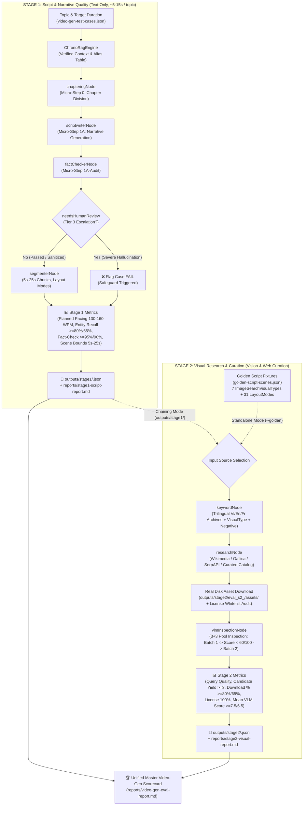

# 🎬 ChronoViet 2-Stage Decoupled Video Generation Pre-Render Evaluation Suite

Production-grade real runtime benchmark for the **2-Stage Decoupled Video Generation Pre-Render Pipeline**.

---

## 1. Overview & Architecture

The video generation evaluation suite assesses the end-to-end multi-agent pre-render workflow (from historical topic input to script generation, pacing verification, visual research, asset download, and VLM visual inspection) **before** rendering with Remotion.

### 2-Stage Decoupled Execution Pipeline:



---

## 2. Test Datasets

### A. End-to-End Topics (`datasets/video-gen-test-cases.json`)
Contains 22 curated historical topics (`vg_01` to `vg_22`) across 5 video types:
- `DYNASTY` (e.g., *Hồng Bàng - Văn Lang*, *Lý Nam Đế - Vạn Xuân*, *Đinh Bộ Lĩnh - Hoa Lư*)
- `BATTLE` (e.g., *Hai Bà Trưng - Mê Linh*, *Bạch Đằng 938/981/1288*, *Điện Biên Phủ 1954*)
- `BIOGRAPHY` (e.g., *Bà Triệu*, *Lý Thường Kiệt*, *Quang Trung - Nguyễn Huệ*)
- `ARTIFACT` (e.g., *Thành Cổ Loa*, *Trống Đồng Đông Sơn*)
- `MYSTERY` / `CULTURE`

### B. Golden Script Fixtures (`datasets/golden-script-scenes.json`)
Contains 5 standardized, pre-verified golden scripts with full scene definitions across all 7 `ImageSearchVisualTypes` (`PORTRAIT`, `ARTIFACT`, `BATTLE_MAP`, `DOCUMENT`, `SCENERY`, `RECONSTRUCTION`, `GENERAL_HISTORY`) and 31 layout modes. Allows isolated benchmarking of Stage 2 without depending on Stage 1 LLM generation variance.

---

## 3. Metrics & Target KPIs

| Stage | Metric | Target KPI | Failure Threshold (Pass Gate) | Method |
|---|---|:---:|:---:|---|
| **Stage 1** | **Planned Script Pacing Deviation** | $\le 8.0\%$ | $> 15.0\%$ | Segmenter word density vs. 145 WPM (130–160 WPM target band) |
| **Stage 1** | **Fact-Check Pass Rate** | $\ge 95.0\%$ | $< 90.0\%$ | Fact checker safeguard audit (`needsHumanReview` count) |
| **Stage 1** | **Entity Recall Rate** | $\ge 80.0\%$ | $< 65.0\%$ | Script entity matching with canonical GraphRAG alias table |
| **Stage 1** | **Scene Chunk Duration Bounds** | $100\%$ in $5\text{s}–25\text{s}$ | $< 90.0\%$ | Scene chunk duration and word density ($10–55$ words) |
| **Stage 2** | **Trilingual Query Coverage** | $\ge 80.0\%$ | $< 65.0\%$ | Vi / En / Fr structured query generation for image scenes |
| **Stage 2** | **Image Candidate Yield** | $\ge 3\text{ cand/scene}$ | $< 2\text{ cand/scene}$ | Visual search candidates resolved per image scene |
| **Stage 2** | **Asset Download Success Rate** | $\ge 80.0\%$ | $< 65.0\%$ | Real disk download verification and format validation |
| **Stage 2** | **License Whitelist Compliance** | $100.0\%$ | $< 100.0\%$ | Zero tolerance for non-whitelisted/unknown licenses |
| **Stage 2** | **VLM Visual Quality Score** | $\ge 7.5 / 10$ | $< 6.5 / 10$ | Normalized VLM visual aesthetics and historical fit |

---

## 4. How to Run

### Command Line Interface:

```bash
# 1. Run Full 2-Stage End-to-End Benchmark (Stage 1 + Stage 2)
pnpm eval:video

# 2. Run Stage 1 only (Fast Text-Only, ~5-15s / topic, LLM + DB + Embedding)
pnpm eval:video:stage1

# 3. Run Stage 2 only (Visual Curation chained from existing Stage 1 outputs)
pnpm eval:video:stage2

# 4. Run Stage 2 standalone against Golden Script Fixtures
pnpm eval:video:golden

# 5. Limit test cases (e.g., 1-2 topics for quick validation)
pnpm eval:video -- --limit 2
pnpm eval:video:stage1 -- --limit 1
pnpm eval:video:stage2 -- --limit 1
pnpm eval:video:golden -- --limit 1

# 6. Filter by video type
pnpm eval:video -- --type BATTLE
pnpm eval:video:stage1 -- --type DYNASTY
pnpm eval:video:stage1 -- --type BIOGRAPHY

# 7. Strict mode (fails fast if any required service is down)
pnpm eval:video -- --strict

# 8. Clean up temporary downloaded assets after evaluation run
pnpm eval:video -- --clean
pnpm eval:video:stage2 -- --clean
```

---

## 5. Preflight Requirements

- **Stage 1 (`pnpm eval:video:stage1`)**: Requires PostgreSQL (`pgvector` via `pnpm stack:infra`), Embedding Server (Port 8090 via `pnpm ai:emb`), and Primary LLM (Port 8092 via `pnpm ai:llm`).
- **Stage 2 (`pnpm eval:video:stage2` / `pnpm eval:video:golden`)**: Requires Primary LLM & Unified Multimodal VLM Inspector (Port 8092 via `pnpm ai:llm`), Redis (Port 6379), and Search Providers (falls back cleanly to Wikimedia Commons & Curated Catalog if external search APIs are offline).
- **Master Video Suite (`pnpm eval:video`)**: Requires all above services plus VieNeu TTS (Port 8080 via `pnpm ai:tts`).

---

## 6. Outputs and Reports

- **Stage 1 Artifacts (`outputs/stage1/<id>/`)**:
  - `script-generation.json`: Narrative chapters, scripts, and segmented scenes.
- **Stage 2 Artifacts (`outputs/stage2/<id>/`)**:
  - `assets/`: Real disk downloaded candidate images (`cand_scene_*.jpg/webp`).
  - `visual-curation.json`: Candidate metadata, license records, and VLM inspection scores.
- **Reports (`reports/`)**:
  - `stage1-script-report.md` & `.json`: Narrative and pacing benchmark scorecard.
  - `stage2-visual-report.md` & `.json`: Visual curation and VLM score scorecard.
  - `video-gen-eval-report.md` & `.json`: Master unified video generation scorecard.
