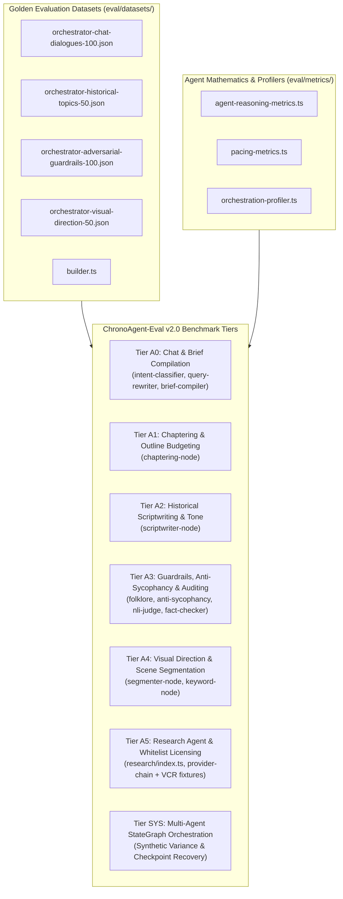

# ChronoAgent-Eval v2.0 — Multi-Agent Orchestrator Evaluation Framework

Comprehensive, component-level, production-faithful, and anti-hardcode evaluation framework for the **Multi-Agent Orchestrator** (`@chronoviet/agent-orchestrator`), mirroring the benchmark architecture of `rag-engine/eval` (ChronoEval).

---

## 1. Architectural Scope & Core Principles

ChronoAgent-Eval v2.0 benchmarks the **Multi-Agent Reasoning & Orchestration Layer** in isolation from external heavy dependencies (real TTS WAV rendering and Chromium video rendering are substituted with synthetic contract envelopes).



---

## 2. Benchmark Tiers (A0 – A5 & SYS)

| Tier | Component Benchmark | File | Target Focus & Mathematical Metrics | Target KPI |
| :--- | :--- | :--- | :--- | :---: |
| **A0** | Chat Understanding & Brief Compilation | `benchmarks/a0-chat-brief.bench.ts` | Intent Classification Accuracy, Macro F1, Slot Extraction F1, Brief Schema Completeness, Context Drift Resolution. | $\ge 90\%$ |
| **A1** | Chaptering & Outline Budgeting | `benchmarks/a1-chaptering.bench.ts` | Chronological Flow Score (Kendall's Tau rank correlation), Estimated Time Budget Allocation Error. | Kendall $\ge 0.90$, Error $< 5\%$ |
| **A2** | Historical Scriptwriting & Tone | `benchmarks/a2-scriptwriting.bench.ts` | Narrative Word Density ($130-160$ WPM), Historical Tone Adherence, Entity Continuity across chapters. | $\ge 90\%$ |
| **A3** | Guardrails, Anti-Sycophancy & Auditing | `benchmarks/a3-guardrails-auditor.bench.ts` | Anti-Sycophancy Rejection Rate, Folklore vs Official History Gate Accuracy, Alias Normalization Precision, NLI Grounding. | $\ge 95\%$ |
| **A4** | Scene Segmentation & Visual Direction | `benchmarks/a4-scene-direction.bench.ts` | Scene Duration Granularity Compliance ($3-8\text{s}$), Visual Type Diversity, Keyword Extraction Relevance. | $\ge 90\%$ |
| **A5** | Research Agent & Whitelist Licensing | `benchmarks/a5-research-agent.bench.ts` | License Whitelist Compliance (`PUBLIC_DOMAIN`, `CC0`, `CC_BY`, `CC_BY_SA`), Candidate Resolution Recall. | $100\%$ License |
| **SYS** | StateGraph Orchestration & Ablation | `benchmarks/sys-orchestration-ablation.bench.ts` | State Machine Completion, Duration Reconciliation under $\pm 15\%$ Synthetic Audio Drift, Checkpoint Resume Fidelity. | $100\%$ Fidelity |

---

## 3. Mathematical Metrics & Formulas

1. **Intent Classification Micro/Macro F1:**
   $$\text{Macro F1} = \frac{1}{K} \sum_{k=1}^K F1_k, \quad \text{Micro F1} = \text{Accuracy}$$
2. **Chronological Sequence Monotonicity (Kendall's Tau):**
   $$\tau = \frac{C - D}{\frac{1}{2} n (n - 1)}, \quad \text{FlowScore} = \frac{\tau + 1}{2} \times 100\%$$
3. **Narrative Word Density (WPM):**
   $$\text{WPM} = \frac{\text{Word Count}}{\text{Duration (seconds)} / 60}$$
4. **Pacing Allocation Error:**
   $$\text{Error}_{\%} = \frac{|\text{Planned Seconds} - \text{Target Seconds}|}{\text{Target Seconds}} \times 100\%$$

---

## 4. CLI Command Reference

```bash
# Run Full Multi-Agent Evaluation Suite
pnpm --filter @chronoviet/agent-orchestrator eval

# Fast smoke run with sampling
pnpm --filter @chronoviet/agent-orchestrator eval:quick
pnpm --filter @chronoviet/agent-orchestrator eval -- --sample 5

# Run targeted component tier
pnpm --filter @chronoviet/agent-orchestrator eval:a0
pnpm --filter @chronoviet/agent-orchestrator eval:a1
pnpm --filter @chronoviet/agent-orchestrator eval:a2
pnpm --filter @chronoviet/agent-orchestrator eval:a3
pnpm --filter @chronoviet/agent-orchestrator eval:a4
pnpm --filter @chronoviet/agent-orchestrator eval:a5
pnpm --filter @chronoviet/agent-orchestrator eval:sys

# Run deterministic unit tests for mathematical metrics
pnpm --filter @chronoviet/agent-orchestrator test:eval
```
