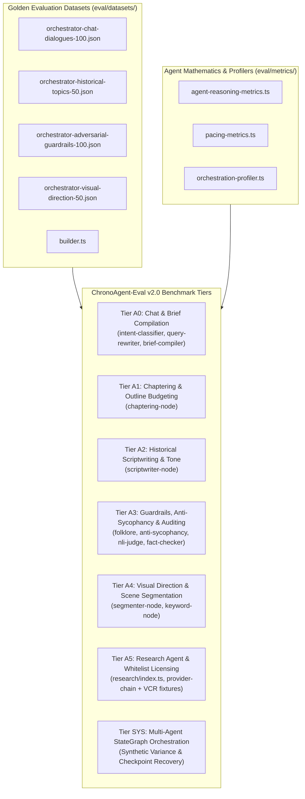

# ChronoAgent-Eval v2.0 — Multi-Agent Orchestrator Evaluation Framework

Comprehensive, component-level, production-faithful, and anti-hardcode evaluation framework for the **Multi-Agent Orchestrator** (`@chronoviet/agent-orchestrator`), mirroring the benchmark architecture of `rag-engine/eval` (ChronoEval).

---

## 1. Architectural Scope & Core Principles

ChronoAgent-Eval v2.0 benchmarks the **Multi-Agent Reasoning & Orchestration Layer** in isolation from external heavy dependencies (real TTS WAV rendering and Chromium video rendering are substituted with synthetic contract envelopes).



---

## 2. Benchmark Tiers (A0 – A5 & SYS)

| Tier | Component Benchmark | File | Target Focus & Mathematical Metrics | Target KPI |
| :--- | :--- | :--- | :--- | :---: |
| **A0** | Chat Understanding & Brief Compilation | `benchmarks/a0-chat-brief.bench.ts` | Intent Classification Accuracy, Macro F1, Slot Extraction F1, Brief Schema Completeness, Context Drift Resolution. | $\ge 90\%$ |
| **A1** | Chaptering & Outline Budgeting | `benchmarks/a1-chaptering.bench.ts` | Chronological Flow Score (Kendall's Tau rank correlation), Estimated Time Budget Allocation Error. | Kendall $\ge 0.90$, Error $< 5\%$ |
| **A2** | Historical Scriptwriting & Tone | `benchmarks/a2-scriptwriting.bench.ts` | Narrative Word Density ($130-160$ WPM), Historical Tone Adherence, Entity Continuity across chapters. | $\ge 90\%$ |
| **A3** | Guardrails, Anti-Sycophancy & Auditing | `benchmarks/a3-guardrails-auditor.bench.ts` | Anti-Sycophancy Rejection Rate, Folklore vs Official History Gate Accuracy, Alias Normalization Precision, NLI Grounding. | $\ge 95\%$ |
| **A4** | Scene Segmentation & Visual Direction | `benchmarks/a4-scene-direction.bench.ts` | Scene Duration Granularity Compliance ($3-8\text{s}$), Visual Type Diversity, Keyword Extraction Relevance. | $\ge 90\%$ |
| **A5** | Research Agent & Whitelist Licensing | `benchmarks/a5-research-agent.bench.ts` | License Whitelist Compliance (`PUBLIC_DOMAIN`, `CC0`, `CC_BY`, `CC_BY_SA`), Candidate Resolution Recall. | $100\%$ License |
| **SYS** | StateGraph Orchestration & Ablation | `benchmarks/sys-orchestration-ablation.bench.ts` | State Machine Completion, Duration Reconciliation under $\pm 15\%$ Synthetic Audio Drift, Checkpoint Resume Fidelity. | $100\%$ Fidelity |

---

## 3. Mathematical Metrics & Formulas

1. **Intent Classification Micro/Macro F1:**
   $$\text{Macro F1} = \frac{1}{K} \sum_{k=1}^K F1_k, \quad \text{Micro F1} = \text{Accuracy}$$
2. **Chronological Sequence Monotonicity (Kendall's Tau):**
   $$\tau = \frac{C - D}{\frac{1}{2} n (n - 1)}, \quad \text{FlowScore} = \frac{\tau + 1}{2} \times 100\%$$
3. **Narrative Word Density (WPM):**
   $$\text{WPM} = \frac{\text{Word Count}}{\text{Duration (seconds)} / 60}$$
4. **Pacing Allocation Error:**
   $$\text{Error}_{\%} = \frac{|\text{Planned Seconds} - \text{Target Seconds}|}{\text{Target Seconds}} \times 100\%$$
5. **Neural LLM-as-a-Judge NLI Grounding (`evaluateNliWithLlmJudge`):**
   $$\text{EntailmentScore} \in [0.0, 1.0], \quad \text{Verdict} \in \{\text{ENTAILMENT}, \text{NEUTRAL}, \text{CONTRADICTION}\}$$
6. **TTS Audio Waveform PCM Inspection (`analyzeWavAudioBuffer`):**
   $$\text{ClippingRatio} = \frac{N_{\text{clipped}}}{N_{\text{total}}}, \quad \text{SilenceRatio} = \frac{N_{\text{silent}}}{N_{\text{total}}}, \quad \text{RMSAmplitude} = \sqrt{\frac{1}{N} \sum_{i=1}^N x_i^2}$$

---

## 4. Preflight Infrastructure & Model Requirements (Yêu Cầu Hạ Tầng AI & CSDL)

> ⚠️ **Chế độ Strict Pre-flight (`EVAL_STRICT`):** Khi chạy benchmark Multi-Agent StateGraph, hệ thống yêu cầu kết nối đến PostgreSQL và các mô hình AI cục bộ thật để đánh giá năng lực lập luận, guardrails và tone văn dã sử.

```bash
# 0. Khởi động CSDL và các AI model tương ứng:
pnpm stack:infra                                    # Khởi động PostgreSQL (Checkpoints persistence) & Redis
pnpm ai:llm                                         # [Bắt buộc A0, A1, A2, A3] Primary LLM Port 8092 (Qwen-9B)
pnpm ai:tts                                         # [Bắt buộc worker TTS] VieNeu TTS Port 8080 (hoặc dùng synthetic fallback)

# Hoặc khởi động nhanh toàn bộ AI stack:
pnpm ai:start                                       # Bật toàn bộ các cổng 8090, 8092, 8096, 8080
pnpm ai:status                                      # Kiểm tra trạng thái các cổng AI
```

---

## 5. CLI Command Reference (Hướng Dẫn Thực Thi)

```bash
# 1. Chạy đánh giá toàn diện Orchestrator (State machine completion, pacing & guardrails)
pnpm eval:orchestrator
# hoặc trong package:
pnpm --filter @chronoviet/agent-orchestrator eval

# 2. Chạy đánh giá nhanh (Fast smoke run with sampling)
pnpm --filter @chronoviet/agent-orchestrator eval:quick
pnpm --filter @chronoviet/agent-orchestrator eval -- --sample 5

# 3. Chạy từng tầng benchmark con (A0 - A5 & SYS):
pnpm --filter @chronoviet/agent-orchestrator eval:a0        # A0: Chat & Brief Compilation
pnpm --filter @chronoviet/agent-orchestrator eval:a1        # A1: Chaptering & Outline Budgeting
pnpm --filter @chronoviet/agent-orchestrator eval:a2        # A2: Historical Scriptwriting & Tone
pnpm --filter @chronoviet/agent-orchestrator eval:a3        # A3: Guardrails, Anti-Sycophancy & Auditing
pnpm --filter @chronoviet/agent-orchestrator eval:a4        # A4: Visual Direction & Scene Segmentation
pnpm --filter @chronoviet/agent-orchestrator eval:a5        # A5: Research Agent & Whitelist Licensing
pnpm --filter @chronoviet/agent-orchestrator eval:sys       # SYS: StateGraph Orchestration & Ablation

# 4. Chạy đánh giá riêng Research Agent (Image candidate resolution)
pnpm --filter @chronoviet/agent-orchestrator eval:research

# 5. Chạy deterministic unit tests (chạy trong CI)
pnpm test:orchestrator
# hoặc trong package:
pnpm --filter @chronoviet/agent-orchestrator test
pnpm --filter @chronoviet/agent-orchestrator test:eval

# 6. Tắt AI giải phóng RAM sau khi hoàn tất benchmark
pnpm ai:stop
```
