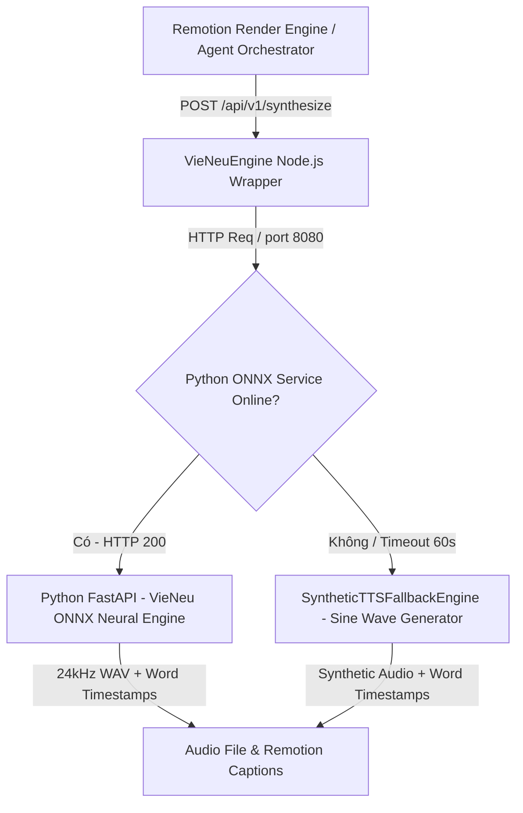

# @chronoviet/vieneu-tts — VieNeu TTS Microservice & Engine

Dịch vụ Tổng hợp Giọng đọc Tiếng Việt AI (Text-to-Speech) chuyên dụng cho hệ thống **ChronoViet**. Tích hợp trực tiếp mô hình thần kinh **VieNeu ONNX Engine** (24kHz NeuCodec) kết hợp cơ chế phòng thủ 2 lớp (Dual-Layer Fallback), tự động tính toán số khung hình (Frames) và khớp mốc thời gian phụ đề (Word Timestamps Alignment) chính xác cho tiến trình dựng video tự động trong **Remotion**.

---

## 🏗️ Kiến Trúc Hệ Thống (Dual-Layer Architecture)



1. **Lớp 1 (Primary Neural Engine)**: `app.py` (Python FastAPI Microservice)
   - Tích hợp mô hình nơ-ron **Piper ONNX Vietnamese Voice** (`vi_VN-vivos-medium.onnx` + config) và **VieNeu-TTS ONNX** chuẩn **24 kHz (PCM 16-bit)** với cơ chế tự động tải model (auto-provisioning) từ Hugging Face.
   - Thuật toán phân bổ timestamp từ ngữ linh hoạt theo số ký tự và khoảng dừng dấu câu (`.`, `,`, `?`, `!`, `;`, `:`).
   - Tích hợp bộ lọc access log loại bỏ log spam từ chu kỳ probe `/health`.
2. **Lớp 2 (Zero-Downtime Fallback Engine)**: `src/engine.ts` (`SyntheticTTSFallbackEngine`)
   - Tự động kích hoạt khi microservice Python bị offline hoặc timeout trong môi trường dev.
   - Sinh xung âm thanh định thanh 480Hz để kiểm thử toán học khung hình video Remotion, đảm bảo tiến trình render không bao giờ bị gián đoạn.

---

## 📋 Data Contract & Zod Schemas (`@chronoviet/shared-spec`)

Tất cả dữ liệu đầu vào và đầu ra tuân thủ Zod Schema khai báo tại [`packages/shared-spec`](../../packages/shared-spec):

### Request Payload (`VieNeuTTSRequestSchema`)
```typescript
{
  text: string;                  // Nội dung câu cần đọc (bắt buộc, min length: 1)
  speakerId?: string;            // ID giọng đọc (mặc định: 'vi_historical_male_1')
  speedRatio?: number;           // Tốc độ đọc (mặc định: 1.0)
  sampleRate?: number;           // Tần số mẫu Hz (mặc định: 24000)
  paddingMs?: number;            // Thời gian lề âm thanh ms (mặc định: 300)
  fps?: number;                  // Khung hình/giây video Remotion (mặc định: 30)
}
```

### Response Payload (`VieNeuTTSResponseSchema`)
```typescript
{
  status: 'SUCCESS' | 'ERROR';
  audioUrl: string;                // Đường dẫn tĩnh tới file WAV (/static/audio/...)
  audioDurationMs: number;         // Tổng thời lượng âm thanh (ms)
  calculatedFramesAt30fps: number;   // Số frames Remotion = ceil((audioDurationMs + paddingMs)/1000 * fps)
  wordTimestamps: Array<{          // Mốc thời gian từng từ cho Caption Karaoke
    word: string;
    startMs: number;
    endMs: number;
  }>;
  errorMsg?: string;               // Thông báo lỗi chi tiết (nếu status === 'ERROR')
  engineType?: 'PIPER_NEURAL_ONNX' | 'REAL_NEURAL_ONNX' | 'SYNTHETIC_FALLBACK_PYTHON' | 'SYNTHETIC_FALLBACK_TONE' // Chế độ engine thực thi
}
```

---

## 🛠️ Public Utility Export Functions (`src/index.ts`)

| Export Symbol | Module File | Description |
| :--- | :--- | :--- |
| `convertVieNeuTimestampsToCaptions` | [`src/timestamp-converter.ts`](src/timestamp-converter.ts) | Quy đổi `wordTimestamps` (ms) $\rightarrow$ `CaptionWord[]` (`startFrame`, `endFrame`) ở FPS quy định. |
| `calculateSceneDurationInFrames` | [`src/timestamp-converter.ts`](src/timestamp-converter.ts) | Tính toán tổng `durationInFrames` cho cảnh phim: $\lceil \frac{\text{audioDurationMs} + \text{paddingMs}}{1000} \times \text{fps} \rceil$. |
| `VieNeuEngine` | [`src/engine.ts`](src/engine.ts) | Primary Engine Wrapper gọi Python FastAPI Service, tự động failover sang `SyntheticTTSFallbackEngine`. |
| `SyntheticTTSFallbackEngine` | [`src/engine.ts`](src/engine.ts) | Fallback engine tạo file `.wav` tone 480Hz giả lập âm thanh và mốc thời gian mượt mà trên CPU dev. |
| `normalizeAudioLoudness` | [`src/audio-normalizer.ts`](src/audio-normalizer.ts) | Chuẩn hóa âm lượng EBU R128 (-16 LUFS) và xử lý clip threshold cho audio. |

---

## 🚀 Hướng Dẫn Khởi Chạy (Quickstart)

### Khởi chạy bằng Unified CLI hoặc Docker Compose (Khuyên dùng)
```bash
# Cách 1: Khởi chạy nhanh qua Unified AI CLI (Tự động quản lý vòng đời)
pnpm ai:tts
# hoặc: pnpm ai tts

# Cách 2: Khởi chạy qua Docker Compose profile
docker compose --profile tts up -d

# Kiểm tra trạng thái sức khỏe
pnpm ai
# hoặc: pnpm ai:status
```
> Service được đóng gói container `vieneu_tts_engine`, mở cổng `8080`, tự động mount volume `./media:/app/media` và sẵn sàng phục vụ endpoint `/api/v1/synthesize`, `/health`, `/static/audio/`.


---

## 🧪 Benchmark & Evaluation Suite (`eval/`)

Thư mục `eval/` chứa bộ công cụ kiểm thử hiệu năng và độ chính xác mốc thời gian (KPI Verification):

### Các KPI mục tiêu:
- ⚡ **Real-Time Factor (RTF)**: `< 0.3x` (Tốc độ sinh âm thanh trên CPU)
- ⏱️ **Alignment Error**: `< 50ms` (Không chênh lệch hay chồng chéo mốc từ)
- 🎬 **Frame Calculation Error**: `< 1.0 frame` (Độ lệch tính toán khung hình Remotion)

### Lệnh chạy Eval Suite:
```bash
# Chạy đánh giá bộ test-cases kịch bản video essay lịch sử
pnpm --filter @chronoviet/vieneu-tts eval
```

### Trích xuất Dataset kịch bản mới:
```bash
npx tsx services/vieneu-tts/eval/scripts/extract_remotion_dataset.ts
```

---

## 🔌 Danh Sách API Endpoints

| Method | Endpoint | Description |
| :--- | :--- | :--- |
| `GET` | `/health` | Kiểm tra trạng thái sống của service |
| `POST` | `/api/v1/synthesize` | Tổng hợp giọng đọc & tính toán word timestamps |
| `GET` | `/static/audio/:filename` | Tải/phát file âm thanh `.wav` đã sinh trong `media/audio-cache/` |

---

## 📁 Cấu Trúc Thư Mục

```
services/vieneu-tts/
├── app.py                      # Python FastAPI ONNX Microservice (Dual-Mode: 24kHz NeuCodec / PCM-16 Synthesizer)
├── Dockerfile                  # Container build config (Python 3.11-slim + libsndfile + uvicorn)
├── requirements.txt            # Python dependencies (fastapi, uvicorn, numpy, soundfile, pydantic)
├── package.json                # Cấu hình npm package, scripts & dependencies
├── tsconfig.json               # Cấu hình TypeScript compiler
├── src/
│   ├── index.ts                # Main export entrypoint
│   ├── engine.ts               # VieNeuEngine Wrapper & SyntheticTTSFallbackEngine
│   ├── server.ts               # Node.js HTTP Server API router & static audio server
│   ├── timestamp-converter.ts  # Quy đổi ms -> Remotion Caption Frames & Scene Duration
│   └── __tests__/              # Unit test bộ quy đổi timestamp
├── eval/
│   ├── runner.ts               # Runner đo lường RTF & alignment accuracy (hỗ trợ --fresh, --clean)
│   ├── datasets/               # Dataset câu thoại trích xuất từ kịch bản Remotion (remotion_script_sentences.json)
│   ├── reports/                # Module report_generator.ts & báo cáo JSON/Markdown
│   └── scripts/                # Script trích xuất dataset từ kịch bản testcase JSON
└── media/
    └── audio-cache/            # Thư mục cache file WAV âm thanh
```

